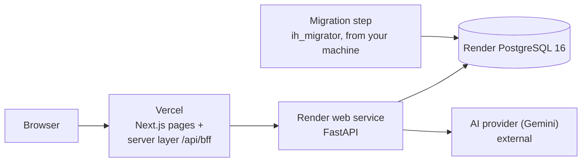

# AI-Powered Project & Task Management Platform

Task 4 (capstone) of the Innovation Hacks Full Stack Development Internship: the Task 1 frontend, the Task 2 API and the Task 3 PostgreSQL layer in one application, with three AI features that only ever suggest. It is built to the Task 4 Engineering Standards Pack in [`docs/standards/`](docs/standards/).

A person registers, signs in, manages projects and tasks, and can ask an AI provider to generate tasks, rank priorities or summarise a project. The AI never changes anything by itself: the person reviews, edits and confirms, and confirmed changes go through the same endpoints as manual ones.

## Architecture



- The browser talks **only** to the site. The server layer (`frontend/src/lib/session`, route `/api/bff`) keeps the session in `HttpOnly` cookies, forwards calls to the API with the Bearer token, checks the `Origin` of every write, allows JSON bodies only and a fixed list of API areas, applies a timeout and passes `X-Request-ID`. No token is ever readable by page scripts.
- The API (`backend/`) is Bearer-only. It holds the business rules, authentication, visibility scoping and the AI pipeline; only it talks to the database and the AI provider.
- Three database roles: `ih_migrator` (owns the schema, used only for migrations), `ih_app` (rows only, used by the API) and `ih_readonly` (no access to password hashes or tokens).
- Decisions are in [`docs/adr/`](docs/adr/README.md); where the pack and the code disagreed, the readback is in [`docs/pack-readback-task4.md`](docs/pack-readback-task4.md).

```text
frontend/   Next.js, TypeScript only: pages, HTTP adapter, AI screens, server layer
backend/    FastAPI, SQLAlchemy 2 async, Alembic: API, migrations, AI pipeline (its own README)
docs/       standards packs, ADRs, runbook, AI evaluation, supersession log, blockers
scripts/    deploy check, smoke test, provisioning, migration, demo data, fault injection
render.yaml docker-compose.yml Makefile
```

## Run it locally

Needs Docker, Node 22, Python 3.12 with `uv`, and `make`.

```bash
make env          # writes .env with random local secrets (git-ignored)
make up           # database, migrations, API on :8000, site on :3000
open http://localhost:3000/register
```

The local stack uses the **fake** AI provider, so it needs no key and costs nothing. To try failures, restart the API with `FAKE_LLM_SCENARIO=timeout`, `bad_json`, `too_long`, `injection_echo`, `rate_limited` or `invalid_then_ok`, with `AI_ENABLED=false`, or with `AI_DAILY_LIMIT_PER_USER=1`. Realistic sample data for an account: `SITE_URL=http://localhost:3000 DEMO_EMAIL=you@example.com DEMO_PASSWORD=... make demo-data`.

## Environment variables

**API on Render** (the full list with defaults is in [`backend/README.md`](backend/README.md#configuration)). Secrets are set only in the dashboard.

| Variable | Purpose | Required | Notes |
|---|---|---|---|
| `APP_ENV` | Environment name | Yes | `production` |
| `STORAGE_BACKEND` | Storage | Yes | `sql` |
| `DATABASE_URL` | Application role connection | Yes | Secret; async driver scheme; TLS required |
| `JWT_SECRET` | Token signing key | Yes | Secret; 32 bytes or more; different in every environment |
| `ACCESS_TOKEN_TTL_S`, `REFRESH_TOKEN_TTL_S` | Session lifetimes | No | 900 and 604800 |
| `CORS_ALLOWED_ORIGINS` | Allowed browser origins | Yes | The Vercel site; no wildcard |
| `REGISTRATION_ENABLED` | Open registration | No | `true` |
| `DOCS_ENABLED` | Swagger UI and ReDoc | No | `false` in production |
| `AI_ENABLED` | AI kill switch | No | `true` |
| `LLM_PROVIDER` | `gemini` or `fake` | Yes | `fake` is refused in production |
| `LLM_API_KEY` | Provider key | With a live provider | Secret; a separate key per environment |
| `LLM_MODEL` | Model name | With a live provider | Never hard-coded |
| `LLM_TIMEOUT_S`, `LLM_MAX_OUTPUT_TOKENS` | Call limits | No | 20 and 1024 |
| `AI_DAILY_LIMIT_PER_USER`, `AI_PER_MINUTE_LIMIT`, `AI_GLOBAL_DAILY_LIMIT` | Quotas | No | 20, 5, 500 |
| `MIGRATION_DATABASE_URL` | Migration role | **Never set on the service** | Only in your shell for `make db-migrate-prod` |

**Frontend on Vercel** (server-only; none starts with `NEXT_PUBLIC_`).

| Variable | Purpose | Notes |
|---|---|---|
| `API_BASE_URL` | The Render API, used only by the server layer | https in production |
| `SITE_URL` | The site's own origin, for the `Origin` check | https in production |
| `BFF_TIMEOUT_MS` | Upstream timeout of the server layer | 28000 |
| `APP_ENV`, `ALLOW_INSECURE_COOKIES` | Local plain-HTTP development only | Production refuses `ALLOW_INSECURE_COOKIES`; leave both unset there |

## Deploying

The step-by-step is in [`docs/deploy-runbook.md`](docs/deploy-runbook.md): Render blueprint, `make db-provision`, `make db-migrate-prod`, `DATABASE_URL` composed by hand, Vercel with root `frontend/`, then `make smoke` and `make e2e-live`. The release order is: merge with the gate green, migrate, deploy the API, smoke, deploy the frontend, smoke again. Rollback is redeploying the previous deployment on each platform; migrations only add things, so it needs no database rollback. Statements about platform plans and limits are marked UNVERIFIED there.

## API and AI design and limits

Interactive documentation is on in development; in production it is off, and [`backend/docs/openapi.json`](backend/docs/openapi.json) is the contract. Six endpoints were added to the Task 3 API: `POST /auth/refresh`, `POST /auth/logout`, `GET /ai/status` and three `POST /ai/projects/{projectId}/…` calls (`task-suggestions`, `prioritization`, `summary`).

- **Who can read what.** A person sees a project if they own it, hold a task in it, or are a lead; anything else is a 404. An email is shown only to its owner and to leads.
- **Sessions.** Access tokens last 15 minutes; refresh tokens last 7 days, work once and rotate. Using a used one revokes the whole session. Logout revokes it and is safe to repeat.
- **The AI pipeline** has ten steps: authorize, check the quota, commit a `pending` usage row, load the minimum data, build a versioned prompt, call the provider, validate (one repair attempt, only when time allows), post-process, record, respond. Prompts carry aliases (`T1`, `T2`), relative dates and no names, emails, tokens or identifiers; what people wrote is escaped and delimited as untrusted data. Output is requested against a schema and limited (at most 10 tasks, titles up to 120 characters, and so on); an identifier not in the input is dropped and a title the project already has is not suggested. The model gets no tools and the endpoints write nothing but a usage row.
- **Limits.** 20 AI calls per person per UTC day, 5 per minute, 500 in total per day, kept in the database so they survive restarts; over a limit is a 429 with `Retry-After`. Usage rows hold metadata only, never prompt or answer text, and are deleted after 90 days.
- **Live provider: Gemini** (ADR-424). The API talks to it behind an `LLMClient` interface with a deterministic fake for tests, the gate and demos.
- **Privacy.** Project text is sent to an external AI provider. The screens say so before first use. Review the provider's data-retention and training terms, and do not use confidential data in the demo.

## The gate

`make gate` runs the Task 2 and Task 3 gates and the Task 1 frontend gate first (the supersessions are listed in [`docs/supersession-log.md`](docs/supersession-log.md)), then `make test-auth` (sessions and isolation), `make test-ai` (the AI suites and the 20 adversarial fixtures), `make test-web` (types, unit and component tests), `make e2e-local` (the browser journey, axe and fault injection on the compose stack), `make security-full` (gitleaks, the built bundle, both audits, headers and cookies), `make deploy-check` and `make docs-check`. After a deploy: `make smoke` and `make e2e-live`. Before submission: `make ai-eval` with your provider key. Open items are in [`docs/blockers.md`](docs/blockers.md).

## Demo script

See [`DEMO_SCRIPT.md`](DEMO_SCRIPT.md): register, sign in, create a project, generate tasks with AI, edit and add them, change a status, show the dashboard, show one AI failure state, sign out. No secret is shown.

## Known limitations

- No email verification and no password reset (out of scope); the Task 1 screens for them, for changing the email or password, for avatar upload and for deleting an account answer "not available in this version".
- The rate limiter is per process, so the API runs as **one instance**. Behind the site every visitor shares one client address, so registration is limited to a few per minute for everyone; login is limited per email.
- Lists read up to 1000 rows and are filtered on the page; server-side paging in the screens is future work.
- AI providers process the text they receive; that is why minimisation is a hard rule.
- Refresh-token and usage tables rely on the periodic cleanup rule (30 and 90 days) to stay small; it is a method on the services, and scheduling it is an operator task.
- Row-level security in the database is a roadmap item.
- Open: the Task 1 first-load JavaScript budget (170 KB) is exceeded on every route (B-401 in [`docs/blockers.md`](docs/blockers.md)).
