# Innovation Hacks Task 4 — AI Project & Task Management Platform

Task 4 combines the Task 1 dashboard, Task 2 REST API and Task 3 PostgreSQL persistence into a full-stack project and task management platform. Members can register, manage work, view dashboards, and ask AI for task suggestions, prioritisation and project summaries. AI output is advisory: a person reviews and confirms changes before they are saved.

[](https://github.com/Aime-Serge/innovation-hacks-task4-platform/actions/workflows/ci.yml) [](LICENSE)

**Live demo:** pending verification · **Demo video:** pending recording · **LinkedIn post:** pending publication

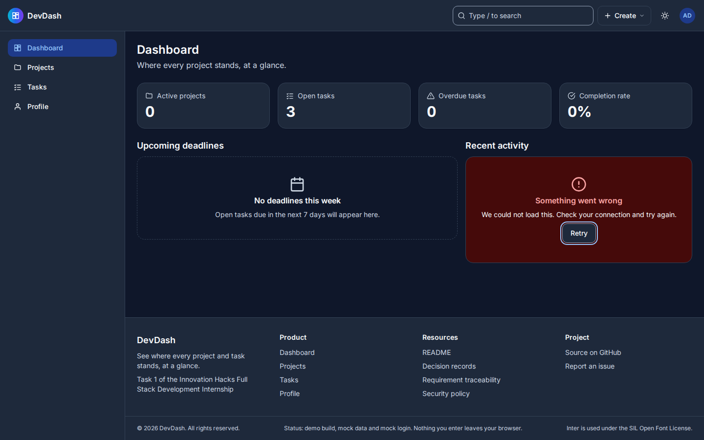

## What the platform does

- **Identity and sessions:** two-step account registration, login and logout; session tokens are kept in HttpOnly cookies by the Next.js server layer. Refresh tokens rotate and can be revoked.
- **Project workflow:** create and manage projects, open project details, track task completion and view project progress.
- **Task workflow:** create, edit, assign and update tasks; filter and search work; use the member picker to choose an assignee.
- **Dashboard:** see project and task statistics, team context and recent activity. Visibility follows the API's ownership and lead rules.
- **Profiles and settings:** manage professional profile details, view member profiles, set preferences and privacy options, change password and manage sessions.
- **AI assistance:** request task suggestions, priority ranking or a project summary. The AI receives minimised project context, has no tools and cannot write business data. The user reviews and confirms any suggested tasks.
- **Responsive interface:** layouts adapt from desktop to mobile, including navigation and task assignment controls.

Feature-to-guide traceability is in [`docs/guide-compliance.md`](docs/guide-compliance.md); known supersessions and blockers are recorded in [`docs/supersession-log.md`](docs/supersession-log.md) and [`docs/blockers.md`](docs/blockers.md).

## Beyond the guide requirements

- The same service boundary supports a deterministic fake AI provider for tests and local demos, while a live provider can be configured separately ([AI design and evaluation record](docs/ai-evaluation.md)).
- The Next.js server layer keeps access credentials in HttpOnly cookies and applies origin checks before forwarding writes ([ADR index](docs/adr/README.md)).
- Task 4 includes the minimal professional profile release: profile visibility, controlled lists and account/session settings ([release notes](docs/submission/release-notes.md)).

## Technology stack

| Layer        | Technology                                             | Version / purpose                                                         |
| ------------ | ------------------------------------------------------ | ------------------------------------------------------------------------- |
| Web          | Next.js, React, TypeScript                             | Versions pinned in `frontend/package-lock.json`; App Router, strict types |
| UI           | Tailwind CSS, Radix UI                                 | Responsive accessible components                                          |
| API          | FastAPI, Pydantic                                      | Python 3.12; async REST API and OpenAPI                                   |
| Persistence  | PostgreSQL, SQLAlchemy, Alembic                        | PostgreSQL 16; async ORM and explicit migrations                          |
| AI           | Gemini provider behind `LLMClient`; deterministic fake | Live provider requires separately configured secret                       |
| Verification | Vitest, Playwright, pytest, Schemathesis               | Unit, browser, API and contract checks                                    |
| Delivery     | Docker Compose, GitHub Actions, Vercel, Render         | Local stack, CI and deployment targets                                    |

## Screenshots

These captures use synthetic example accounts and data. Automated UI captures are regenerated with `make screenshots` from a running local stack. Desktop is 1440×900 and mobile is 390×844.

### Sign-in and registration

| Login                                                                | Registration                                                                   |
| -------------------------------------------------------------------- | ------------------------------------------------------------------------------ |
| 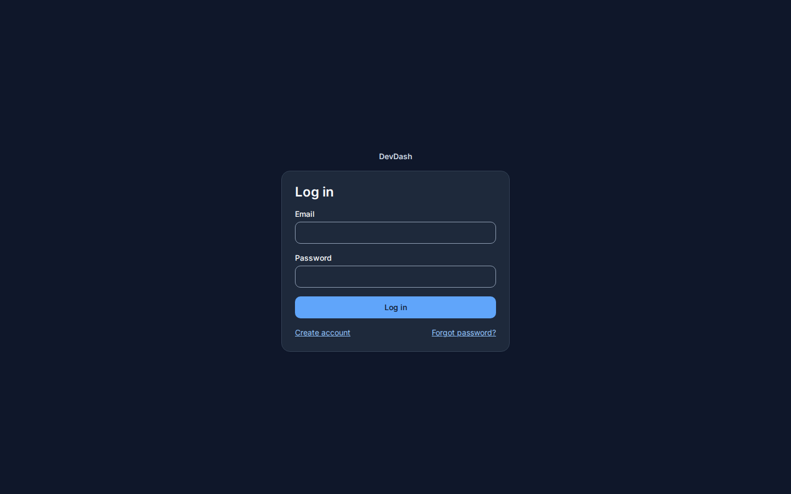 | 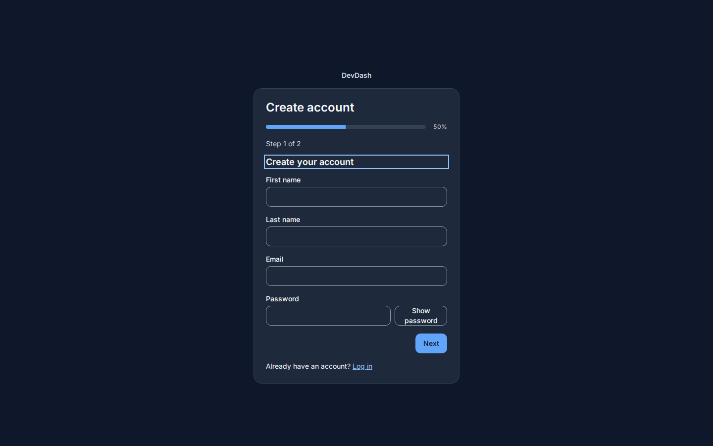 |
| 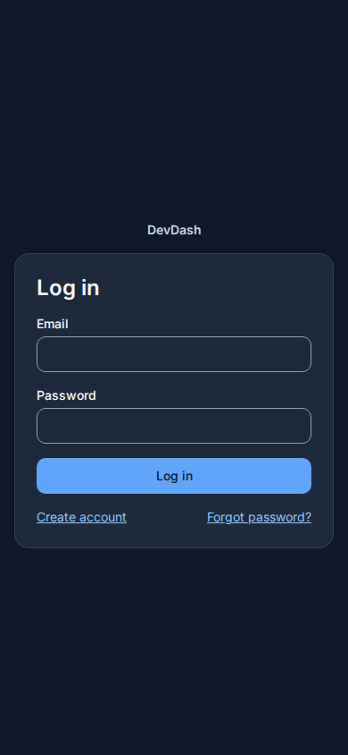   | 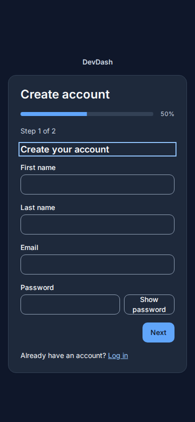   |

### Dashboard and work management

| Dashboard                                                               | Projects                                                              | Tasks                                                           |
| ----------------------------------------------------------------------- | --------------------------------------------------------------------- | --------------------------------------------------------------- |
|  | 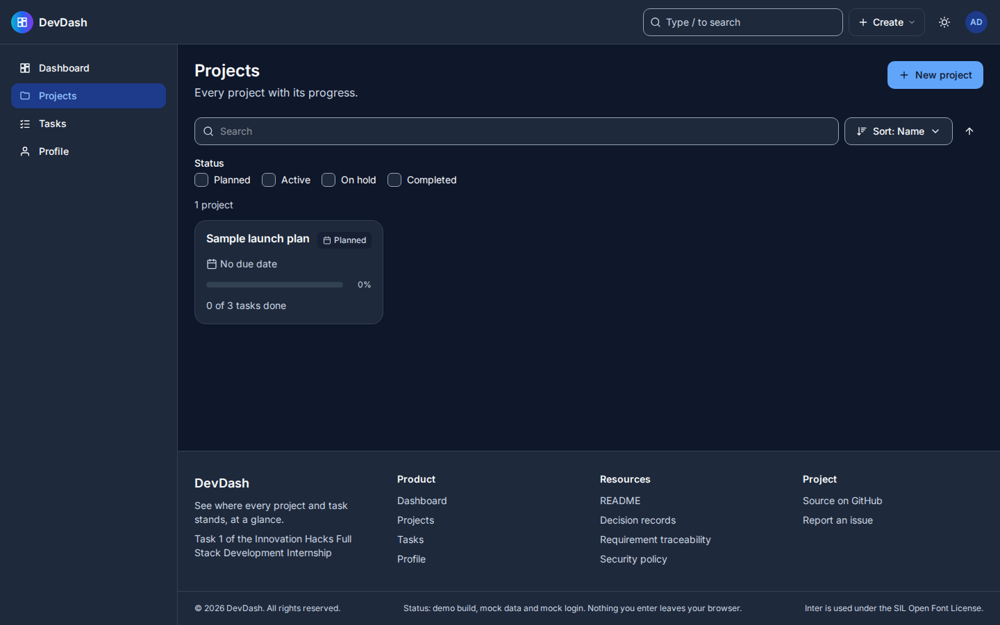 | 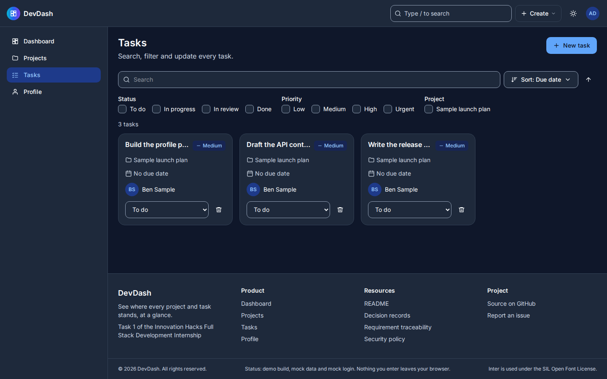 |
| 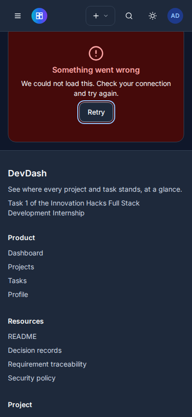   | 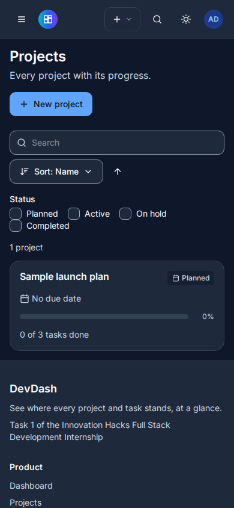   | 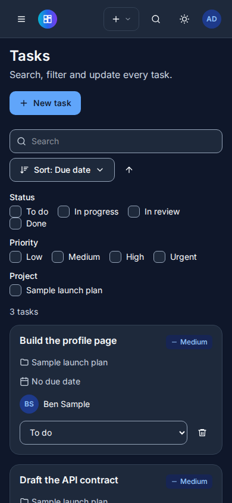   |

### Profiles, settings and assignment

| My profile                                                              | Settings                                                              | Member profile                                                                    | Assign task                                                                                 |
| ----------------------------------------------------------------------- | --------------------------------------------------------------------- | --------------------------------------------------------------------------------- | ------------------------------------------------------------------------------------------- |
| 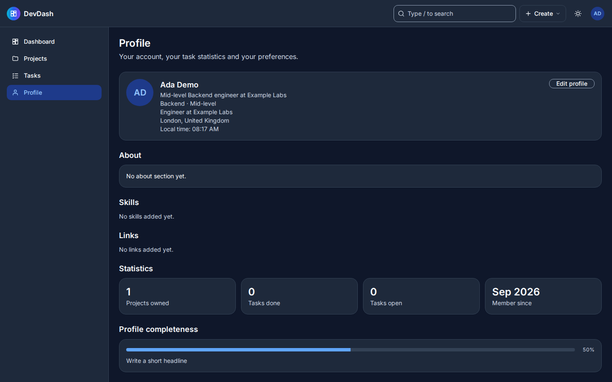 | 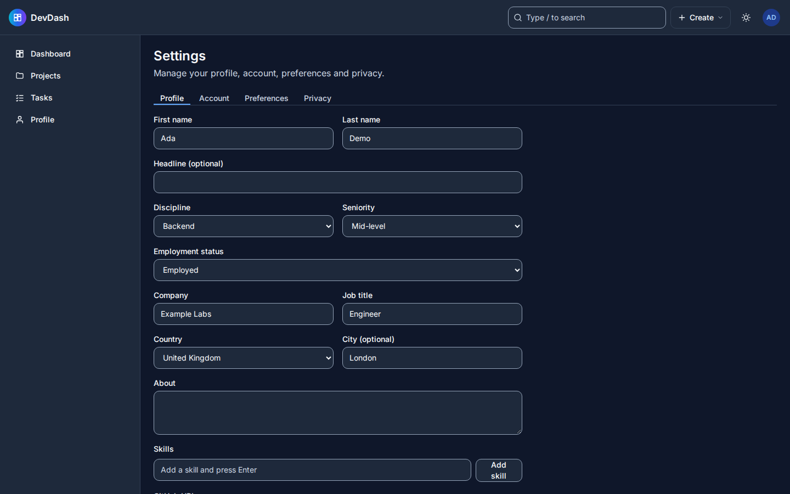 | 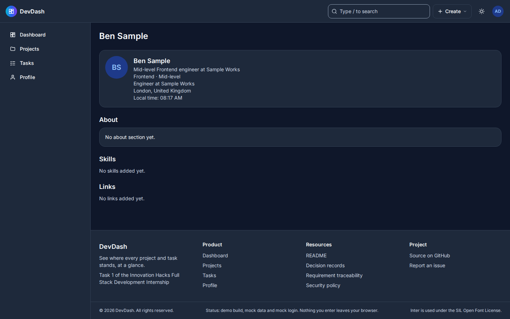 | 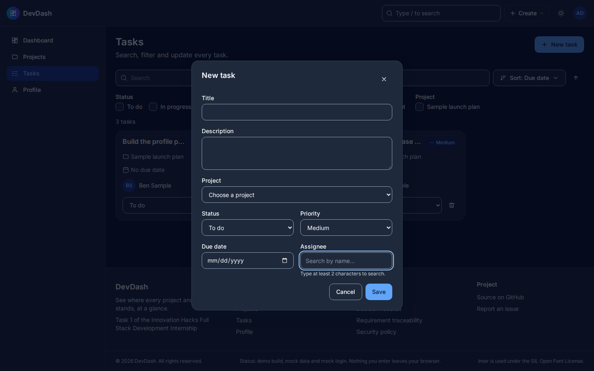 |
| 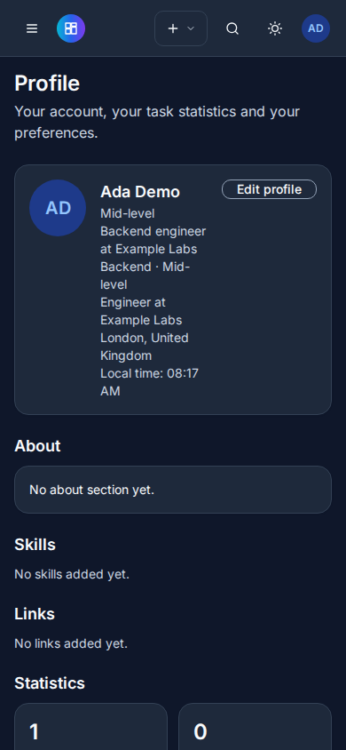   | 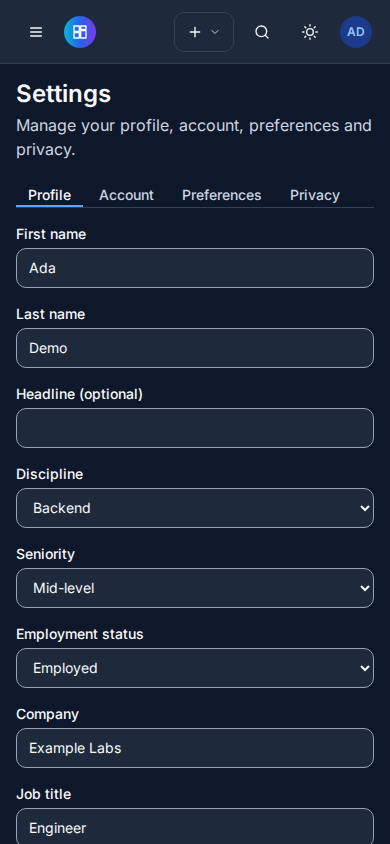   | 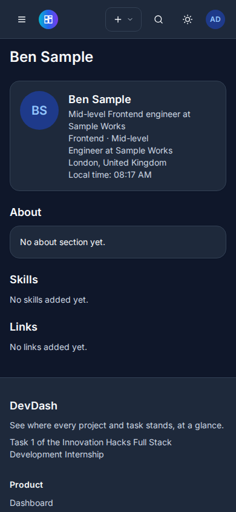   | 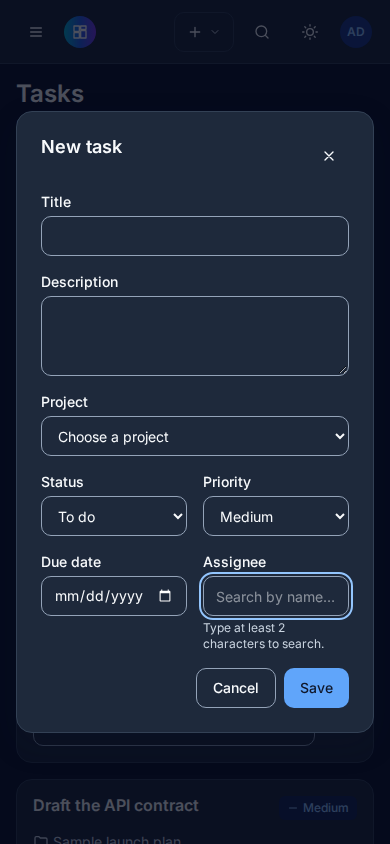   |

### Project detail and AI assistance (local deterministic provider)

| Project detail                                                                                             | Generation before suggestions                                                                                                   | Generation results                                                                                                             |
| ---------------------------------------------------------------------------------------------------------- | ------------------------------------------------------------------------------------------------------------------------------- | ------------------------------------------------------------------------------------------------------------------------------ |
|  |  |  |

| Suggested priorities                                                                                                                  | Project summary                                                                                             |
| ------------------------------------------------------------------------------------------------------------------------------------- | ----------------------------------------------------------------------------------------------------------- |
|  |  |

| Generation before suggestions, mobile                                                                    | Generation results, mobile                                                                                             | Suggested priorities, mobile                                                                | Project summary, mobile                                                         | Quota reached, mobile                                                        |
| -------------------------------------------------------------------------------------------------------- | ---------------------------------------------------------------------------------------------------------------------- | ------------------------------------------------------------------------------------------- | ------------------------------------------------------------------------------- | ---------------------------------------------------------------------------- |
|  |  |  |  |  |

| Quota reached, desktop                                                                                    |
| --------------------------------------------------------------------------------------------------------- |
|  |

These are local deterministic fake-provider results against synthetic sample content, not a live-provider quality claim. The suggested tasks in the generation image remain unconfirmed and are not represented as persisted data. The quota capture uses an isolated local API configured to four calls per throwaway account; it shows the actual API quota response.


**Additional evidence required by the submission standard is manual or not yet captured:** two authenticated browser windows demonstrating data isolation; the browser address bar showing the actual live deployment; a rendered architecture-diagram screenshot; a deployed Lighthouse report; and gate output. Architecture is documented below and in the Mermaid diagram. No live AI evaluation is claimed by these local screenshots; see [`docs/ai-evaluation.md`](docs/ai-evaluation.md). Terminal, live-account and isolation evidence must be captured from the actual target environment with secrets and personal data hidden.

## Workflows

### Register and sign in

1. Open `/register` and enter account details.
2. Complete the professional profile and consent fields.
3. Open `/login`, authenticate, then use protected app routes.
4. Sign out from Settings; protected routes require a valid session again.

The registration endpoint accepts a role choice in the current release; this affects dashboard/team behaviour. Email verification and password reset are not included. See ADR-605 and the policy change in ADR-618.

### Plan and track work

1. Create a project from Projects.
2. Add tasks with due dates, priority and an optional assignee.
3. Search and filter the task list; change task status as work progresses.
4. Review dashboard metrics, activity and project progress.

### Use AI suggestions

1. Open a project and choose task generation, prioritisation or summary.
2. Review the proposed output and make edits or selections.
3. Explicitly confirm selected task suggestions before they are created.

The local Compose stack uses a deterministic fake provider. Live provider behaviour has not been verified unless the AI evaluation record says otherwise. Do not use confidential project content with an external provider.

## Architecture

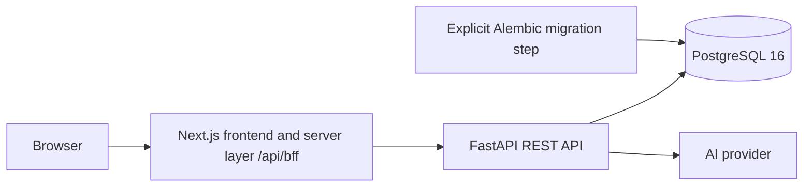
```mermaid
flowchart LR
  B[Browser] --> V[Next.js frontend and server layer /api/bff]
  V --> A[FastAPI REST API]
  A --> D[(PostgreSQL 16)]
  A --> L[AI provider]
  M[Explicit Alembic migration step] --> D
```

The browser calls the Next.js site only. Its server layer validates and forwards API calls and stores session credentials in HttpOnly cookies. FastAPI owns authorization, business rules, visibility scoping, persistence and AI orchestration. PostgreSQL enforces relational constraints. The AI provider receives minimised inputs and can only return suggestions.

Important decisions are indexed in [`docs/adr/README.md`](docs/adr/README.md). Operational setup, migration, deploy, smoke and rollback steps are in [`docs/deploy-runbook.md`](docs/deploy-runbook.md).

## Getting started

Requirements: Docker Compose, Node 22, Python 3.12 with `uv`, and GNU Make.

```bash
make env
make up
# open http://localhost:3000/register
```

`make env` creates ignored local credentials. The Compose stack starts PostgreSQL, applies migrations explicitly, then starts the API and frontend. The default local AI provider is fake and requires no provider key. Stop the stack with `make down`.

To seed a synthetic demo account, set `SITE_URL`, `DEMO_EMAIL` and `DEMO_PASSWORD` in your shell and run `make demo-data`. Do not put real credentials in screenshots, source files or shell history.

### Environment variables

Local Compose values are documented in [`.env.example`](.env.example); copy them with `make env` and keep the generated `.env` private. Production configuration is set in the Vercel/Render dashboards and detailed in [`backend/README.md`](backend/README.md#configuration). Examples below are placeholders, never working credentials.

| Variable                                                                               | Purpose                                                      | Example (placeholder only)                                 |
| -------------------------------------------------------------------------------------- | ------------------------------------------------------------ | ---------------------------------------------------------- |
| `POSTGRES_PASSWORD`, `APP_DB_PASSWORD`, `MIGRATOR_DB_PASSWORD`, `READONLY_DB_PASSWORD` | Separate database role credentials                           | `<set-me>`                                                 |
| `JWT_SECRET`                                                                           | Sign session tokens                                          | `<set-me>`                                                 |
| `DATABASE_URL`                                                                         | API's async application-role connection                      | `postgresql+asyncpg://<user>:<password>@<host>/<database>` |
| `MIGRATION_DATABASE_URL`                                                               | One-time migration-role connection                           | `<set-me>`                                                 |
| `API_BASE_URL`                                                                         | Frontend server-layer upstream API                           | `https://<api-host>`                                       |
| `SITE_URL`, `CORS_ALLOWED_ORIGINS`                                                     | Canonical site and allowed origin                            | `https://<site-host>`                                      |
| `LLM_API_KEY`                                                                          | Live AI provider credential, only when using a live provider | `<provider-key>`                                           |
| `AI_ENABLED`, `LLM_PROVIDER`, `LLM_MODEL`                                              | AI feature switch/provider/model                             | `true`, `fake`, `<model-name>`                             |
| `MIN_AGE`, `TERMS_VERSION`                                                             | Registration consent configuration                           | `16`, `2026-09`                                            |

### Tests and quality gate

`make gate` is the single local gate entry point. It runs frontend and backend checks, browser journeys, security and documentation checks. For deployed verification, configure the targets first and run `make smoke` and `make e2e-live`; live AI evaluation is a separate manual step using `make ai-eval` and an explicitly configured provider key. Evidence and unresolved items belong in [`docs/task-status-report.md`](docs/task-status-report.md).

## API documentation

The API contract is [`backend/docs/openapi.json`](backend/docs/openapi.json). Interactive Swagger UI and ReDoc are enabled in local development; production exposure is controlled by `DOCS_ENABLED`. API route and error-envelope details are in [`backend/README.md`](backend/README.md).

## Database

PostgreSQL stores users, profiles, projects, tasks, sessions, refresh-token families and AI usage metadata. Alembic migrations run as an explicit migration step, not when the API starts. Schema setup, database roles and local inspection instructions are in [`backend/README.md`](backend/README.md) and [`docs/deploy-runbook.md`](docs/deploy-runbook.md).

## Deployment

The deployment plan uses Vercel for the Next.js frontend and Render for FastAPI and PostgreSQL. Follow [`docs/deploy-runbook.md`](docs/deploy-runbook.md) for configuration, migrations, deployment order, smoke checks and rollback. **No live deployment is represented as verified by this README.**

## Repository map

- `frontend/` — Next.js App Router, typed services, server-side session/BFF, UI and browser/unit tests.
- `backend/` — FastAPI API, SQLAlchemy async persistence, Alembic migrations, AI services and API tests.
- `docs/` — architecture decisions, standards packs, traceability, runbook, evaluation and submission evidence.
- `scripts/` — local release, screenshot, smoke, deployment and demo helpers.
- `docker-compose.yml`, `Makefile` — local stack and repeatable quality/release commands.

## Quality and verification

Run `make gate` for the repository's combined automated checks. The command includes component and API checks, browser journeys, security scans, deployment configuration checks and documentation checks. A green local gate is not evidence of a deployed live run; publish actual command output and deployment evidence separately. Live checks are `make smoke` and `make e2e-live` after deployment. Run `make ai-eval` with an intentionally configured provider key to produce an AI evaluation record.

Current blockers, deferred checks and any unverified release claims are maintained in [`docs/blockers.md`](docs/blockers.md) and [`docs/task-status-report.md`](docs/task-status-report.md). Do not infer success from this README in place of those records.

## Task submissions

This monorepo supports the four task submissions. Release tags, video URLs, LinkedIn URLs and optional live URLs should be filled only after publication and verification.

| Task                            | Release | Demo video                                                                          | LinkedIn post                                                                          | Live demo            |
| ------------------------------- | ------- | ----------------------------------------------------------------------------------- | -------------------------------------------------------------------------------------- | -------------------- |
| Task 1 — frontend dashboard     | Pending | Pending                                                                             | Pending                                                                                | Pending              |
| Task 2 — REST API               | Pending | Pending                                                                             | Pending                                                                                | Pending              |
| Task 3 — PostgreSQL persistence | Pending | Pending                                                                             | Pending                                                                                | Pending              |
| Task 4 — full platform          | Pending | Pending; script: [`docs/submission/demo-script.md`](docs/submission/demo-script.md) | Pending; draft: [`docs/submission/linkedin-post.md`](docs/submission/linkedin-post.md) | Pending verification |

Release notes and self-review templates: [`docs/submission/release-notes.md`](docs/submission/release-notes.md), [`docs/submission/self-review.md`](docs/submission/self-review.md).

## Author and acknowledgements

Built for the Innovation Hacks Full Stack Development Internship. The author is identified in the repository contribution history; project documentation and design credit the internship task guides and engineering standards.

## Security and limitations

Never commit `.env`, provider credentials, production tokens or real member records. Report vulnerabilities using [`SECURITY.md`](SECURITY.md). Current release limitations include no email verification or password reset, one-process rate limiting, deferred row-level database security and other items listed in [`docs/blockers.md`](docs/blockers.md). The demo should use throwaway synthetic accounts.
