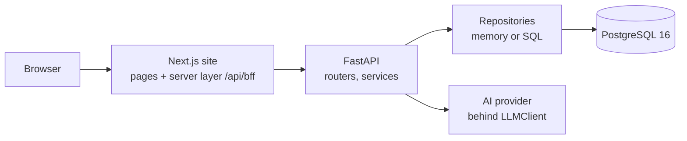

# How it works

Understanding notes for the author (guide section 12: AI tools may assist, but the intern must understand the implementation). It describes the code that exists on the base commit. Parts added on `feat/minimal-profile` are described **from the design in the pack** (`docs/standards/minimal-profile-pack.md`); their file references are marked **(to be confirmed)** until the other workers' code is merged and this file is re-checked against it.

The "Author's answer" fields are intentionally empty. They are for the author to fill in, in their own words.

## 1. Architecture

- Frontend (`frontend/src`): `app/` routes, `features/` screens, `ui/` presentation, `services/` and `adapters/` (a mock adapter for tests and an HTTP adapter for the API), `lib/session/` the server layer.
- The server layer (`frontend/src/lib/session/bff.ts`) is the only code that touches session tokens: it forwards browser calls to the API with the Bearer token from an `HttpOnly` cookie, checks `Origin` on writes, and never returns a token to the browser (ADR-403).
- API (`backend/app`): `api/v1/` routers translate HTTP; `services/` hold business rules and transactions; `repositories/` (memory and `sql`) hide storage; `domain/` holds models, rules and the visibility scope; `schemas/` are the request and response shapes; `core/` is settings, errors, security and rate limiting.
- Database: migrations in `backend/migrations`, constraints named and tested in `backend/tests/db`.

## 2. Key code paths

### 2.1 Registration today (base commit)

1. `frontend/src/features/auth/RegisterForm.tsx` submits name, email and password through the server layer to `POST /api/v1/users`.
2. `backend/app/api/v1/users.py` `register()` refuses when registration is switched off, applies the rate limit, then calls `container.users.register(...)`.
3. `backend/app/services/users.py` `UsersService.register` normalises the email, rejects a password equal to the email, hashes the password with argon2 **outside** the transaction, and adds the user in one write; the unique constraint `uq_users_email` closes the race between the pre-check and the insert.
4. The login that follows goes through `backend/app/services/session_service.py`: it issues an access token and a rotating refresh token whose hash is stored (ADR-404).

### 2.2 Registration with a profile (design; added on feat/minimal-profile)

- Step 1 (given name, family name, email, password) and step 2 (discipline, seniority, employment, company, country, time zone, terms, age confirmation) are each checked by `POST /users/validate`, which creates nothing and is rate limited.
- The final `POST /users` sends everything at once. The service composes the display name from the given and family names (at most 80 characters, ADR-612), creates the user and the `profiles` row in **one transaction**, stores `terms_version`, `terms_accepted_at` and `age_confirmed_at`, and signs the person in. A duplicate email still returns 409 `EMAIL_ALREADY_EXISTS`.
- Rules live in three places on purpose: the client (messages), the API schemas (`extra="forbid"`), and named database constraints (`ck_profiles_*`), so a bypass of one layer is caught by the next (MN-06).
- Controlled lists come from one configuration file (ADR-607).
- Files to be confirmed: `backend/app/api/v1/users.py`, `backend/app/schemas/users.py`, `backend/app/services/users.py`, `backend/app/domain/lists.py`, `backend/migrations/versions/0008_minimal_profile.py`, `frontend/src/features/auth/RegisterForm.tsx`.

### 2.3 Profile (design; added on feat/minimal-profile)

- `GET /me` returns the signed-in user with the profile (ADR-611). `PATCH /me/profile`, `PUT /me/skills`, `PUT /me/preferences` and `PUT /me/privacy` change it. Skills are limited to 10 unique names by a lock and a constraint trigger (ADR-604).
- `GET /users/{userId}` returns the professional details of another member only if that member allows it (one privacy switch, ADR-603); the email and the statistics are never returned for others (ADR-406).
- Password change (`POST /me/password`) needs the current password, then revokes the other sessions using the optional `refreshToken` to identify the one to keep (ADR-610). `DELETE /me/sessions` signs out everywhere. `POST /me/delete` needs the password and is blocked when the person owns projects (ADR-614).
- Files to be confirmed: `backend/app/api/v1/me.py`, `backend/app/services/profiles.py`, `backend/app/services/session_service.py`, `frontend/src/app/(app)/profile`, `frontend/src/app/(app)/people/[id]`, `frontend/src/app/(app)/settings`, `frontend/src/features/profile/`, `frontend/src/features/settings/`.

### 2.4 Task assignment

- Today: `backend/app/services/tasks.py` `_check_assignee` rejects an assignee who does not exist (a 422 on `assigneeId`); the form field is in `frontend/src/features/tasks/TaskFormDialogImpl.tsx`, a `Select` of members.
- Design (added on feat/minimal-profile): the field becomes a people picker (combobox) whose items come from `GET /users`, extended with a privacy-aware professional summary (discipline and company), so a person choosing an assignee sees who they are. Files to be confirmed: `frontend/src/features/tasks/`, `backend/app/api/v1/users.py`.
- Who may read a project or task is decided once, by the read scope in `backend/app/domain/visibility.py` (ADR-405, ADR-423).

## 3. Sources and libraries

The code is intended as original work for this internship (guide section 12: no copying from tutorials or repositories); only the author can attest to that. Third-party libraries used (from `frontend/package.json` and `backend/pyproject.toml`):

| Area | Libraries |
|---|---|
| Frontend runtime | Next.js, React, React DOM, TanStack Query, Radix UI, Zod |
| Frontend build and style | TypeScript, Tailwind CSS, ESLint, Prettier |
| Frontend tests | Vitest, Testing Library, jsdom, Playwright, axe-core, Lighthouse, openapi-typescript |
| API runtime | FastAPI, Uvicorn, Pydantic and pydantic-settings, PyJWT, argon2-cffi, SQLAlchemy 2 (async), asyncpg, Alembic, httpx |
| API tests and checks | pytest, pytest-asyncio, pytest-cov, mypy, ruff, import-linter, schemathesis, locust, bandit, pip-audit |
| Tooling | Docker, Docker Compose, gitleaks |
| Reference documents | The Innovation Hacks guide and the Task 1 to 4 and Minimal Profile standards packs in `docs/standards/` |

AI assistance: parts of the code, tests and documents were written with an AI coding assistant. The author confirms each choice in the review questions below. Only the author can attest that the list is complete.

## 4. Review questions

Answer each in your own words before submission (guide section 12).

1. Why does the browser talk only to the Next.js site and not directly to the API?
   - Author's answer:
2. Why is the password hashed before the database transaction opens rather than inside it?
   - Author's answer:
3. What does the unique constraint `uq_users_email` protect against that the "does this email exist" check cannot?
   - Author's answer:
4. Why does registration validate each step with `POST /users/validate` and create nothing until the last step?
   - Author's answer:
5. Why are the profile rules enforced on the client, the API and the database?
   - Author's answer:
6. Why is discipline stored separately from the platform role (ADR-606)?
   - Author's answer:
7. How does the read scope make a stranger's project return 404 instead of 403 (ADR-405)?
   - Author's answer:
8. What happens when a used refresh token is presented a second time, and why (ADR-404)?
   - Author's answer:
9. Why does `POST /me/password` accept an optional refresh token (ADR-610)?
   - Author's answer:
10. Why does the AI receive aliases and relative dates instead of names and identifiers (ADR-409, ADR-412)?
    - Author's answer:
11. Why does migration 0008 only add things, and how does that allow the previous API version to keep running during a release (ADR-413, ADR-609)?
    - Author's answer:
12. Which limitation would you fix first, and how (see the README)?
    - Author's answer:
