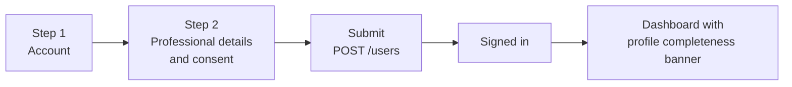

# Minimal Profile, Registration and Final Integration Pack

2026-09-21 · @Someone

## 1. Purpose and scope rule

The full profile pack describes 57 functional requirements, which is far more than the internship needs. This pack keeps only the small part that the guide requires or that makes a required feature work well, so the project can be finished, verified, and submitted. It also turns the complete guide, now available in full, into a compliance matrix (section 8) and a finishing plan (section 9).

**Scope rule.** A feature is built now only if it passes all four tests. Anything that fails one goes to the deferred list in section 2.

| Test | Question |
| --- | --- |
| Required or enabling | Does a guide requirement need it, or does a required feature work poorly without it? |
| Cheap | Can it be built and tested in about a day using what already exists? |
| Safe | Does it avoid a new external service, a new secret, and a new privacy risk? |
| Visible | Can an evaluator see it working within the 2 to 5 minute demo? |

**How the guide is served**

| Guide item | Minimal feature that serves it |
| --- | --- |
| Task 1: user and profile section | Own profile page and profile editing (MF-06, MF-08) |
| Task 4: registration, login, logout, protected routes | Two-step registration that captures professional information (MF-01 to MF-05), and sign out of all devices (MF-14) |
| Task 4: assign tasks | People picker that shows each member's discipline and company (MF-11), and a member profile page (MF-07) |
| Task 4: dashboard statistics and recent activity | Profile statistics from data that already exists (MF-06) |
| UI / UX (15%) | Updated avatar menu, settings, and designed states (MF-12, MF-18) |
| Code quality (20%) and technical implementation (15%) | Database-enforced fields, one reversible migration, focused tests (MF-19, MT-01 to MT-23) |
| Documentation (10%) and GitHub repository quality (5%) | README, screenshots, environment example, compliance matrix (MF-22, MF-23) |
| Demo and presentation (5%) | Demo script and LinkedIn post draft (MF-24) |
| Innovation and additional features (5%) | Professional registration data, profile completeness, and the discipline-aware people picker |
| Guideline: AI tools are allowed but the intern must understand the implementation | Understanding notes written for the author (MF-25) |

**What the full guide changes.** The guide sets the demo video at 2 to 5 minutes and asks it to show the application running end to end, the main features in action, key technical implementation details, and the final result. It confirms that the LinkedIn post must tag the official Innovation Hacks page, and it lists what the reward review may consider: quality of all four tasks, technical implementation, innovation, code quality, GitHub activity, documentation, timely submission, demo quality, problem-solving, and professionalism. The submission standard assumed a 3 to 5 minute video, and that assumption is corrected there to match the guide.

## 2. Minimal feature set

The minimal set adds one registration flow, one profile page and its editor, one people picker, one settings page, and one menu change. It needs one migration, no new external service, and no new secret.

**Built now**

| Area | What is built | Why it passes the scope rule |
| --- | --- | --- |
| Registration | Two steps: account, then professional details (discipline, seniority, employment status, company, job title, country, city, time zone) with consent | Task 4 registration, and the request to capture who the person is as a professional |
| Profile | Own profile page with about, skills, links, and statistics; a page for other members; an editor | Task 1 user and profile section |
| People picker | Search members by name when assigning a task, showing discipline and company | Task 4 "assign" requirement |
| Settings | Four tabs: Profile, Account, Preferences, Privacy | A professional platform needs a place for basics, and it is quick to demo |
| Menu | Avatar menu with name and headline, and a Settings entry | UI and UX score |
| Data | One migration: two profile tables and two name columns | Database-enforced validation is scored in Task 3 |

**Deferred, with the reason**

| Deferred feature | Why it waits | Full-pack reference |
| --- | --- | --- |
| Email verification, non-enumerating registration, password reset | Needs an email provider, which is a new external service and secret; kept as a documented limitation and the first item to add later | FR-503, FR-512, FR-564 |
| Username and profile addresses by handle | Member identifiers already work as addresses | FR-509, FR-533 |
| Avatar upload | Needs object storage; initials avatars already exist | FR-530 |
| Company records, deduplication, verified employees, company pages | A free-text company name is enough to display and to assign | FR-505, FR-513, FR-536 |
| Experience, education, certifications, portfolio, languages, achievements | Not required by the guide and a large surface to build and test | FR-523 to FR-528 |
| Per-section visibility, public profiles, search indexing | One privacy switch is enough for now | FR-534 |
| A full directory page with filters | The people picker covers the guide's need | FR-535 |
| Availability and work preferences | Not needed by any guide item | FR-531 |
| Contribution graph, profile activity feed, badges | The dashboard already shows activity; profile statistics are enough | FR-540 to FR-542 |
| Two-factor authentication, security log, access tokens, connected accounts, notification settings, consent history, data export, moderation | Each adds a service, a secret, or a large test surface | FR-554, FR-555, FR-557, FR-559 to FR-561, FR-563 |
| Import and export of profiles | Not required by the guide | FR-537, FR-538 |
| Bot challenge, breached-password check, disposable-email blocking | The rate limiting from Task 2 stays in place | FR-511 |
| Additional interface languages | English only | FR-574 |

The full profile pack remains the source for these items when the team wants to grow the product, and its phase plan already orders them.

## 3. Registration and profile

Registration collects the minimum that describes a software professional in two short steps, and the profile shows it. Everything is stored in typed columns with database constraints, so the data is trustworthy enough to filter and display.



Each step validates its fields on the server without creating anything, and the second step submits everything in one request. Non-secret answers may be kept in `sessionStorage`, and the password never is.

**Registration fields**

| Field | Step | Required | Rules |
| --- | --- | --- | --- |
| `givenName` | 1 | Yes | 1 to 60 characters; Unicode letters, spaces, hyphens, apostrophes; trimmed |
| `familyName` | 1 | Yes | Same as above |
| `email` | 1 | Yes | Existing rules from Task 2: valid, at most 254 characters, stored lowercase, unique |
| `password` | 1 | Yes | Existing rules from Task 2: 12 to 128 characters, not equal to the email or name; a show toggle instead of a confirmation field |
| `discipline` | 2 | Yes | One value from the discipline list |
| `seniority` | 2 | Yes | One value from the seniority list |
| `employmentStatus` | 2 | Yes | One value from the employment status list |
| `companyName` | 2 | When employed or freelancing | 1 to 120 characters; freelancers may enter "Independent" |
| `jobTitle` | 2 | When employed or freelancing | 1 to 100 characters |
| `country` | 2 | Yes | ISO 3166-1 alpha-2 code chosen from a list |
| `city` | 2 | No | 1 to 80 characters |
| `timeZone` | 2 | Yes | IANA name, defaulted from the browser and editable |
| `termsAccepted` | 2 | Yes | Stores the terms version and the time |
| `ageConfirmed` | 2 | Yes | A checkbox that the person meets the minimum age (16 by default, a setting); no birth date is collected |

The display name `name` is built from the given and family names, so every existing screen keeps working.

**Controlled lists**

| List | Values |
| --- | --- |
| Discipline | `backend`, `frontend`, `full_stack`, `mobile`, `devops_cloud`, `data_ai`, `security`, `qa`, `other` (labels: Backend, Frontend, Full-stack, Mobile, DevOps and cloud, Data and AI, Security, QA and testing, Other) |
| Seniority | `student_intern`, `junior`, `mid`, `senior`, `lead_or_above` |
| Employment status | `employed`, `freelance`, `student`, `between_roles` |

The lists live in one configuration file used by the API, the database migration, and the frontend, so the three never disagree.

**Profile page**

| Zone | Contents |
| --- | --- |
| Header | Initials avatar, display name, headline, discipline and seniority, company and job title, city and country, the person's local time, and an Edit profile button on the owner's own page |
| About | Plain text of up to 500 characters |
| Skills | Up to 10 free-text tags of up to 30 characters, unique ignoring case |
| Links | GitHub, LinkedIn, and website, each `https` only; GitHub and LinkedIn must point to that provider's host |
| Statistics (own page only) | Projects owned, tasks done, tasks open, and member since, from data that already exists |
| Completeness (own page only) | Percentage and the next suggested step |

The headline is composed when shown, for example "Senior Backend engineer at Acme", unless the person stored their own of up to 120 characters. Every text field is plain text and is always escaped, and external links open with `rel` set to `noopener nofollow`. Another member's page shows the professional details only when that member allows it, never shows the email, and never shows statistics.

**Profile completeness** (owner only; registration alone earns 50)

| Component | Points |
| --- | --- |
| Name | 10 |
| Discipline and seniority | 15 |
| Employment: status, and company and title when working | 15 |
| Country and time zone | 10 |
| Headline | 10 |
| About | 15 |
| At least three skills | 15 |
| At least one link | 10 |

**Interface rules.** One column, a progress indicator ("Step 1 of 2"), Back and Next buttons, validation when a field loses focus with plain-language messages, correct `autocomplete` values (`given-name`, `family-name`, `email`, `new-password`, `organization`, `organization-title`, `country-name`), full keyboard operation, and focus moved to the step heading on each change. After registration the person lands on the dashboard with a dismissible banner showing their completeness and a link to edit the profile.

## 4. Settings, people picker and navigation

This section covers the parts around the profile that a reviewer will click next: the menu, the settings page, and the place where members meet the rest of the app, which is task assignment.

**Avatar menu** (replaces the four-item menu)

| Item | Goes to | Notes |
| --- | --- | --- |
| Header block | Own profile | Initials avatar, display name, and headline; the email address is no longer shown here, so a shared screen reveals less |
| Profile | `/profile` | Unchanged label |
| Projects | `/projects` | Unchanged |
| Tasks | `/tasks` | Unchanged |
| Settings | `/settings` | New |
| Log out | Ends the session | Unchanged; also revokes the refresh token |

**Settings page** (four tabs; every tab has loading, error, and saved states, and works by keyboard)

| Tab | Contents | Rules |
| --- | --- | --- |
| Profile | Edit given and family name, discipline, seniority, employment status, company, job title, country, city, headline, about, skills, and links | Same rules as registration and the profile page; the display name is rebuilt from the given and family names |
| Account | Email shown read-only; change password; sign out of all devices; delete account | Changing the password needs the current one and ends every other session; sign out of all devices ends every session including this one; deleting needs the password |
| Preferences | Theme (light, dark, or system) and time zone | Saved per account and applied on every device, and the theme toggle in the header keeps working and saves to the same setting |
| Privacy | A switch, "Show my professional details to other members", on by default | Turning it off hides discipline, seniority, company, job title, and location from other members at once; the email is never shown to other members, and leads see it as before (Task 4 BR-403) |

**Account deletion.** The dialog asks for the password and states what will happen. If the person still owns projects, the API answers with the existing `USER_OWNS_PROJECTS` conflict and the dialog explains that the projects must be deleted or handed to someone else first. Otherwise the account is removed, tasks assigned to the person become unassigned, and the person is signed out. These are the referential actions already defined in Task 3.

**People picker.** Wherever a task is assigned, a keyboard-operable combobox searches members by name.

| Aspect | Rule |
| --- | --- |
| Search | At least two characters, matched on name, at most 20 results, using the existing `GET /users` list contract |
| Each result | Initials avatar, name, and, when the member allows it, discipline and company |
| Privacy | Members who turned off the privacy switch show name and avatar only; email is never shown to non-leads |
| Accessibility | The result count is announced in a live region, arrow keys move through results, and Escape closes the list |
| Visibility of projects | Unchanged: assigning a task still gives the assignee sight of that project only (Task 4 BR-401) |

**Member profile page.** Opening a name anywhere in the app shows `/people/{id}`, which uses the same layout as the own profile without the edit button, statistics, or completeness meter, and with the professional details subject to the privacy switch.

## 5. Data model and API

The change is one reversible migration, `0006_minimal_profile`, and a handful of endpoints, all following the conventions of Tasks 2 to 4: camelCase JSON, UUIDs, named constraints (`pk_`, `fk_`, `uq_`, `ck_`, `ix_`), the existing error envelope, and additive changes except where section 6 lists a supersession.

**Changes to `users`.** Two nullable columns are added: `given_name` and `family_name`, each 1 to 60 characters when present. The existing `name` column stays as the display name, and `theme` stays where Task 3 put it.

**Table `profiles`** (one row per user)

| Column | Type | Null | Constraints |
| --- | --- | --- | --- |
| `user_id` | uuid | no | `pk_profiles`; `fk_profiles_user_id_users`, on delete cascade |
| `discipline` | text | no | `ck_profiles_discipline`: one of the discipline values |
| `seniority` | text | no | `ck_profiles_seniority`: one of the seniority values |
| `employment_status` | text | no | `ck_profiles_employment_status`: one of the status values |
| `company_name` | text | yes | `ck_profiles_company_name_length`: 1 to 120 characters, trimmed |
| `job_title` | text | yes | `ck_profiles_job_title_length`: 1 to 100 characters, trimmed |
| (table check) |  |  | `ck_profiles_employment_details`: when the status is `employed` or `freelance`, both company and job title are present |
| `country_code` | text | no | `ck_profiles_country_code`: two uppercase letters |
| `city` | text | yes | `ck_profiles_city_length`: 1 to 80 characters |
| `time_zone` | text | no | `ck_profiles_time_zone_length`: at most 64; the value is checked against the IANA list by the service |
| `headline` | text | yes | `ck_profiles_headline_length`: at most 120 |
| `about` | text | no | default empty; `ck_profiles_about_length`: at most 500 |
| `github_url`, `linkedin_url`, `website_url` | text | yes | `ck_profiles_*_https`: starts with `https://` and at most 2,048 characters; GitHub and LinkedIn also check their host |
| `show_professional_details` | boolean | no | default true |
| `terms_version`, `terms_accepted_at` | text, timestamptz | no | Recorded at registration |
| `age_confirmed_at` | timestamptz | yes | `ck_profiles_age_confirmed`: present unless `terms_version` is `legacy` |
| `created_at`, `updated_at` | timestamptz | no | Application-supplied through the injected clock |

**Table `profile_skills`**

| Column | Type | Null | Constraints |
| --- | --- | --- | --- |
| `id` | uuid | no | `pk_profile_skills` |
| `user_id` | uuid | no | `fk_profile_skills_user_id_users`, on delete cascade; indexed |
| `name` | text | no | `ck_profile_skills_name_length`: 1 to 30 characters, trimmed |
| `sort_order` | smallint | no | Position in the list |
| (unique) |  |  | `uq_profile_skills_user_id_name_lower`: one skill per person ignoring case |

At most 10 skills per person are enforced by the service under a lock on the profile row and by a constraint trigger on the table.

**Migration and existing users.** The migration creates both tables, then gives every existing user a profile with `discipline` set to `other`, `seniority` to `mid`, `employment_status` to `between_roles`, `country_code` to `ZZ` (the reserved "unknown" code), `time_zone` to `UTC`, `terms_version` to `legacy`, and `age_confirmed_at` left empty. Their settings page shows a prompt to complete the profile. The downgrade drops both tables and the two columns. No existing data is changed or lost.

**Endpoints** (under `/api/v1`)

| Method | Path | Success | Errors | Requirement |
| --- | --- | --- | --- | --- |
| POST | `/users` | 201 | 409, 422, 429 | MF-01 to MF-04 (payload extended) |
| POST | `/users/validate` | 200 | 422, 429 | MF-01 (validates one step and creates nothing) |
| GET | `/me` | 200 | 401 | MF-06, MF-09, MF-12 |
| PATCH | `/me/profile` | 200 | 401, 422 | MF-08 |
| PUT | `/me/skills` | 200 | 401, 422 | MF-08 |
| PUT | `/me/preferences` | 200 | 401, 422 | MF-15 |
| PUT | `/me/privacy` | 200 | 401, 422 | MF-16 |
| POST | `/me/password` | 204 | 401, 403, 422, 429 | MF-13 |
| DELETE | `/me/sessions` | 204 | 401 | MF-14 |
| POST | `/me/delete` | 204 | 401, 403, 409, 422 | MF-17 |
| GET | `/users` | 200 | 401, 422 | MF-11 (items extended) |
| GET | `/users/{userId}` | 200 | 401, 404 | MF-07 (response extended) |

A wrong current password on `/me/password` or `/me/delete` returns 403 with the existing `INVALID_CREDENTIALS` code, and not 401, so the client does not mistake it for an expired session. No new error codes are needed.

**User representation.** The existing user object gains `givenName`, `familyName`, and a `profile` object with `discipline`, `seniority`, `employmentStatus`, `companyName`, `jobTitle`, `country`, `city`, `timeZone`, `headline`, `about`, `links` (`github`, `linkedin`, `website`), and `skills`. For another member the `profile` is present only when that member has professional details switched on, and `email` follows Task 4 BR-403. `GET /me` adds `stats` (`projectsOwned`, `tasksDone`, `tasksOpen`) and `completeness` (`percent` and `next`). The discipline, seniority, and status values appear as enumerations in `openapi.json`, so the frontend types are generated from the same lists.

**Settings.** Two non-secret settings are added: `MIN_AGE` (default 16) and `TERMS_VERSION` (the current terms version). The controlled lists live in one configuration file used by the migration, the API, and the type generation. There are no new secrets and no new external services.

## 6. Requirements and business rules

There are 25 functional requirements (22 Must, 3 Should) and 9 non-functional requirements. Every Must blocks release, and Should items are tracked in the gate. IDs use `MF-` and `MN-` so they never clash with the four task packs, and each row names the full-pack requirement it narrows.

**Functional requirements**

| ID | Requirement | Pri | Acceptance criteria | Full pack |
| --- | --- | --- | --- | --- |
| MF-01 | Two-step registration | M | Steps of section 3; each step is checked by `POST /users/validate`, which creates nothing; one final `POST /users`; success signs the person in | FR-501, FR-504 to FR-506 |
| MF-02 | Field rules and controlled lists | M | Every rule of section 3 is enforced on the client, the server, and the database; list values come from one configuration file and appear as OpenAPI enumerations | FR-502, NFR-516 |
| MF-03 | Consent and age confirmation | M | Terms version, time, and age confirmation are required and stored; no birth date is kept | FR-508 |
| MF-04 | Duplicate email behaviour unchanged | M | A duplicate email still returns 409 `EMAIL_ALREADY_EXISTS`; recorded as a known limitation until email verification is added | none |
| MF-05 | Welcome banner | M | After registration the dashboard shows a dismissible banner with the completeness percentage and a link to edit the profile | FR-510 |
| MF-06 | Own profile page | M | Header, about, skills, links, statistics, and completeness per section 3, with loading, empty, and error states | FR-520 |
| MF-07 | Member profile page | M | `/people/{id}` shows professional details only when allowed, and never the email or statistics; an unknown id shows the not-found page | FR-520 |
| MF-08 | Edit profile | M | Every field validated with per-field messages; skills up to 10 and unique ignoring case; links `https` and host-checked; clear saved and error feedback | FR-521, FR-525, FR-529 |
| MF-09 | Profile completeness | S | Percentage by the section 3 formula and the next step, shown to the owner only | FR-532 |
| MF-10 | Plain text and safe links | M | Markup in any field appears as text; external links use `noopener nofollow` | FR-522 |
| MF-11 | People picker | M | Behaviour of section 4; results respect the privacy switch; assigning a task still works end to end | FR-535, FR-571 |
| MF-12 | Settings page | M | Four tabs, keyboard operable, all states, reachable from the avatar menu | FR-550 |
| MF-13 | Change password | M | Needs the current password and follows the password rules; ends every other session; a wrong current password returns 403 | FR-552 |
| MF-14 | Sign out of all devices | S | Revokes every refresh-token family of the person and returns to the login page | FR-553 |
| MF-15 | Preferences | M | Theme and time zone are saved per account and applied on any device at the next sign-in | FR-558 |
| MF-16 | Privacy switch | M | Applies at once to the profile page, the people picker, and `GET /users` responses | FR-556 |
| MF-17 | Delete account | S | Password required; blocked with `USER_OWNS_PROJECTS` while projects are owned; otherwise the account is removed and the person signed out | FR-562 |
| MF-18 | Avatar menu | M | Items of section 4, with no email in the header | none |
| MF-19 | Migration | M | `0006_minimal_profile` runs up, down, and up; existing users are backfilled; constraints follow the naming convention; the drift check is clean | FR-575, NFR-519 |
| MF-20 | API and generated types | M | Endpoints of section 5 are in `openapi.json`, and the TypeScript types regenerate and compile with no manual edits | FR-570 |
| MF-21 | Existing behaviour preserved | M | The Task 1 to 4 gates pass except for the supersessions below, each logged with the old and new assertion | NFR-518 |
| MF-22 | Guide compliance matrix | M | The matrix of section 8 is saved as `docs/guide-compliance.md` with evidence for every row | none |
| MF-23 | GitHub deliverables | M | README, screenshots, `.env.example`, and demo link per guide section 08, with no secrets in files or history | none |
| MF-24 | Demo script and post | M | A demo script that fits 2 to 5 minutes and a LinkedIn post draft tagging Innovation Hacks | none |
| MF-25 | Understanding notes | M | `docs/how-it-works.md` explains the architecture and the key code paths of registration, profile, and assignment, with review questions for the author to answer in their own words | none |

**Non-functional requirements**

| ID | Category | Requirement | Target | Verified by |
| --- | --- | --- | --- | --- |
| MN-01 | Accessibility | New screens meet WCAG 2.2 AA, and registration and settings work by keyboard alone | 0 axe violations | axe, Playwright |
| MN-02 | Usability | Median time to finish registration | 2 minutes or less | Five timed runs |
| MN-03 | Performance | p95 latency of profile reads, and Largest Contentful Paint of the profile page on a mobile profile | 150 ms, and 2.5 s | Locust, Lighthouse |
| MN-04 | Privacy | No field collects a category excluded by MB-07; hidden professional details are absent from every response; email shown only to the person and to leads | 0 leaks | Schema review, privacy tests |
| MN-05 | Security | Text is escaped, links are `https`, password change and deletion need the current password and are rate limited, and no new secret exists | 0 findings | Tests, gitleaks |
| MN-06 | Data quality | Every controlled value and length rule is a named database constraint, proved by writing invalid rows directly | 100% of constraints | Bypass tests |
| MN-07 | Compatibility | Existing users and their data are unaffected, and OpenAPI changes are additive apart from `POST /users` | 0 losses, 0 other breaking changes | Migration test, OpenAPI diff |
| MN-08 | Documentation | README, compliance matrix, ADRs, supersession log, and changelog are updated | All present | Documentation check |
| MN-09 | Footprint | New external services, new secrets, and migrations | 0, 0, 1 | Configuration review |

**Business rules**

| ID | Rule |
| --- | --- |
| MB-01 | Discipline, seniority, and company never affect permissions; only the platform role does. |
| MB-02 | A member sees another member's professional details only when that member's switch is on. The email follows Task 4 BR-403, and statistics and completeness are visible to the owner only. |
| MB-03 | Registration requires the fields of section 3, and company and job title are required when the status is `employed` or `freelance`. |
| MB-04 | Profile text is plain text and always escaped. Links are `https`, and GitHub and LinkedIn links must point to those providers' hosts. |
| MB-05 | A person has at most 10 skills, unique ignoring case. |
| MB-06 | Changing the password ends all other sessions, signing out of all devices ends all of them, and deleting an account needs the password and follows the Task 3 referential actions. |
| MB-07 | The platform does not collect gender, birth date, ethnicity, religion, national identifiers, health data, or precise location. |
| MB-08 | Statistics count only the person's own projects and tasks. Times are stored in UTC and shown in the person's time zone. |

**Supersessions** (the only permitted departures from earlier packs; each is logged in `docs/supersession-log.md`)

| ID | Change | Reason | Effect on tests |
| --- | --- | --- | --- |
| S-A | `POST /users` requires `givenName`, `familyName`, the `profile` block, consent, and age confirmation | Registration must capture the professional identity | The shared registration helper used by Task 2 to 4 tests is updated once, and each old assertion is logged |
| S-B | The user representation gains fields, and `GET /users` items gain a professional summary when allowed | The people picker needs it | Additive; the privacy switch governs it |
| S-C | The avatar menu no longer shows the email | Privacy on shared screens | Interface tests only |
| S-D | The Task 1 mock adapter gains the new fields | Keeps mock and real adapters aligned | Test data only |

## 7. Tests and Standards Gate

The tests are few and each proves one requirement, with the most attention on what must not leak and what the database must refuse. The existing Task 1 to 4 suites are reused as the regression net.

**Tests**

| ID | Test | Proves |
| --- | --- | --- |
| MT-01 | Registration wizard: both steps, per-step validation that creates nothing, final submit, automatic sign-in | MF-01, MF-05 |
| MT-02 | Field-rule matrix: every field with valid, empty, too long, and wrong-format values, and every list value plus one invalid | MF-02 |
| MT-03 | Database bypass: raw SQL rejects a bad discipline, seniority, or status, a company missing for an employed person, a bad country code, non-`https` links, and over-long text | MF-02, MN-06 |
| MT-04 | Consent and age confirmation are required and stored, and no birth date exists in the schema | MF-03, MN-04 |
| MT-05 | A duplicate email still returns 409 `EMAIL_ALREADY_EXISTS` | MF-04 |
| MT-06 | Own profile page, statistics from real data, and the completeness formula | MF-06, MF-09 |
| MT-07 | Member profile: professional details follow the switch, and the email and statistics are never shown | MF-07, MB-02 |
| MT-08 | Edit profile: validation messages, 10-skill limit under concurrent requests, case-insensitive uniqueness, link host checks | MF-08, MB-05 |
| MT-09 | Markup and script payloads in every text field appear as plain text, and external links carry `noopener nofollow` | MF-10, MB-04 |
| MT-10 | People picker: search, results, privacy switch, and assigning a task, with Task 4 visibility rules unchanged | MF-11 |
| MT-11 | Settings navigation, states, and preferences persisting across sign-in | MF-12, MF-15 |
| MT-12 | Change password: needs the current one, follows the rules, and ends other sessions; a wrong current password returns 403 | MF-13 |
| MT-13 | Sign out of all devices ends every session | MF-14 |
| MT-14 | The privacy switch takes effect immediately in the profile, the picker, and `GET /users` | MF-16 |
| MT-15 | Delete account: password required, blocked while projects are owned, tasks unassigned, and signed out | MF-17 |
| MT-16 | Avatar menu items and no email in the header | MF-18 |
| MT-17 | Migration: up, down, and up on an empty and a seeded database, existing users backfilled, drift check clean | MF-19, MN-07 |
| MT-18 | OpenAPI diff is additive apart from `POST /users`, and generated types compile | MF-20, MN-07 |
| MT-19 | Accessibility and keyboard: axe on every new screen, registration and settings by keyboard, three viewports | MN-01 |
| MT-20 | Regression: Task 1 to 4 gates, and every changed assertion appears in the supersession log | MF-21 |
| MT-21 | Every row of the compliance matrix has an evidence path that exists | MF-22 |
| MT-22 | README sections, `.env.example` completeness, screenshots present, and gitleaks clean over files and history | MF-23, MN-05, MN-08 |
| MT-23 | Profile read p95 latency and page load targets | MN-03 |

**Rules for tests**

- A test's name starts with its `MT-##` and names the requirement it proves.
- Every hidden-data test checks three things: the field is absent, the count is unchanged, and the answer for hidden data equals the answer for missing data.
- Where a supersession changes an earlier assertion, the earlier test is updated and never deleted, and the change is logged with its reason.
- Tests create their users through one shared helper, so a future change to registration touches one place.

**Standards Gate**

```bash
make gate            # Task 1 to 4 gates first (with the supersessions above), then:

make test-profile    # MT-01 to MT-16 on the API and units, MT-23 timing
make db-check        # migration 0006 up, down, up; drift; bypass matrix (MT-03, MT-17)
make e2e-profile     # Playwright: registration to banner, profile edit, settings, picker, 3 viewports, axe
make guide-check     # compliance matrix evidence, README sections, .env.example, gitleaks (MT-21, MT-22)

# after each deploy
make smoke           # register, edit the profile, assign a task with the picker, change password, sign out
```

**Reviewer checklist** (someone other than the author, on the deployed site)

- [ ] Registration takes two steps and about two minutes, every rule shows a clear message, consent is required, and a duplicate email gives the existing message (MF-01 to MF-04)
- [ ] After registering, the dashboard banner shows the completeness and leads to the editor (MF-05)
- [ ] The own profile shows header, about, skills, links, statistics, and completeness, and another member's page shows none of the statistics or email (MF-06, MF-07)
- [ ] Typing markup into every text field shows text, and links must be `https` (MF-10)
- [ ] Turning the privacy switch off hides professional details from another account at once, in the profile and in the picker (MF-16)
- [ ] The picker finds a member by name and assigns a task, and the member sees only that project (MF-11)
- [ ] Changing the password ends a second signed-in browser, and "sign out of all devices" ends both (MF-13, MF-14)
- [ ] Theme and time zone persist after signing in on another browser (MF-15)
- [ ] Deleting an account that owns projects explains what to do first (MF-17)
- [ ] The menu shows name and headline and no email (MF-18)
- [ ] The migration ran on a copy of the real data with no loss, and older accounts see the completion prompt (MF-19)
- [ ] The compliance matrix of section 8 is complete, and every guide deliverable is ready (MF-22 to MF-25)

**Failure handling.** A failed item gets a defect note naming the requirement ID, the fix, and the test that now covers it, and the gate is then rerun in full.

## 8. Guide compliance matrix

Every requirement of the Innovation Hacks guide appears below with the feature that satisfies it and the file or test that proves it. The build copies this table to `docs/guide-compliance.md`, adds a status of Pass, Partial, Fail, or Manual step with real evidence to each row, and the reviewer checks it against the running application. The `make guide-check` target verifies that every evidence path exists.

**Task 1: Modern frontend (guide section 03)**

| ID | Guide requirement | Satisfied by | Evidence |
| --- | --- | --- | --- |
| G-01 | Dashboard as the primary landing view | Dashboard route `/`; Task 1 FR-01 to FR-04 | Screenshot, TC-001 |
| G-02 | Navigation bar with accessible wayfinding | Navigation and the new avatar menu; Task 1 FR-05 to FR-08, MF-18 | TC-010 to TC-012, MT-16 |
| G-03 | User and profile section | Profile page, editor, and settings; MF-06 to MF-08, MF-12 | MT-06, MT-08, screenshots |
| G-04 | Project and task cards with a consistent visual system | Card components on design tokens; Task 1 FR-11, FR-12 | TC-030, TC-031 |
| G-05 | Progress indicators for tasks and projects | Progress bar and ring; Task 1 FR-13 | TC-040, TC-041 |
| G-06 | Search and filter | Filters kept in the URL; Task 1 FR-15 to FR-19 | TC-050 to TC-054 |
| G-07 | Fully responsive on mobile, tablet, and desktop | Mobile-first layouts; Task 1 FR-23 | TC-060, MT-19 |
| G-08 | Loading and empty states for all dynamic views | Skeletons, empty and error states; Task 1 FR-20 to FR-22 | TC-070 to TC-073, MT-19 |
| G-09 | Clean, reusable component architecture | Layering rules and boundary lint; Task 1 section 7 | TC-080 to TC-083 |

**Task 2: Backend and REST API (section 04)**

| ID | Guide requirement | Satisfied by | Evidence |
| --- | --- | --- | --- |
| G-10 | User management endpoints | Task 2 FR-201 to FR-208, plus `/me` endpoints | TC-201 to TC-208, MT-01 |
| G-11 | Project creation and retrieval | Task 2 FR-209 to FR-213 | TC-210 to TC-213 |
| G-12 | Task creation, update, and deletion | Task 2 FR-214 to FR-218 | TC-220 to TC-224 |
| G-13 | Task status management | Enforced workflow; Task 2 FR-219 | TC-230 to TC-233 |
| G-14 | Centralized error handling | One envelope and handlers; Task 2 FR-224 | TC-240 to TC-242 |
| G-15 | Input validation on all write operations | Schemas with `extra="forbid"`, including the new endpoints | TC-250 to TC-253, MT-02 |
| G-16 | Correct, meaningful HTTP status codes | Status-code decision table; Task 2 FR-226 | TC-260 to TC-262 |
| G-17 | Environment variables for configuration and secrets | Validated settings and `.env.example`; Task 2 FR-227 | TC-270 to TC-272, MT-22 |
| G-18 | Clear API documentation | `docs/openapi.json`, Postman collection, README; Task 2 FR-228 | TC-280 to TC-283, MT-18 |

**Task 3: Database integration (section 05)**

| ID | Guide requirement | Satisfied by | Evidence |
| --- | --- | --- | --- |
| G-19 | User, project, and task data storage | PostgreSQL tables, plus `profiles` and `profile_skills` | TC-301 to TC-308 |
| G-20 | Full CRUD across all entities | Task 3 FR-305 | TC-310 to TC-312 |
| G-21 | Data validation at the database level | Named constraints, including the new ones | TC-303, TC-305, TC-307, MT-03 |
| G-22 | Relationships between users, projects, and tasks | Foreign keys with delete rules | TC-320 to TC-324 |
| G-23 | Secure database configuration with no hard-coded credentials | Environment-only URLs, separate roles, TLS in production | TC-330 to TC-337 |
| G-24 | Repository includes the schema and models | Migrations, models, ERD, and data dictionary | `backend/migrations/`, `database/docs/` |

**Task 4: Final application (section 06)**

| ID | Guide requirement | Satisfied by | Evidence |
| --- | --- | --- | --- |
| G-25 | Registration, login, logout, and protected routes | Task 4 FR-401 to FR-405, and MF-01 to MF-05 | TC-401 to TC-408, MT-01 |
| G-26 | Project overview, task statistics, progress, and recent activity | Task 4 FR-410 | TC-420 |
| G-27 | Create, edit, delete, and view project details | Task 4 FR-411 to FR-414 | TC-421 |
| G-28 | Create, assign, update status, priority, due dates, search, and filter | Task 4 FR-415 to FR-420, and the people picker MF-11 | TC-422 to TC-424, MT-10 |
| G-29 | At least one AI capability in the product experience | Task generation, with prioritisation and summary; Task 4 FR-421 to FR-428 | TC-430 to TC-447, `docs/ai-evaluation.md` |
| G-30 | Deployed on a recommended platform | Vercel and Render from committed configuration; Task 4 FR-437 to FR-440 | `make smoke` output, live address |

**Submission and repository (sections 07 and 08)**

| ID | Guide requirement | Satisfied by | Evidence |
| --- | --- | --- | --- |
| G-31 | GitHub repository link, mandatory, for each task | A release per task tag, linked from the README | Release pages |
| G-32 | Demo video link, mandatory | Uploaded video with a working public link | Link tested signed out |
| G-33 | Live deployment link, optional | The Vercel address, delivered | Live address |
| G-34 | LinkedIn post link, with Innovation Hacks tagged, mandatory | A public post tagging the official page, with its URL submitted | Post URL |
| G-35 | README.md with installation instructions | Root README, tested from a clean clone | `README.md`, MT-22 |
| G-36 | Technology stack and feature list | README sections | `README.md` |
| G-37 | Screenshots | `docs/screenshots/task-N/`, embedded in the README | Files, MT-22 |
| G-38 | Environment variable instructions in `.env.example` with no real values | Placeholder-only example files | `.env.example`, MT-22 |
| G-39 | Demo link in the repository | Top of the README | `README.md` |
| G-40 | Never upload keys, passwords, or credentials | gitleaks over files and history, ignored `.env` files | gitleaks report |

**Demo, evaluation, and guidelines (sections 09 to 12)**

| ID | Guide requirement | Satisfied by | Evidence |
| --- | --- | --- | --- |
| G-41 | Video of 2 to 5 minutes | A script timed to 2 to 5 minutes | `docs/submission/demo-script.md` |
| G-42 | Video shows the app end to end, main features, key technical details, and the final result | The script's four segments | Script, and the recorded video |
| G-43 | Scored on the eight-criterion rubric | The self-review sheet from the submission standard | `docs/submission/self-review.md` |
| G-44 | Complete tasks within the assigned deadlines | The finishing plan of section 9 | Dates in the release notes |
| G-45 | Do not copy projects from tutorials or repositories | Original code, with the libraries and sources listed | Sources section of `docs/how-it-works.md` |
| G-46 | AI tools are allowed, but the intern must understand the implementation | Understanding notes and review questions answered by the author | `docs/how-it-works.md` |
| G-47 | Organised repositories, no exposed credentials, functional projects | Repository checklist, gitleaks, smoke test | Checklist, gitleaks report, smoke output |
| G-48 | Professional communication | README, post, and release notes reviewed for tone and accuracy | Review |
| G-49 | Reward review may consider GitHub activity and timely submission | A readable commit history in logical commits, tags, and on-time submission | `git log`, tags |

## 9. Finalization plan

The work runs in parallel where the files do not overlap: the backend fixes the contract first, the frontend and the documents follow from it, and the build then verifies everything together. The steps a machine cannot do are listed separately for the author.

**Build order**

| Step | Work | Output | Parallel with |
| --- | --- | --- | --- |
| 1. Baseline | Run the existing gates, save the results, copy `openapi.json`, and read this pack | `docs/baseline-final.md` | none |
| 2. Backend | Migration `0006`, validators and lists, endpoints of section 5, backend tests | Green API and database tests, new `openapi.json` | Step 4 |
| 3. Frontend | Generated types, registration wizard, profile pages, editor, settings, people picker, avatar menu, screen tests | Working screens on the Compose stack | Step 4 |
| 4. Documents | README, compliance matrix, how-it-works notes, ADRs, supersession log, demo script, post draft, screenshot script, environment example | Files under `docs/` and the repository root | Steps 2 and 3 |
| 5. Integration | End-to-end journey at three viewports, accessibility, regression, `make guide-check`, `make gate` | Gate results saved to `docs/reports/` | none |
| 6. Deploy | The author follows the release order of Task 4: migrate, then API, then frontend, then smoke test | Live addresses | none |
| 7. Submit | Video, post, releases, and links, in the order of the submission standard | Four links per task | none |

**Decisions to record as ADRs**

| ADR | Decision | Reason |
| --- | --- | --- |
| ADR-601 | Scope chosen by the four-test rule of section 1 | Finishes the required work first |
| ADR-602 | Company is free text, not a shared record | Enough to display and assign, and no deduplication work |
| ADR-603 | One privacy switch instead of per-section visibility | Small, testable, and easy to explain |
| ADR-604 | Skills in a small table, with the limit enforced by a lock and a constraint trigger | Database-level validation without arrays |
| ADR-605 | No email verification in this release | Avoids a new external service and secret; recorded as the first item to add |
| ADR-606 | Discipline is separate from the platform role | Identity and permissions stay apart |
| ADR-607 | Controlled lists live in one configuration file | The migration, API, and types cannot disagree |
| ADR-608 | Existing users are backfilled with neutral values and `legacy` terms | No data loss, and honest about what is unknown |

**Known limitations, stated in the README**

- Email addresses are not verified, and there is no password reset, because both need an email provider.
- A duplicate email is reported at registration, so the existence of an account can be learned.
- Companies are free text, and profiles are visible to signed-in members only.
- The rate limiter is per process, so one API instance runs.

**Manual steps for the author, in order**

1. Read the compliance matrix and mark anything that is not true yet.
2. Run the migration on the production database with the migration role, then deploy the API and then the frontend, as in Task 4 section 8.
3. Run `make smoke`, and sign in on the live site with a second browser to check the privacy switch and the password change.
4. Capture the screenshots the script cannot, and run `make ai-eval` with your own provider key.
5. Rehearse the demo once, then record it within 2 to 5 minutes, covering the application end to end, the main features, key technical details, and the final result.
6. Publish the LinkedIn post tagging the Innovation Hacks page, and copy its URL.
7. Create the release for each task, paste the four links (repository, video, live address if any, post), and reopen each from the confirmation.
8. Keep every secret in the platform dashboards and out of the repository, the screenshots, and the video.

**Open items closed by the full guide.** The video length is 2 to 5 minutes; the post must tag the official Innovation Hacks LinkedIn page and its URL must be submitted; and the reward review considers GitHub activity, timely submission, and professionalism, so the history should be steady and readable.

**Still open.** The guide gives no calendar dates, so the author must confirm each task's deadline with the organisers, since late submissions may affect evaluation. The licence is the author's choice. The guide says "every repository you submit" without saying whether that means one repository or one per task; this plan uses one repository with a release per task, and a separate repository per task can be cut from each tag if the organisers prefer.

**Contact.** Questions about the programme go to `contact@innovationhacks.in`, as the guide states.
