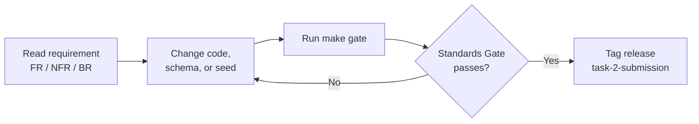
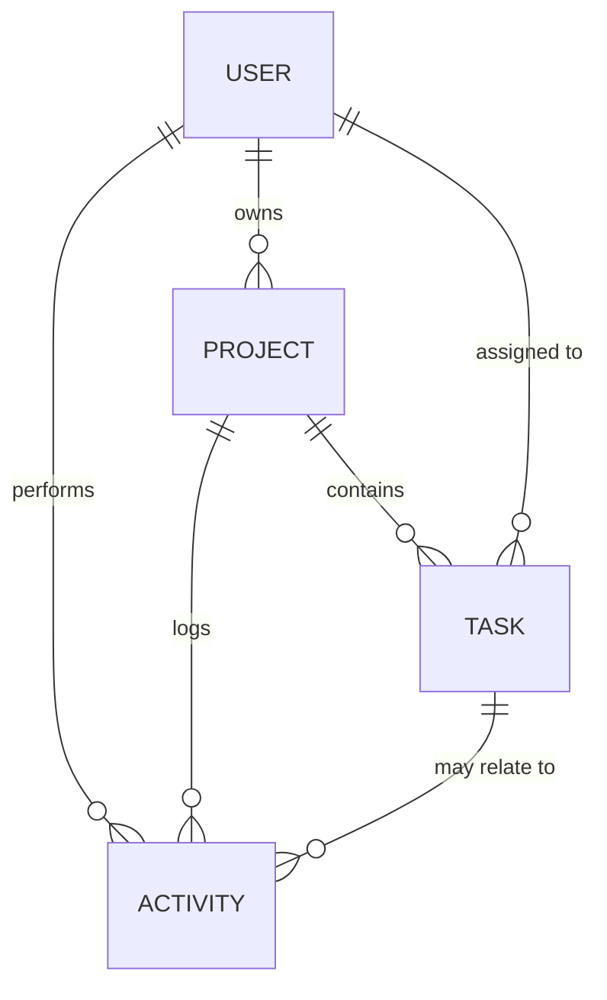
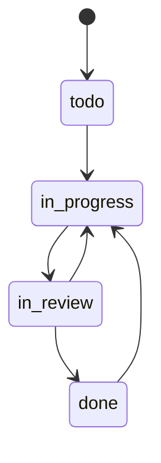
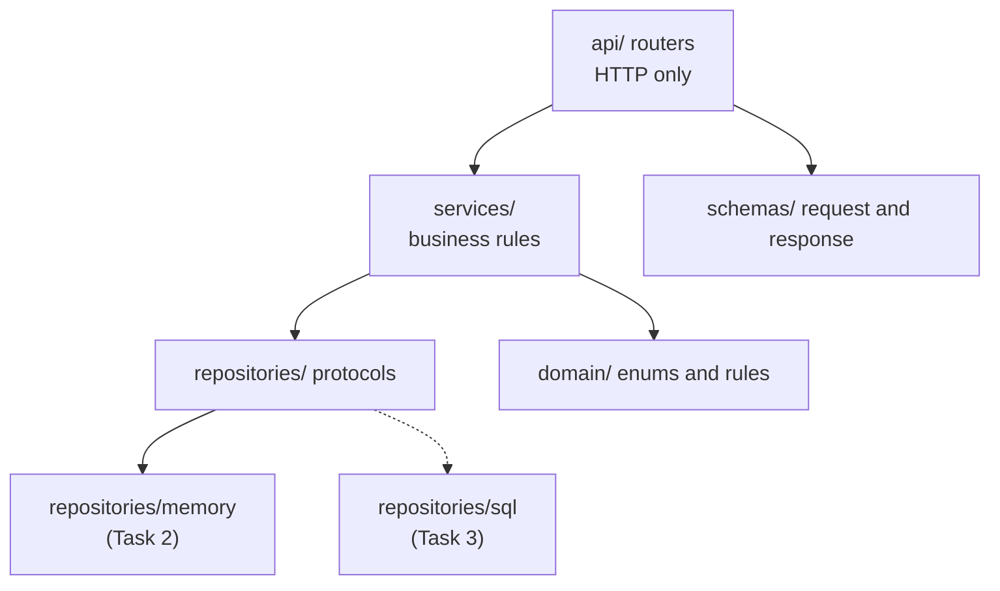
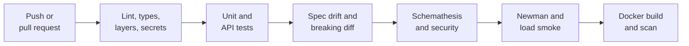

# Users, Projects & Tasks API — Engineering Standards Pack (Task 2)

2026-09-19 · @Someone

## 1. How to use this pack

Developers improve the FastAPI service until every Must item in the Standards Gate (section 11) passes. This pack extends the Task 1 pack: the API must satisfy the contract the frontend already depends on, so the dashboard can switch from mock data to this backend by changing one adapter.



| Section | Document | Primary owner | Used for |
| --- | --- | --- | --- |
| 2 | Product Vision and Scope | Product Manager | What the API is for and what is excluded |
| 3 | System Analysis | Systems Analyst | Actors, use cases, domain, business rules |
| 4 to 5 | SRS (functional, non-functional) | Systems Analyst | Testable requirements |
| 6 | API Contract | API Designer | Endpoints, status codes, errors, authorization |
| 7 | Architecture and Python Rules | Tech Lead | Layers, typing, structure, decisions |
| 8 | Data Model and Seed Data | Backend Engineer | Entities, repositories, fixtures |
| 9 | API Security and Threat Model | Security Engineer | Controls against the OWASP API Top 10 |
| 10 | Test Strategy and Traceability | QA Engineer | Proving each requirement |
| 11 | Standards Gate | Whole team | Pass or fail verification |
| 12 | Conventions, CI and Roadmap | Tech Lead | Working rules and the path to Tasks 3 and 4 |

**ID conventions.** This pack continues the Task 1 numbering without clashes: `FR-2##` and `NFR-2##` for requirements, `BR-2##` for new business rules, `TC-2##` for tests, `TH-2##` for threats, `ADR-2##` for decisions. Business rules BR-01 to BR-06 from Task 1 still apply and are now enforced on the server.

**Compatibility contract with Task 1**

| Task 1 element | Task 2 obligation |
| --- | --- |
| `TaskService.list(query)` returning `Page<Task>` | `GET /api/v1/tasks` returns `{ items, page, pageSize, total }` |
| `TaskService.updateStatus(id, status)` | `PATCH /api/v1/tasks/{id}/status` |
| Entity names, field names, and enum values (section 8 of Task 1) | Identical, with JSON in camelCase, and `createdAt` and `updatedAt` added |
| `ApiError = { error: { code, message } }` | Same envelope; `details` and `requestId` are optional additions, so the Task 1 type stays valid |
| Query names from URL filter state (`q`, `status`, `priority`, `projectId`, `sort`) | Same names on `GET /tasks` and `GET /projects` |
| Dashboard KPIs, deadlines, and activity feed | `GET /dashboard/summary` and `GET /activity` |
| Session stored in an `HttpOnly` cookie (TH-08) | API issues a Bearer token; the Next.js server layer keeps it in the cookie |
| Types generated from the OpenAPI schema (ADR-008) | The exported `openapi.json` is stable, versioned, and checked for drift in CI |

## 2. Product vision and scope

The Users, Projects and Tasks API is the backend that the Task 1 dashboard and the Task 4 AI platform depend on. It must be consistent, well validated, well documented, and secure enough to build on without rework.

**Vision.** A versioned REST API that a client team can integrate by reading its OpenAPI document alone, and that a new backend engineer can extend by following its layers.

**Consumers**

| Consumer | Needs | Delivered by |
| --- | --- | --- |
| Task 1 dashboard (TypeScript) | Lists, filters, status change, KPIs, activity, session | Sections 4 and 6 |
| Task 3 database layer | Persistence swap with no service changes | Repository contract, section 8 |
| Task 4 AI platform | Stable task and project data, authenticated access | Sections 6 and 9 |
| Evaluator and reviewers | Try endpoints quickly and judge quality | Swagger UI, Postman collection, README |

**Guide requirements and how this pack raises them**

| Guide requirement | Minimum | Standard set here |
| --- | --- | --- |
| User management endpoints | Create and read users | Registration, login, current user, list, update, delete, roles |
| Project creation and retrieval | Create, get | Create, get, list with filters, update, delete, progress summary |
| Task create, update, delete | Three operations | Plus search, filters, sorting, pagination |
| Task status management | A status field | Enforced workflow with a dedicated endpoint |
| Centralised error handling | Some error handler | One envelope, one catalogue of codes, no stack traces |
| Input validation on writes | Basic checks | Strict schemas, field-level errors, unknown fields rejected |
| Meaningful status codes | Reasonable codes | Decision table verified by tests and fuzzing |
| Environment variables | A `.env` file | Validated settings, fail-fast startup, `.env.example`, secret scan |
| API documentation | README or OpenAPI | Complete OpenAPI, examples, README, Postman collection, drift check |

**Success metrics**

| Metric | Target |
| --- | --- |
| Endpoints documented with examples and all error responses | 100% |
| `mypy --strict` errors, lint errors | 0 |
| Line coverage on `app/` | 90% or higher |
| Property-based contract test failures (Schemathesis) | 0 |
| High or critical known vulnerabilities in dependencies | 0 |

**In scope (Task 2)**

- Users, projects, tasks, activity, and dashboard summary endpoints
- Authentication with Bearer tokens and two roles
- In-memory storage behind a repository interface, plus seed data
- OpenAPI, Postman collection, README, demo video, LinkedIn post

**Out of scope (Task 2)**

- Persistent database and migrations (Task 3)
- AI endpoints (Task 4)
- Refresh tokens, password reset by email, and social login
- Real-time updates and file uploads

## 3. System analysis

The API has two human roles and one main external client. Every request is authenticated except registration, login, and health checks.

**Actors**

| Actor | Type | Responsibility |
| --- | --- | --- |
| Anonymous caller | Human or client | Registers and logs in |
| Developer | Human, role `developer` | Manages own profile, owns projects, works on tasks |
| Lead | Human, role `lead` | Everything a developer does, plus manages any user, project, or task |
| Dashboard client | System | Calls the API on behalf of a signed-in user |
| Operator | Human | Deploys, monitors health, reads logs |

**Use cases**

| ID | Use case | Actor | Main flow |
| --- | --- | --- | --- |
| UC-201 | Register | Anonymous | Submit name, email, password; account created as developer |
| UC-202 | Log in | Anonymous | Submit credentials; receive a short-lived token |
| UC-203 | View and update own profile | Authenticated | Read `/auth/me`; change name, avatar, theme |
| UC-204 | Manage users | Lead | List, change role, delete users, with safeguards |
| UC-205 | Create and browse projects | Authenticated | Create project; list with filters; open one with progress |
| UC-206 | Maintain a project | Owner or lead | Edit fields, delete an empty project |
| UC-207 | Create and edit tasks | Owner, assignee, or lead | Create in a project; edit details; delete |
| UC-208 | Move a task through its workflow | Assignee, owner, or lead | Request a new status; server checks the transition |
| UC-209 | Search and filter tasks | Authenticated | Combine text, status, priority, project, assignee, overdue |
| UC-210 | View dashboard data | Authenticated | Read KPIs, deadlines, and recent activity |
| UC-211 | Recover from errors | Client | Read the standard error envelope and act on its code |

**Domain model**



Field-level definitions are in section 8. Progress for a project is calculated, never stored.

**Business rules.** BR-01 to BR-06 from Task 1 apply unchanged: four task statuses, four priorities, progress as done over total, overdue definition, case-insensitive trimmed search, and AND across filters with OR within one filter. New rules:

| ID | Rule |
| --- | --- |
| BR-201 | Email is unique ignoring case and is stored lowercase. |
| BR-202 | Only the project owner or a lead may edit or delete a project. |
| BR-203 | Tasks may be created or deleted by the project owner or a lead; edited by the owner, the assignee, or a lead; moved between statuses by the assignee, the owner, or a lead. |
| BR-204 | Status changes follow the workflow below. Requesting the current status succeeds with no change and logs no activity. |
| BR-205 | A project in status `completed` accepts no new tasks. |
| BR-206 | A project that still has tasks cannot be deleted. |
| BR-207 | A user who owns projects cannot be deleted. Deleting any other user unassigns their tasks. |
| BR-208 | The last remaining lead cannot be deleted or demoted. |
| BR-209 | Only a lead may change a user's role. New accounts are always `developer`. |
| BR-210 | Identifiers are server-generated UUIDs; timestamps are server-set in UTC. Clients never supply either. |
| BR-211 | `completedAt` is set when a task becomes `done` and cleared when it leaves `done`. |

**Task status workflow** (identical to Task 1)



Any transition not drawn above is rejected with `409 INVALID_STATUS_TRANSITION`, and the response lists the allowed next statuses.

## 4. SRS: functional requirements

There are 34 functional requirements, 25 Must and 9 Should, and each item in the guide's Task 2 list is covered by at least one. Priority uses MoSCoW: M = must, S = should. All paths are under `/api/v1` unless stated.

| ID | Requirement | Pri | Acceptance criteria | Use case |
| --- | --- | --- | --- | --- |
| FR-201 | Register a user with `POST /users` | M | Returns 201 with a `Location` header and the user without any password data; duplicate email gives 409 `EMAIL_ALREADY_EXISTS`; role is always `developer` | UC-201 |
| FR-202 | Password policy and storage | M | 12 to 128 characters and not equal to the email; stored only as an argon2id hash | UC-201 |
| FR-203 | Log in with `POST /auth/login` | M | 200 with `accessToken`, `tokenType`, `expiresIn`; unknown email and wrong password give the same 401 `INVALID_CREDENTIALS` | UC-202 |
| FR-204 | Current user with `GET /auth/me` | M | Returns the caller; a missing, expired, or invalid token gives 401 `UNAUTHENTICATED` | UC-203 |
| FR-205 | List users with `GET /users` | M | Paginated; filter `role`; search `q` on name and email; no password data in any response | UC-204 |
| FR-206 | Get a user with `GET /users/{userId}` | M | 200, or 404 `NOT_FOUND` for an unknown id | UC-204 |
| FR-207 | Update a user with `PATCH /users/{userId}` | M | Self or lead; a non-lead may change only name, avatar, and preferences; role changes follow BR-208 and BR-209 | UC-203, UC-204 |
| FR-208 | Delete a user with `DELETE /users/{userId}` | S | Lead only; 204; BR-207 and BR-208 enforced with 409 codes | UC-204 |
| FR-209 | Create a project with `POST /projects` | M | Owner is the caller; status defaults to `planned`; 201 with `Location` | UC-205 |
| FR-210 | Get a project with `GET /projects/{projectId}` | M | Includes `progress` with `totalTasks`, `doneTasks`, `percent` per BR-03 | UC-205 |
| FR-211 | List projects with `GET /projects` | M | Filters `status` (repeatable), `ownerId`, `q`; sort by `dueDate`, `name`, `createdAt`; each item carries `progress` | UC-205 |
| FR-212 | Update a project with `PATCH /projects/{projectId}` | S | Partial update; BR-202 enforced; 200 | UC-206 |
| FR-213 | Delete a project with `DELETE /projects/{projectId}` | S | 204 when empty; 409 `PROJECT_NOT_EMPTY` otherwise (BR-206) | UC-206 |
| FR-214 | Create a task with `POST /tasks` | M | Status starts `todo`, priority defaults `medium`; unknown project gives 422 with a field error; completed project gives 409 `PROJECT_CLOSED`; BR-203 enforced; 201 | UC-207 |
| FR-215 | Get a task with `GET /tasks/{taskId}` | M | 200, or 404 `NOT_FOUND` | UC-207 |
| FR-216 | List tasks with `GET /tasks` | M | Filters `q`, `status`, `priority`, `projectId`, `assigneeId`, `overdue`, `dueBefore`, `dueAfter` combine per BR-05 and BR-06; sorted and paginated | UC-209 |
| FR-217 | Update a task with `PATCH /tasks/{taskId}` | M | Partial update of title, description, priority, due date, assignee; a `status` field is rejected with 422; BR-203 enforced | UC-207 |
| FR-218 | Delete a task with `DELETE /tasks/{taskId}` | M | 204 with no body; deleting again gives 404 | UC-207 |
| FR-219 | Change status with `PATCH /tasks/{taskId}/status` | M | Workflow of BR-204 and BR-211 enforced; invalid transition gives 409 `INVALID_STATUS_TRANSITION` listing allowed statuses | UC-208 |
| FR-220 | List a project's tasks with `GET /projects/{projectId}/tasks` | S | Same filters as FR-216; unknown project gives 404 | UC-205 |
| FR-221 | Activity feed with `GET /activity` | S | Records project created, task created, status changed, task completed; newest first; `limit` default 10, maximum 50 | UC-210 |
| FR-222 | Dashboard summary with `GET /dashboard/summary` | S | Returns `activeProjects`, `openTasks`, `overdueTasks`, `completionRate`, and `upcomingDeadlines` (next 7 days, done excluded, soonest first) | UC-210 |
| FR-223 | Role-based authorization | M | Every route except registration, login, and health requires a valid token; BR-202, BR-203, BR-209 are enforced in one shared layer; violations give 403 `FORBIDDEN` | UC-204 to UC-208 |
| FR-224 | Centralised error handling | M | Validation errors, domain errors, unknown routes, wrong methods, and unexpected exceptions all return the section 6 envelope; no stack trace ever leaves the server | UC-211 |
| FR-225 | Input validation on every write | M | Types, lengths, enums, and dates are checked; unknown fields rejected; strings trimmed; the error lists each invalid field | UC-211 |
| FR-226 | Correct HTTP status codes | M | Every endpoint follows the decision table in section 6 | UC-211 |
| FR-227 | Configuration from environment variables | M | Settings are validated at startup; a missing or invalid variable stops the app and names it; `.env.example` lists every variable | All |
| FR-228 | API documentation | M | Swagger UI at `/docs`, exported `openapi.json`, README with curl examples, Postman collection; each operation has a summary, description, example, and all error responses | All |
| FR-229 | Common list contract | M | Every list uses `page`, `pageSize` (default 20, maximum 100), `sort` (`field` or `-field`), and the same response shape | UC-209 |
| FR-230 | Versioned routes | M | Business routes live under `/api/v1`; health checks sit outside the version | All |
| FR-231 | CORS allowlist | M | Allowed origins come from the environment; no wildcard; the Task 1 origin works in development | All |
| FR-232 | Request identifiers | S | `X-Request-ID` is accepted or generated, returned in the response, the error envelope, and every log line | All |
| FR-233 | Health and readiness | S | `GET /healthz` reports the process is up; `GET /readyz` reports dependencies ready, else 503 | All |
| FR-234 | Seed data command | S | `python -m app.seed` loads the Task 1 default dataset; refuses to run when `APP_ENV=production`; passwords come from the environment, never from code | All |

Every Must requirement blocks submission. Should requirements are expected and tracked in the gate but do not block.

## 5. SRS: non-functional requirements

Each of the 25 non-functional requirements has a number and a tool that measures it, so a developer knows when it is met. Performance targets are measured locally against the in-memory store with the 500-task dataset.

| ID | Category | Requirement | Target | Verified by |
| --- | --- | --- | --- | --- |
| NFR-201 | Performance | p95 latency of list endpoints | 150 ms or less | Locust smoke test (20 users, 60 s) |
| NFR-202 | Performance | p95 latency of single-resource reads and writes | 100 ms or less | Locust smoke test |
| NFR-203 | Performance | Start to ready | 5 s or less | Startup test |
| NFR-204 | Reliability | No 5xx response contains a stack trace or internal detail | 0 leaks | Fault-injection and fuzz tests |
| NFR-205 | Reliability | Graceful shutdown finishes in-flight requests on SIGTERM | 30 s or less | Container test |
| NFR-206 | Type safety | `mypy --strict` on `app/` and `tests/` | 0 errors | CI |
| NFR-207 | Code quality | `ruff` lint and format, complexity 10 or less per function | 0 findings | CI |
| NFR-208 | Testability | Line coverage on `app/`, and each endpoint has one success and one failure test | 90% or higher | pytest-cov, endpoint coverage test |
| NFR-209 | Maintainability | Routers contain no business logic; layers import only downward | 0 violations | import-linter |
| NFR-210 | Security | No secrets in the repository or history | 0 findings | gitleaks |
| NFR-211 | Security | Dependencies and code free of high or critical findings | 0 findings | pip-audit, bandit |
| NFR-212 | Security | Passwords hashed with argon2id, never logged or returned | 0 exposures | Unit and log-scan tests |
| NFR-213 | Security | Security headers on every response, `Cache-Control: no-store` on auth responses | All present | Header test |
| NFR-214 | Security | Request body size limit | 1 MB, else 413 | API test |
| NFR-215 | Security | CORS uses an explicit allowlist | No wildcard | CORS test |
| NFR-216 | Security | Rate limit on login and registration | 5 per minute per client and email, else 429 | API test |
| NFR-217 | Observability | JSON logs with request ID, method, path, status, duration, no personal data or secrets | 100% of requests | Log test |
| NFR-218 | Operability | Liveness and readiness endpoints usable by an orchestrator | Both respond | API test |
| NFR-219 | Documentation | Every operation documented with examples and all error responses; OpenAPI validates | 100% | OpenAPI validator and doc test |
| NFR-220 | Contract quality | Property-based test of every endpoint against the OpenAPI schema | 0 failures | Schemathesis |
| NFR-221 | Compatibility | Changes to `/api/v1` are additive only; a breaking change needs `/api/v2` | 0 breaking diffs | OpenAPI diff in CI |
| NFR-222 | Deployability | Fresh clone runs in 3 commands; container runs as non-root | Both true | CI and container test |
| NFR-223 | Configuration | All configuration from environment, validated at startup | 100% | Settings tests |
| NFR-224 | Portability | Repository implementations are interchangeable | Same contract suite passes for each | Repository contract tests |
| NFR-225 | Data quality | All timestamps are UTC ISO 8601 ending in `Z`; dates are `YYYY-MM-DD` | 100% | Schema tests |

## 6. API contract

Every endpoint follows one set of conventions, so a client that learns one resource can use them all. This section is the contract; the exported `openapi.json` must match it.

**Design conventions**

| Topic | Rule |
| --- | --- |
| Base path | `/api/v1`; health checks at `/healthz` and `/readyz` |
| Resources | Plural nouns, lowercase, no verbs: `/users`, `/projects`, `/tasks` |
| JSON | UTF-8, `Content-Type: application/json`, camelCase keys |
| Identifiers | UUID v4 strings, server-generated (BR-210) |
| Dates | Date `YYYY-MM-DD`; timestamp ISO 8601 UTC ending in `Z` |
| Enums | Lowercase snake\_case values, as in Task 1 |
| Create | `POST` returns 201, the full resource, and a `Location` header |
| Partial update | `PATCH` with only the changed fields; `PUT` is not used |
| Delete | `DELETE` returns 204 with no body |
| Authentication | `Authorization: Bearer <token>`; JWT, 15-minute expiry, algorithm pinned, issuer and audience checked |
| Unknown request fields | Rejected with 422 |

**Endpoint catalogue**

| Method | Path | Success | Possible errors | FR |
| --- | --- | --- | --- | --- |
| POST | `/auth/login` | 200 | 401, 422, 429 | FR-203 |
| GET | `/auth/me` | 200 | 401 | FR-204 |
| POST | `/users` | 201 | 409, 422, 429 | FR-201 |
| GET | `/users` | 200 | 401, 422 | FR-205 |
| GET | `/users/{userId}` | 200 | 401, 404 | FR-206 |
| PATCH | `/users/{userId}` | 200 | 401, 403, 404, 409, 422 | FR-207 |
| DELETE | `/users/{userId}` | 204 | 401, 403, 404, 409 | FR-208 |
| POST | `/projects` | 201 | 401, 422 | FR-209 |
| GET | `/projects` | 200 | 401, 422 | FR-211 |
| GET | `/projects/{projectId}` | 200 | 401, 404 | FR-210 |
| PATCH | `/projects/{projectId}` | 200 | 401, 403, 404, 422 | FR-212 |
| DELETE | `/projects/{projectId}` | 204 | 401, 403, 404, 409 | FR-213 |
| GET | `/projects/{projectId}/tasks` | 200 | 401, 404, 422 | FR-220 |
| POST | `/tasks` | 201 | 401, 403, 409, 422 | FR-214 |
| GET | `/tasks` | 200 | 401, 422 | FR-216 |
| GET | `/tasks/{taskId}` | 200 | 401, 404 | FR-215 |
| PATCH | `/tasks/{taskId}` | 200 | 401, 403, 404, 422 | FR-217 |
| PATCH | `/tasks/{taskId}/status` | 200 | 401, 403, 404, 409, 422 | FR-219 |
| DELETE | `/tasks/{taskId}` | 204 | 401, 403, 404 | FR-218 |
| GET | `/activity` | 200 | 401, 422 | FR-221 |
| GET | `/dashboard/summary` | 200 | 401 | FR-222 |
| GET | `/healthz` (unversioned) | 200 | none | FR-233 |
| GET | `/readyz` (unversioned) | 200 | 503 | FR-233 |

Every authenticated endpoint can also return 500, and any endpoint can return 404 for an unknown path, 405 for a wrong method, 413 for an oversized body, and 415 for a wrong content type.

**Status code decision table**

| Code | Use when |
| --- | --- |
| 200 | A read or update succeeded and returns a body |
| 201 | A resource was created; `Location` points to it |
| 204 | A delete succeeded; no body |
| 400 | The body is not parseable JSON (`MALFORMED_REQUEST`) |
| 401 | Token or credentials are missing, invalid, or expired |
| 403 | The caller is known but not allowed (BR-202, BR-203, BR-209) |
| 404 | The resource or route does not exist |
| 405 | The method is not supported on that path |
| 409 | The request is valid but conflicts with current state: duplicates, workflow, or delete safeguards |
| 413 | The body exceeds the size limit |
| 415 | The content type is not `application/json` |
| 422 | The body or query fails validation |
| 429 | Rate limit exceeded; `Retry-After` is returned |
| 500 | Unexpected fault; the response carries only a generic message and the request ID |
| 503 | A dependency is unavailable (readiness) |

**Error envelope.** Every error, from every layer, has this shape. `details` appears for validation errors and for `INVALID_STATUS_TRANSITION`; `requestId` matches the `X-Request-ID` header.

```json
{
  "error": {
    "code": "VALIDATION_ERROR",
    "message": "One or more fields are invalid.",
    "details": [
      { "field": "title", "message": "Must be between 1 and 120 characters." }
    ],
    "requestId": "8f0c2e4a-3b1d-4f6e-9a57-2d7c1e9b5a10"
  }
}
```

| Code | HTTP | When |
| --- | --- | --- |
| `MALFORMED_REQUEST` | 400 | Body is not valid JSON |
| `UNAUTHENTICATED` | 401 | Token missing, invalid, or expired |
| `INVALID_CREDENTIALS` | 401 | Login failed; same message for unknown email and wrong password |
| `FORBIDDEN` | 403 | Role or ownership rule not met |
| `NOT_FOUND` | 404 | Unknown resource or route |
| `METHOD_NOT_ALLOWED` | 405 | Method not supported |
| `EMAIL_ALREADY_EXISTS` | 409 | BR-201 |
| `INVALID_STATUS_TRANSITION` | 409 | BR-204; `details` lists allowed statuses |
| `PROJECT_NOT_EMPTY` | 409 | BR-206 |
| `PROJECT_CLOSED` | 409 | BR-205 |
| `USER_OWNS_PROJECTS` | 409 | BR-207 |
| `LAST_LEAD` | 409 | BR-208 |
| `PAYLOAD_TOO_LARGE` | 413 | Body over 1 MB |
| `UNSUPPORTED_MEDIA_TYPE` | 415 | Not `application/json` |
| `VALIDATION_ERROR` | 422 | Any field or query parameter is invalid |
| `RATE_LIMITED` | 429 | Too many attempts |
| `INTERNAL_ERROR` | 500 | Unexpected fault |
| `SERVICE_UNAVAILABLE` | 503 | Dependency not ready |

**List contract** (all list endpoints, FR-229)

| Element | Rule |
| --- | --- |
| Pagination | `page` from 1, `pageSize` default 20, maximum 100; larger values give 422 |
| Sorting | `sort=field` ascending or `sort=-field` descending; unknown field gives 422; ties broken by `id` for stable order |
| Response | `{ "items": [...], "page": 1, "pageSize": 20, "total": 134 }` |
| Repeated filters | `status=todo&status=in_review` means OR inside one filter; different filters combine with AND |
| Task sort fields | `dueDate`, `priority`, `title`, `createdAt` |
| Search | `q` matches title and description, trimmed, case-insensitive (BR-05) |

**Authorization matrix** (A = any authenticated user, O = project owner, S = assignee, L = lead)

| Action | Allowed |
| --- | --- |
| Register, log in, health | Anyone |
| Read users, projects, tasks, activity, summary | A |
| Update own profile | Self |
| Update another user, change role, delete user | L |
| Create project | A |
| Update or delete project | O or L |
| Create or delete task | O or L |
| Update task details | O, S, or L |
| Change task status | O, S, or L |

## 7. Architecture, Python rules and decisions

The service is a layered FastAPI application in which HTTP handling, business rules, and storage are separate, and storage sits behind an interface. That separation is what lets Task 3 replace the in-memory store with a database without touching a single route or rule.

**Stack**

| Concern | Choice |
| --- | --- |
| Language and framework | Python 3.12, FastAPI, Uvicorn |
| Validation and settings | Pydantic v2, pydantic-settings |
| Authentication | PyJWT for tokens, argon2-cffi for password hashing |
| Rate limiting | slowapi (in-memory; see limitation in section 9) |
| Dependencies | `pyproject.toml` with `uv` and a committed lockfile |
| Quality | ruff, mypy strict, import-linter |
| Tests | pytest, httpx `AsyncClient`, pytest-cov, Schemathesis, Locust |
| Security tooling | bandit, pip-audit, gitleaks |
| Packaging | Docker image, non-root user |
| Documentation | Built-in OpenAPI and Swagger UI, exported spec, generated Postman collection |

**Layers and allowed dependencies**



Dependencies point downward only. Routers call services and never contain rules; services never import FastAPI or return HTTP objects. An import-linter contract fails the build if either is broken.

**Folder structure**

```text
backend/
  app/
    main.py              app factory, middleware, router registration
    core/                config.py, errors.py, handlers.py, security.py,
                         logging.py, middleware.py, clock.py
    api/
      deps.py            current user, pagination, repositories
      v1/                auth.py users.py projects.py tasks.py
                         activity.py dashboard.py
      health.py
    schemas/             Pydantic request and response models
    services/            UserService, ProjectService, TaskService, ...
    repositories/
      base.py            async Protocol interfaces
      memory/            in-memory implementations
    domain/              enums, workflow table, business rule functions
    seed/                seed command and dataset builder
  tests/                 unit/, api/, contract/, security/, load/
  docs/                  openapi.json, postman_collection.json, ADRs
  pyproject.toml  uv.lock  Makefile  Dockerfile  .env.example  README.md
```

**Python rules (enforced, not advisory)**

| Rule | Setting |
| --- | --- |
| Typing | Every function annotated; `mypy --strict`; no `Any` in public signatures; `# type: ignore` needs an error code and a reason |
| Schemas | API models separate from domain data; `extra="forbid"`, whitespace stripped, camelCase aliases, one shared base class |
| Async | Handlers and repository methods are `async`; password hashing runs in a thread pool so it never blocks the event loop |
| Errors | Services raise `AppError` subclasses carrying code, HTTP status, and message; only central handlers build responses; services never raise `HTTPException` |
| Dependency injection | Settings, repositories, clock, and current user come through `Depends`; no module-level mutable state |
| Time and identifiers | Injected clock and ID factory, so tests are deterministic |
| Logging | Structured JSON through one logger; no `print`; never log passwords, tokens, or request bodies |
| Complexity | Functions of 10 or lower cyclomatic complexity (ruff C901) |
| Configuration | One `Settings` class; every field appears in `.env.example` (tested) |

**Architecture decision records**

| ADR | Decision | Reason |
| --- | --- | --- |
| ADR-201 | FastAPI with Pydantic v2 | Guide-approved; typed validation and generated OpenAPI |
| ADR-202 | Layered design with repository protocols | Storage can change in Task 3 without touching services |
| ADR-203 | In-memory repositories in Task 2 | The database is a Task 3 deliverable; state resets on restart |
| ADR-204 | Stateless Bearer JWT | Simple to test in Swagger and Postman; the Next.js server layer holds the cookie, so the API needs no CSRF handling |
| ADR-205 | argon2id for passwords | Current recommended memory-hard hash |
| ADR-206 | One error envelope and an `AppError` hierarchy | Consistent errors and one place to change them |
| ADR-207 | 422 for validation, 409 for state conflicts | Separates bad input from valid input that clashes with state |
| ADR-208 | URL versioning with additive-only changes | Clients such as the dashboard are never broken silently |
| ADR-209 | Page and pageSize pagination | Matches Task 1 `Page<T>`; cursor pagination is revisited if data grows |
| ADR-210 | Locked, pinned dependencies | Reproducible builds and auditable supply chain |
| ADR-211 | Committed `openapi.json` with a drift check | Single contract for docs, Postman, and Task 1 generated types |

## 8. Data model, repository contract and seed data

The four entities match Task 1 field for field and add only audit timestamps, so the dashboard's types keep working. Storage is in memory behind async repository protocols, and the same contract tests must pass for every implementation, including the SQL one in Task 3.

**Entities and constraints**

| Entity | Field | Type and constraint |
| --- | --- | --- |
| User | `id` | UUID, server-generated |
| User | `name` | String, 1 to 80 characters after trimming |
| User | `email` | Valid email, at most 254 characters, unique ignoring case, stored lowercase |
| User | `passwordHash` | argon2id hash; internal only, never in any response |
| User | `role` | `developer` or `lead` |
| User | `avatarUrl` | Optional `https` URL, at most 2048 characters; stored, never fetched by the server |
| User | `preferences.theme` | `light`, `dark`, or `system`; default `system` |
| Project | `id` | UUID, server-generated |
| Project | `name` | String, 1 to 80 characters |
| Project | `description` | String, at most 2000 characters, default empty |
| Project | `status` | `planned`, `active`, `on_hold`, or `completed`; default `planned` |
| Project | `dueDate` | Optional date |
| Project | `ownerId` | User id; the creator |
| Project | `progress` | Calculated `totalTasks`, `doneTasks`, `percent`; never stored |
| Task | `id`, `projectId` | UUIDs; project must exist |
| Task | `title` | String, 1 to 120 characters |
| Task | `description` | String, at most 4000 characters, default empty |
| Task | `status` | `todo`, `in_progress`, `in_review`, `done`; default `todo` |
| Task | `priority` | `low`, `medium`, `high`, `urgent`; default `medium` |
| Task | `dueDate` | Optional date |
| Task | `assigneeId` | Optional user id; null when unassigned |
| Task | `completedAt` | Optional timestamp, set and cleared by BR-211 |
| Activity | `id`, `actorId`, `projectId`, `taskId` (optional), `type`, `at` | `type` is `created`, `status_changed`, or `completed` |
| All except Activity | `createdAt`, `updatedAt` | UTC timestamps, server-set |

**Repository contract** (async protocols; services depend only on these)

```python
class TaskRepository(Protocol):
    async def get(self, task_id: UUID) -> Task | None: ...
    async def list(self, query: TaskQuery) -> Page[Task]: ...
    async def add(self, task: Task) -> Task: ...
    async def update(self, task: Task) -> Task: ...
    async def delete(self, task_id: UUID) -> bool: ...
    async def progress_for(self, project_id: UUID) -> Progress: ...
```

`UserRepository`, `ProjectRepository`, and `ActivityRepository` follow the same pattern: `get`, `list` (query object in, `Page` out), `add`, `update`, `delete`, plus the few lookups their rules need, such as `get_by_email` and `count_leads`. Query objects carry filters, sort, and pagination, so services never build storage-specific queries.

**Storage rules for Task 2**

- State lives in process memory and is lost on restart; the service runs with one worker.
- Writes take a single asyncio lock per repository so concurrent requests cannot interleave.
- Repositories return copies, never live internal objects.
- A repository contract suite under `tests/contract/` runs against every implementation.

**Seed data** (`python -m app.seed --profile <name>`)

| Profile | Contents | Purpose |
| --- | --- | --- |
| `default` | 4 users including 1 lead, 8 projects (one with no tasks, one completed, one on hold), 60 tasks across all statuses and priorities, 40 activity items | Matches the Task 1 `default` scenario |
| `empty` | Users only | Matches the Task 1 `empty` scenario |
| `large` | 40 projects and 500 tasks | Matches the Task 1 `large` scenario; used by load tests |

Seed dates are computed relative to today, so overdue, due-today, and upcoming items always exist. The seed command refuses to run when `APP_ENV=production`, reads the seed password from `SEED_PASSWORD`, and otherwise generates a random one and prints it once. No default credentials exist in code or documentation.

## 9. API security and threat model

The main risks for this API are broken object and function authorization, weak authentication, over-exposed data, and unrestricted requests. Each threat below has a control that is written into a requirement and proved by a test.

**Assets and trust boundaries.** Assets: user accounts and password hashes, tokens, project and task data, and the signing secret. Everything that crosses the network is untrusted: bodies, query strings, headers, and tokens. The signing secret and configuration come only from the environment.

**Threats and controls** (OWASP API Security Top 10 2023 in brackets)

| ID | Threat | Control | Verified by |
| --- | --- | --- | --- |
| TH-201 | A user reads or edits objects they should not \[API1, API5\] | One authorization layer applies BR-202, BR-203, BR-209 to every route; deny by default | TC-300 role by endpoint matrix |
| TH-202 | Token forgery or replay \[API2\] | Algorithm pinned (`none` rejected); signature, `exp`, `iss`, `aud` checked; secret of 32 bytes or more from the environment; 15-minute expiry | TC-301 |
| TH-203 | Credential guessing and user enumeration \[API2, API6\] | Rate limit on login and registration; identical response for unknown email and wrong password; dummy hash check equalises timing | TC-302, TC-202 |
| TH-204 | Passwords stolen from storage or logs \[API2\] | argon2id only; passwords and tokens never logged or returned | TC-208, log scan |
| TH-205 | Mass assignment and over-exposure \[API3\] | Separate request and response schemas; `extra="forbid"`; `role`, `id`, `ownerId`, timestamps not writable by clients; no `passwordHash` in any response | TC-251, TC-303 |
| TH-206 | Resource exhaustion \[API4\] | Body limit of 1 MB, `pageSize` maximum of 100, query length limits, request timeout | TC-305, TC-252 |
| TH-207 | SSRF through user-supplied URLs \[API7\] | `avatarUrl` is validated as `https` and stored only; the server never fetches it | Schema test |
| TH-208 | Misconfiguration and leaked internals \[API8\] | Fail-fast settings; secure headers; no stack traces; CORS allowlist; debug off in production; docs UI toggle by environment | TC-270, TC-304 |
| TH-209 | Undocumented or forgotten endpoints \[API9\] | Exported OpenAPI checked for drift; only documented routes exist; contract fuzzing | TC-281, TC-253 |
| TH-210 | Injection through fields \[API3\] | Typed validation; no string-built queries; strings are data everywhere; output is JSON only | TC-250 |
| TH-211 | Vulnerable dependencies or leaked secrets \[API8\] | Locked and pinned dependencies; pip-audit, bandit, and gitleaks gates | TC-271, TC-294 |
| TH-212 | Attacks on Task 4 AI endpoints \[API10, LLM Top 10\] | Deferred: model output treated as untrusted; reviewed in Task 4 | Task 4 gate |

**Security controls in one place**

| Control | Setting |
| --- | --- |
| Token | JWT, 15 minutes, claims `sub`, `role`, `iss`, `aud`, `iat`, `exp`; role re-read from the store on each request so demotion takes effect immediately |
| Password policy | 12 to 128 characters, not equal to email, hashed with argon2id in a thread pool |
| Response headers | `X-Content-Type-Options: nosniff`, `Cache-Control: no-store` on auth routes, `Content-Security-Policy: default-src 'none'` on API responses |
| CORS | Allowlist from environment, credentials disabled, methods and headers listed explicitly |
| Rate limit | 5 attempts per minute per client and email on login and registration; `429` with `Retry-After` |
| Logging | Request ID, method, path, status, duration; no bodies, passwords, tokens, or emails beyond a user id |
| Docs UI | Swagger UI and ReDoc enabled in development, disabled by setting in production |

**Known limitation.** The in-process rate limiter counts per worker, so it is only accurate with one worker. Task 3 deployment replaces its store with a shared one.

**Frontend session (from Task 1, TH-08).** The API returns a Bearer token. The Next.js server layer stores it in an `HttpOnly`, `Secure`, `SameSite` cookie and attaches it to API calls, so the browser's JavaScript never reads the token.

## 10. Test strategy and traceability

Automated tests carry the proof: each guide requirement traces to functional requirements and to named tests, so a failing test points straight to the broken rule. Every test runs against the real application with in-memory repositories, not against mocked services.

**Test levels**

| Level | Tool | Scope | Runs |
| --- | --- | --- | --- |
| Static | ruff, mypy strict, import-linter, gitleaks | Style, types, layer boundaries, secrets | Every commit |
| Unit | pytest | Business rules: workflow, progress, overdue, filters, password policy | Every commit |
| API | pytest and httpx `AsyncClient` | Every endpoint: success and failure paths, headers, bodies | Every commit |
| Contract | Schemathesis, repository contract suite, OpenAPI drift and diff | Spec matches behaviour; repositories interchangeable | Every pull request |
| Security | pytest, pip-audit, bandit | Authorization matrix, token attacks, rate limits, headers | Every pull request |
| Load | Locust | Latency targets on the `large` seed | Every pull request |
| Client | Newman | Postman collection runs with 0 failures against a live instance | Every pull request |

**Traceability matrix**

| Guide requirement | Requirements | Tests |
| --- | --- | --- |
| User management endpoints | FR-201 to FR-208, FR-223, NFR-212 | TC-201 register, TC-202 login and enumeration, TC-203 current user and token errors, TC-204 user CRUD, TC-205 role and self-update rules, TC-206 last lead and ownership, TC-207 password policy, TC-208 hashing and non-exposure |
| Project creation and retrieval | FR-209 to FR-213, FR-229 | TC-210 create and get with progress, TC-211 list, filters, sort, pagination, TC-212 update, TC-213 delete and not-empty |
| Task create, update, delete | FR-214 to FR-218, FR-220 | TC-220 create, TC-221 get, TC-222 list and filter combination, TC-223 update, TC-224 delete, TC-225 project task list |
| Task status management | FR-219, BR-204, BR-211 | TC-230 every valid transition, TC-231 every invalid transition with allowed list, TC-232 same-status no-op, TC-233 `completedAt` set and cleared |
| Centralised error handling | FR-224, NFR-204 | TC-240 envelope for every error class, TC-241 fault injection leaks nothing, TC-242 unknown route and wrong method |
| Input validation on writes | FR-225, NFR-220 | TC-250 invalid input per write endpoint, TC-251 unknown and non-writable fields, TC-252 boundaries and query limits, TC-253 Schemathesis |
| Correct HTTP status codes | FR-226 | TC-260 status-code matrix built from section 6, TC-261 `Location` on 201, TC-262 empty body on 204 |
| Environment variables and secrets | FR-227, NFR-210, NFR-223 | TC-270 missing or invalid settings stop startup, TC-271 secret scan, TC-272 `.env.example` lists every setting |
| Clear API documentation | FR-228, FR-230, NFR-219, NFR-221 | TC-280 OpenAPI valid and complete, TC-281 exported spec equals generated, TC-282 Newman run, TC-283 README examples execute, TC-284 no breaking diff |
| Dashboard support | FR-221, FR-222 | TC-312 activity feed, TC-313 dashboard summary |
| Platform behaviour | FR-231 to FR-234, NFR-213 to NFR-218 | TC-304 CORS, TC-305 body and content-type limits, TC-306 security headers, TC-309 request ID and JSON logs, TC-310 health and readiness, TC-311 seed command |
| Security | FR-223, NFR-216 | TC-300 authorization matrix, TC-301 token tampering, TC-302 rate limit, TC-303 no sensitive field in any response |
| Quality bar | NFR-201 to NFR-209, NFR-211, NFR-222, NFR-224, NFR-225 | TC-290 load and startup, TC-291 mypy, TC-292 ruff, TC-293 coverage and endpoint coverage, TC-294 pip-audit and bandit, TC-295 container and shutdown, TC-307 layer contract, TC-308 repository contract suite, TC-315 date and timestamp formats |

**Rules for tests**

- A test's name starts with its `TC-###` and names the requirement it proves.
- A test walks the OpenAPI operations and fails if any endpoint lacks a success test and a failure test (NFR-208).
- The authorization matrix (TC-300) is generated from the table in section 6, so a new endpoint cannot ship without a row.
- Tests use an injected clock and ID factory, so results are deterministic.
- A bug fix adds a test that failed before the fix.

## 11. Standards Gate

The API is submission-ready only when every Must item below passes; anything failing goes back into the loop from section 1. Part A is one command, and parts B to H are checked by a reviewer who did not write the code, using Swagger UI and the Postman collection.

**A. Automated gate**

```bash
make gate         # runs the targets below in order and stops at the first failure

make lint         # ruff check and format check, complexity 10 or less
make typecheck    # mypy --strict on app and tests
make layers       # import-linter: routers hold no rules, layers point downward
make test         # pytest with coverage, fails under 90%
make contract     # Schemathesis against a running app, repository contract suite
make spec-check   # exported openapi.json equals generated, no breaking diff
make security     # pip-audit, bandit, gitleaks
make postman      # build collection, run with Newman against a live instance
make load         # Locust smoke test on the large seed, latency budgets
make docker       # image builds, runs as non-root, health check passes
```

**B. API design consistency review**

- [ ] Every resource uses plural nouns, camelCase JSON, UUIDs, and the date formats of section 6
- [ ] Every create returns 201 with `Location`; every delete returns 204 with no body
- [ ] Every list uses the common contract and the same response shape (FR-229)
- [ ] Types generated from `openapi.json` compile in the Task 1 project with no manual edits

**C. Validation and error review**

- [ ] Each write endpoint rejects a wrong type, an empty value, an over-long value, and an unknown field, and the error names each field (FR-225)
- [ ] Every error class in section 6 returns the envelope, and `requestId` matches the header (FR-224)
- [ ] A forced server fault returns a generic 500 with no internal detail (NFR-204)

**D. Status code review**

- [ ] A reviewer tries the cases below by hand in Swagger UI and each matches the decision table: no token, wrong role, unknown id, duplicate email, invalid transition, bad JSON, invalid field, oversized body (FR-226)

**E. Business rule review**

- [ ] Each valid and invalid status transition behaves per BR-204 and BR-211
- [ ] BR-201 to BR-209 are each demonstrated once through the API
- [ ] Progress, overdue, search, and filter results match BR-03 to BR-06 on the seed data

**F. Documentation review**

- [ ] Every operation in Swagger UI has a summary, description, request example, response example, and its error responses (FR-228)
- [ ] README gives setup in 3 commands, an environment variable table, an authentication walkthrough, a curl example per resource, the error catalogue, and how to run the gate
- [ ] The Postman collection imports with its environment and runs cleanly
- [ ] A person new to the project completes log in, create project, create task, and change status using the documentation alone

**G. Security and configuration review**

- [ ] The app refuses to start without the signing secret, and the message names the missing variable (FR-227)
- [ ] `.env` is not committed, `.env.example` is complete, and no default credentials exist anywhere
- [ ] Swagger UI is disabled when the production setting is on

**H. Delivery**

- [ ] Commits follow `type(scope): description` with scopes `api`, `auth`, `env`, `docs`, committed file by file in logical groups
- [ ] Git tag `task-2-submission` created on the passing commit
- [ ] Demo video shows: log in, create project, create task, invalid status transition, validation error, unauthorised call, and a 404
- [ ] LinkedIn post published

**Failure handling.** A failed item gets a defect note naming the requirement ID, the fix, and the test that now covers it; the gate is then rerun in full.

## 12. Conventions, CI and scaling roadmap

The gate that developers run locally runs unchanged in CI on every pull request, so the standard cannot be skipped. The roadmap shows what Tasks 3 and 4 change, so the team scales this service instead of rewriting it.

**Repository and Git conventions**

| Topic | Rule |
| --- | --- |
| Layout | Same monorepo as Task 1: `frontend/`, `backend/`, `database/`, `docs/`; Task 2 lives in `backend/` |
| Branching | `task/2-backend` for the work; short-lived feature branches merged by pull request |
| Commits | `type(scope): description`; scopes `api`, `auth`, `env`, `docs`, `deploy`; committed file by file in logical groups, not in one bulk commit |
| Releases | Tag `task-2-submission` on the commit that passes the gate |
| Environment | `.env.example` committed with every variable; real `.env` never committed |
| Spec | `docs/openapi.json` regenerated and committed with any API change |

**CI pipeline**



Each stage blocks the next, and a pull request cannot merge until all stages pass.

**Pull request definition of done:** requirement IDs listed, tests added or updated, `openapi.json` regenerated, Postman collection regenerated, README updated when behaviour changes, and the affected gate items ticked.

**Scaling roadmap**

| Task | Backend change | Documents to update | Gate additions |
| --- | --- | --- | --- |
| 3. Database | Add `repositories/sql`; migrations; transactions in services; shared rate-limit store; multiple workers | Data model and ERD, storage rules in section 8, ADR-203 superseded | Repository contract suite passes for SQL; migration up and down checks; data integrity tests; load test on real data |
| 4. AI platform | Add AI endpoints under `/api/v1`; server-side prompt handling, output filtering, cost and rate limits; streaming responses | API contract, threat model TH-212, new NFRs for latency and cost | LLM Top 10 review, prompt-injection tests, usage-limit tests |
| Beyond the internship | Refresh tokens, password reset, audit log, observability with traces and metrics, cursor pagination, background jobs | Full SRS revision, runbook, incident process | Load and soak tests, alerting checks, release checklist |

**Change control.** A new or changed requirement gets a new ID or a version note, its tests are added in the same pull request, and the traceability matrix in section 10 is updated so it never drifts from the code. A breaking API change needs a new version prefix, never an edit to `/api/v1`.
