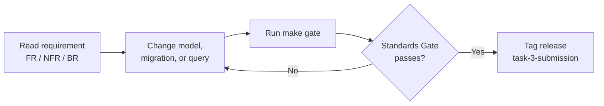
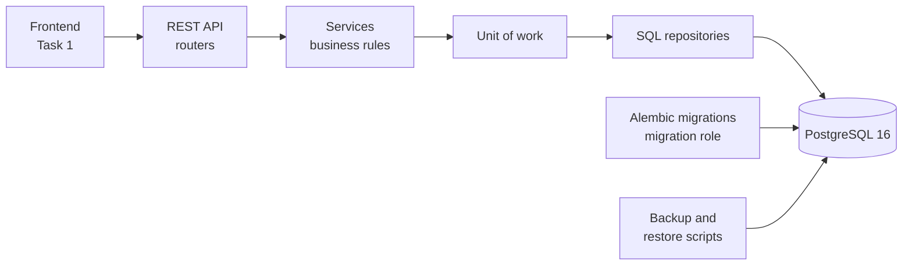
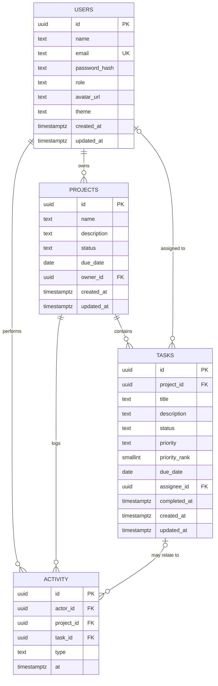
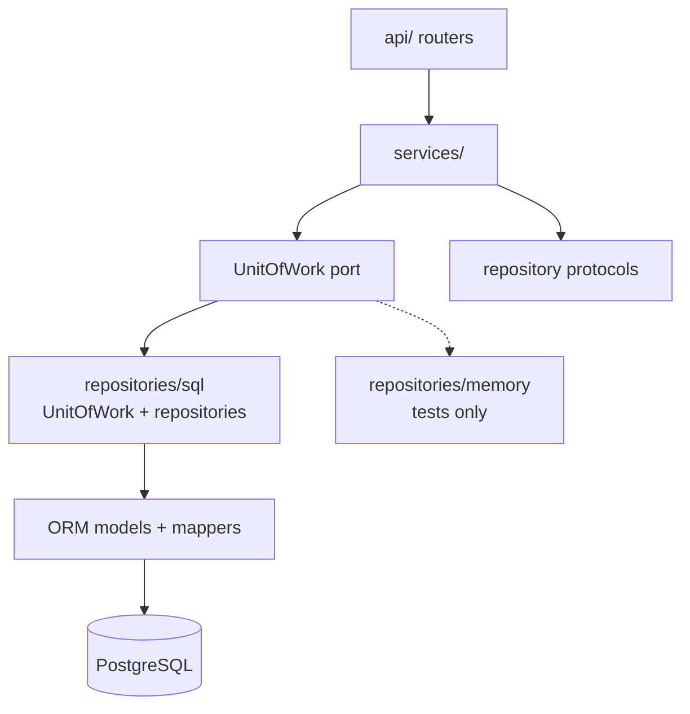
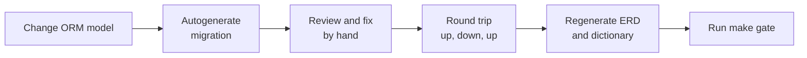
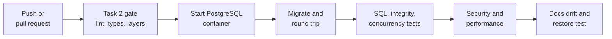

# Persistent Data Layer — Engineering Standards Pack (Task 3)

2026-09-19 · @Someone

## 1. How to use this pack

Developers replace the in-memory storage of Task 2 with PostgreSQL and iterate until every Must item in the Standards Gate (section 11) passes. The API contract stays exactly as it is, so the Task 1 dashboard and every Task 2 test keep working without changes.



| Section | Document | Primary owner | Used for |
| --- | --- | --- | --- |
| 2 | Product Vision and Scope | Product Manager | What changes, what does not, and why PostgreSQL |
| 3 | System Analysis | Systems Analyst | Data flow, use cases, lifecycle, business rules |
| 4 to 5 | SRS (functional, non-functional) | Systems Analyst | Testable requirements |
| 6 | Database Design | Data Architect | Tables, constraints, relationships, indexes |
| 7 | Architecture and Decisions | Tech Lead | SQL repositories, transactions, error mapping |
| 8 | Configuration, Migrations and Operations | Backend Engineer | Secrets, roles, migrations, seed, backup |
| 9 | Data Security and Threat Model | Security Engineer | Controls for credentials, access, and data |
| 10 | Test Strategy and Traceability | QA Engineer | Proving each requirement |
| 11 | Standards Gate | Whole team | Pass or fail verification |
| 12 | Conventions, CI and Roadmap | Tech Lead | Working rules and the path to Task 4 |

**ID conventions.** This pack continues the numbering without clashes: `FR-3##` and `NFR-3##` for requirements, `BR-3##` for new business rules, `TC-3##` for tests, `TH-3##` for threats, `ADR-3##` for decisions. Earlier rules BR-01 to BR-06 and BR-201 to BR-211 still apply unchanged.

**Compatibility contract with Tasks 1 and 2**

| Earlier element | Task 3 obligation |
| --- | --- |
| Repository protocols (Task 2, section 8) | Method signatures unchanged; two additive changes only: locking reads and a `UnitOfWork` port (ADR-303) |
| Business rules BR-01 to BR-06, BR-201 to BR-211 | Same behaviour; where a rule can be expressed as a constraint, the database enforces it too |
| Error envelope and code catalogue | Unchanged; database errors translate into the existing codes and add none |
| `/api/v1` contract and `openapi.json` | Unchanged; the spec diff must be empty apart from documented readiness details |
| Seed profiles `default`, `empty`, `large` | Same content on PostgreSQL, plus a new `xl` profile for performance tests |
| Task 2 repository contract suite (NFR-224) | Runs against both the memory and the SQL implementation, with identical results |
| Task 2 Standards Gate | Still passes; `make gate` is extended, never replaced |
| Task 2 ADR-203 (in-memory storage) | Superseded by ADR-301 to ADR-303; the memory backend remains for fast unit tests only |
| Task 1 dashboard | Works unchanged against the PostgreSQL-backed API |
| Task 2 roadmap row for Task 3 | This pack drops the shared rate-limit store and multi-worker items from Task 3; the single-worker limitation stays documented (section 2) |

## 2. Product vision, scope and database decision

Task 3 makes user, project, and task data survive restarts, with relationships and validation enforced by the database itself, and with credentials handled so that none live in code. The architecture chain from the guide is Frontend to REST API to Backend to Database, and only its last link changes.

**Vision.** A data layer that stays correct even when the API is bypassed, that a new engineer can understand from its schema diagram, and that Task 4 can extend with new tables through migrations.

**Guide requirements and how this pack raises them**

| Guide requirement | Minimum | Standard set here |
| --- | --- | --- |
| User, project, and task data storage | Tables or collections exist | Typed, constrained tables with named constraints and audit timestamps |
| Full CRUD across all entities | CRUD works | Every Task 2 endpoint passes its full test suite on PostgreSQL, atomically |
| Validation at database level | Some required fields | NOT NULL, lengths, enums, uniqueness, and status consistency as constraints, proved by bypass tests |
| Relationships between entities | Ids stored as references | Foreign keys with a deliberate delete rule for each, indexed, and tested |
| Secure configuration | Credentials in `.env` | Env-only secrets, separate migration and application roles, TLS in production, redacted logs, secret scanning |
| Schema in repository | Models committed | Reversible migrations, generated ERD and data dictionary, drift checks |

**Database engine decision.** The guide allows MongoDB, MySQL, or PostgreSQL. This pack chooses PostgreSQL 16 (ADR-301).

| Criterion | PostgreSQL | MySQL 8 | MongoDB |
| --- | --- | --- | --- |
| Relationships enforced by the database | Foreign keys with delete rules | Foreign keys with delete rules | No foreign keys; references are kept by application code |
| Schema-level validation | NOT NULL, CHECK, unique, generated columns | Same, with CHECK enforced from 8.0.16 | Optional `$jsonSchema` validation, no cross-collection rules |
| Multi-record transactions | Full, default | Full with InnoDB | Needs a replica set |
| Partial indexes and trigram search | Both supported | Neither; full-text indexes only | Text indexes only |
| Fit for Task 4 (AI) | `pgvector` extension for embeddings | No comparable extension | Vector search in Atlas |
| Fit for this data | Strongly relational: users, projects, tasks | Strongly relational | Document model gains little here |

The evaluation rewards schema design, correct relationships, and validation. All three are strongest when the database enforces them, which favours a relational engine, and PostgreSQL's constraints and indexes give the most control.

**Success metrics**

| Metric | Target |
| --- | --- |
| Task 2 API and contract suites passing on PostgreSQL | 100%, no test changed to pass |
| Invalid direct-SQL writes accepted by the database | 0 of the defined matrix |
| Orphaned rows after any test run | 0 |
| Credentials found in repository, history, compose files, or logs | 0 |
| p95 latency of list endpoints on the `xl` seed | 200 ms or less |

**In scope (Task 3)**

- PostgreSQL schema for users, projects, tasks, and activity, created only through migrations
- SQL repository implementations and a unit of work for transactions
- Configuration, roles, TLS, and secrets handling for local, test, and production
- Seed profiles, backup and restore procedure, generated schema documentation
- Schema and models in the repository, demo video of live CRUD, LinkedIn post

**Out of scope (Task 3)**

- AI features and their tables (Task 4)
- A shared rate-limit store and multi-worker deployment: the in-process limiter and the single-worker limit from Task 2 remain and stay documented
- Read replicas, sharding, and soft delete with audit trails (roadmap, section 12)
- Migrating existing production data, because Task 2 data was in memory

## 3. System analysis

The database is reached only through the API service, and the API reaches it only through SQL repositories inside a transaction boundary. Nothing in the frontend, routers, or business rules knows that PostgreSQL exists.



The application connects with a limited role; only the migration step uses the role that may change the schema.

**Actors**

| Actor | Type | Responsibility |
| --- | --- | --- |
| API service | System | Reads and writes data through the application role |
| Developer | Human | Changes models, writes migrations, runs the gate |
| Operator | Human | Provisions the database, sets secrets, runs backups and restores |
| CI pipeline | System | Starts a disposable PostgreSQL, runs migrations and the full test suite |
| Reviewer | Human | Inspects the schema, relationships, and configuration |

**Use cases**

| ID | Use case | Actor | Main flow |
| --- | --- | --- | --- |
| UC-301 | Persist and reload data | API service | Data written through the API is still there after the API and database restart |
| UC-302 | Create the schema | Developer, CI | Run migrations against an empty database and get the full schema |
| UC-303 | Change the schema safely | Developer | Change a model, generate and review a migration, prove it goes up and down |
| UC-304 | Enforce integrity independently of the API | Database | Reject invalid rows and orphans even when written directly |
| UC-305 | Run multi-step operations atomically | API service | Create a task and its activity together, or neither |
| UC-306 | Resolve concurrent conflicting requests | API service | Two simultaneous status changes or lead demotions end in a valid state |
| UC-307 | Seed data | Developer | Load a named profile into an empty or reset non-production database |
| UC-308 | Back up and restore | Operator | Take a dump, restore it into a scratch database, verify it matches |
| UC-309 | Survive a database outage | API service | Return a clean 503, then recover with no restart |
| UC-310 | Review the schema | Reviewer | Read the generated ERD and data dictionary, and try invalid inserts |

**Data lifecycle**

| Stage | Rule |
| --- | --- |
| Create | The application validates first for a clear error; the database validates again as the last line of defence |
| Read | Lists are paginated in SQL; progress is calculated by aggregation, never stored |
| Update | Partial updates change only sent fields and refresh `updated_at` from the injected clock |
| Delete | Hard delete with the referential actions below; no soft delete in Task 3 |
| Change history | The `activity` table is a feed, not an audit log |

**Business rules.** BR-01 to BR-06 and BR-201 to BR-211 apply unchanged. New rules:

| ID | Rule |
| --- | --- |
| BR-301 | Every relationship has a defined delete behaviour, listed in the table below. |
| BR-302 | A rule that a constraint can express is enforced by the database as well as by the application. No such rule lives in application code alone. |
| BR-303 | A task's `completed_at` is set if and only if its status is `done` (BR-211 as a constraint). |
| BR-304 | Project progress and dashboard totals are calculated from tasks at read time and never stored. |
| BR-305 | An operation that changes more than one row or table succeeds or fails as a whole. |
| BR-306 | A status change checks the current status while holding a row lock; the last-lead check locks the lead rows (BR-204, BR-208). |
| BR-307 | The application supplies the current time and date to queries; business logic never relies on the database clock. |
| BR-308 | The characters `%`, `_`, and `\` in a search term match literally, and a search term is at most 100 characters. |
| BR-309 | Priority sorts by importance (`urgent` highest), not alphabetically; a missing due date sorts last in both directions. |
| BR-310 | The schema changes only through migrations; nobody edits a deployed schema by hand. |

**Referential actions (BR-301)**

| Relationship | On delete of the parent | Why |
| --- | --- | --- |
| `projects.owner_id` to users | Restrict | A user who owns projects cannot be deleted (BR-207) |
| `tasks.project_id` to projects | Restrict | A project that has tasks cannot be deleted (BR-206) |
| `tasks.assignee_id` to users | Set null | Deleting a user unassigns their tasks (BR-207) |
| `activity.project_id` to projects | Cascade | History of a deleted, empty project has no meaning |
| `activity.actor_id` to users | Cascade | The feed shows people who exist; audit history is a roadmap item |
| `activity.task_id` to tasks | Set null | The feed entry stays, and `taskId` is already optional in the API |

## 4. SRS: functional requirements

There are 26 functional requirements, 22 Must and 4 Should, and every item in the guide's Task 3 list is covered by at least one. Priority uses MoSCoW: M = must, S = should.

| ID | Requirement | Pri | Acceptance criteria | Use case |
| --- | --- | --- | --- | --- |
| FR-301 | Persist users | M | Every user field of Task 2 section 8 is stored in `users`; data is intact after restarting both API and database | UC-301 |
| FR-302 | Persist projects | M | Every project field is stored in `projects`, and `progress` is not stored | UC-301 |
| FR-303 | Persist tasks | M | Every task field is stored in `tasks`, including `completed_at` | UC-301 |
| FR-304 | Persist activity | S | The feed of FR-221 reads from `activity` and survives restarts | UC-301 |
| FR-305 | Full CRUD with unchanged behaviour | M | Every Task 2 endpoint returns the same statuses, bodies, and errors on PostgreSQL; the whole Task 2 test suite passes with no test edited | UC-301 |
| FR-306 | Foreign keys with delete rules | M | All six relationships of section 3 exist with the stated actions, each indexed, each tested | UC-304 |
| FR-307 | Unique email at database level | M | Two emails that differ only by case cannot both be stored, even by direct SQL | UC-304 |
| FR-308 | Field constraints at database level | M | Lengths, enums, `https` avatar, lowercase email, and NOT NULL rules of section 6 are constraints; each has a bypass test | UC-304 |
| FR-309 | Status and completion consistency | M | A task is `done` if and only if `completed_at` is set, enforced by a constraint (BR-303) | UC-304 |
| FR-310 | Progress by aggregation | M | Project progress and dashboard totals come from one aggregate query per request; no counters are stored | UC-301 |
| FR-311 | Query semantics identical to Task 2 | M | Search, filters, sort, and pagination run in SQL; a differential test shows identical results to the memory backend on the same data | UC-301 |
| FR-312 | Time from the injected clock | M | Overdue and upcoming logic receives today's date as a query parameter (BR-307) | UC-301 |
| FR-313 | Atomic multi-step operations | M | Task create, status change, task delete, and user delete each run in one transaction with their activity and unassignment effects; a forced failure leaves no partial data | UC-305 |
| FR-314 | Concurrency safety | M | Concurrent status changes on one task, concurrent demotions of leads, and a task creation racing a project deletion always end in a valid state (BR-306) | UC-306 |
| FR-315 | Database errors mapped to API errors | M | Constraint violations and connection failures become existing Task 2 codes (409, 422, 503); no SQL text, table name, or driver message reaches a client | UC-309 |
| FR-316 | Configuration from environment | M | `DATABASE_URL` and `MIGRATION_DATABASE_URL` are validated at startup; a missing or invalid value stops the app and names the variable; no credential appears in code, compose files, or docs | UC-302 |
| FR-317 | Least-privilege roles | M | The application role can read and write rows but cannot create, alter, or drop objects; only the migration role can | UC-302 |
| FR-318 | TLS required in production | M | With `APP_ENV=production` the app refuses a connection string without TLS and refuses `STORAGE_BACKEND=memory` | UC-302 |
| FR-319 | Reversible migrations | M | Alembic builds the full schema from an empty database; every revision has a working downgrade | UC-302, UC-303 |
| FR-320 | Schema drift check | M | `alembic check` reports no difference between models and migrations; every constraint follows the naming convention | UC-303 |
| FR-321 | Seed on PostgreSQL | S | `python -m app.seed --profile <name>` loads `default`, `empty`, `large`, and `xl`; `--reset` works only outside production | UC-307 |
| FR-322 | Database-aware readiness | M | `GET /readyz` returns 200 only when a query succeeds and returns 503 otherwise | UC-309 |
| FR-323 | Pool and timeouts | S | Pool size, overflow, statement timeout, lock timeout, and idle-transaction timeout are configured from the environment with safe defaults | UC-309 |
| FR-324 | Backup and verified restore | S | `make db-backup` and `make db-restore-test` produce a dump, restore it into a scratch database, and match row counts and checksums | UC-308 |
| FR-325 | Local database with Docker Compose | M | One command starts PostgreSQL; the compose file reads the password from the environment and fails if it is unset | UC-302 |
| FR-326 | Schema documentation | M | An ERD and a data dictionary are generated from the live schema, committed, and checked for drift | UC-310 |

Every Must requirement blocks submission. Should requirements are expected and tracked in the gate but do not block.

## 5. SRS: non-functional requirements

Each of the 25 non-functional requirements has a number and a tool that measures it. Performance is measured locally against PostgreSQL 16 on the `xl` seed: 20,000 tasks, 1,000 projects, and 200 users.

| ID | Category | Requirement | Target | Verified by |
| --- | --- | --- | --- | --- |
| NFR-301 | Performance | p95 latency of list endpoints on the `xl` seed | 200 ms or less | Locust load test |
| NFR-302 | Performance | p95 latency of single-resource reads and writes | 100 ms or less | Locust load test |
| NFR-303 | Performance | Filter, join, and sort columns used by the endpoints are indexed | 0 full-table scans on `tasks` for indexed filters | EXPLAIN plan test |
| NFR-304 | Performance | No N+1 queries: list endpoints use a constant number of queries | 3 or fewer per request at any page size | Query-count test |
| NFR-305 | Reliability | No connection leaks after load | 0 connections checked out when idle | Pool statistics test |
| NFR-306 | Integrity | No orphaned rows after any test run, including fuzz and concurrency | 0 orphans | Orphan-scan SQL |
| NFR-307 | Integrity | Every defined constraint has a bypass test that expects rejection | 100% of constraints | Constraint matrix test |
| NFR-308 | Data types | `uuid`, `timestamptz` in UTC, `date`, and `text` with length checks as in section 6 | 100% of columns | Schema inspection test |
| NFR-309 | Durability | Data survives a restart of the API and of the database container | 0 rows lost | Restart test |
| NFR-310 | Migration safety | Migrations go up, down, and up again on an empty and on a seeded database | 100% success | Round-trip test |
| NFR-311 | Recoverability | A restore reproduces the data; documented objectives are RPO 24 hours and RTO 1 hour | Row counts and checksums equal | Restore test |
| NFR-312 | Availability | Database outage gives a clean 503 within 5 s and recovery within 30 s of the database returning, with no restart | Pass | Outage test |
| NFR-313 | Concurrency | READ COMMITTED isolation with explicit row locks where BR-306 needs them | 0 invalid end states in 200 racing runs | Concurrency tests |
| NFR-314 | Security | No credentials in the repository, history, compose files, images, or logs | 0 findings | gitleaks, log scan |
| NFR-315 | Security | The application role cannot run DDL | Permission denied on create, alter, drop | Privilege test |
| NFR-316 | Security | Production connections require TLS | Enforced at startup | Configuration test |
| NFR-317 | Security | All SQL is parameterised; search input is data | 0 string-built queries | ruff S608, bandit, injection-string test |
| NFR-318 | Security | `password_hash` is read only by the login lookup | 1 query | Query-capture test |
| NFR-319 | Maintainability | Only `repositories/sql` imports SQLAlchemy or the driver; ORM objects never leave it | 0 violations | import-linter |
| NFR-320 | Maintainability | ERD and data dictionary match the live schema | 0 differences | Documentation drift check |
| NFR-321 | Maintainability | Every constraint and index follows the naming convention; every migration is reversible | 100% | Naming lint, round-trip test |
| NFR-322 | Portability | The repository contract suite passes for the memory and SQL implementations | Identical results | Repository contract suite |
| NFR-323 | Testability | Tests use a disposable PostgreSQL container, never a shared or existing database | 100% | CI configuration |
| NFR-324 | Observability | Queries slower than 200 ms are logged with a fingerprint and duration, never with parameter values | All slow queries | Log test |
| NFR-325 | Compatibility | The exported `openapi.json` is unchanged from Task 2 apart from documented readiness details | 0 breaking differences | OpenAPI diff |

## 6. Database design

Four normalised tables hold all data, and every rule the database can express is a named constraint. Column names are snake\_case here and camelCase in the API; the mapping happens only in the schemas layer.



**Naming convention.** Every constraint and index is named explicitly, because the names are used by tests and by error mapping: `pk_<table>`, `fk_<table>_<column>_<parent>`, `uq_<table>_<column>`, `ck_<table>_<rule>`, `ix_<table>_<columns>`. SQLAlchemy is configured with the same convention so migrations never contain auto-generated names.

**Table `users`**

| Column | Type | Null | Default | Constraints |
| --- | --- | --- | --- | --- |
| `id` | uuid | no | application-generated; `gen_random_uuid()` as fallback | `pk_users` |
| `name` | text | no | none | `ck_users_name_length`: 1 to 80 characters and equal to its trimmed value |
| `email` | text | no | none | `uq_users_email` unique; `ck_users_email_format`: equal to its lowercase value, at most 254 characters, contains `@` |
| `password_hash` | text | no | none | `ck_users_password_hash_present`: not empty |
| `role` | text | no | `developer` | `ck_users_role`: `developer` or `lead` |
| `avatar_url` | text | yes | none | `ck_users_avatar_url`: starts with `https://` and at most 2048 characters |
| `theme` | text | no | `system` | `ck_users_theme`: `light`, `dark`, or `system` |
| `created_at`, `updated_at` | timestamptz | no | `now()` as fallback | none |

**Table `projects`**

| Column | Type | Null | Default | Constraints |
| --- | --- | --- | --- | --- |
| `id` | uuid | no | as above | `pk_projects` |
| `name` | text | no | none | `ck_projects_name_length`: 1 to 80 characters, trimmed |
| `description` | text | no | empty string | `ck_projects_description_length`: at most 2000 |
| `status` | text | no | `planned` | `ck_projects_status`: `planned`, `active`, `on_hold`, `completed` |
| `due_date` | date | yes | none | none |
| `owner_id` | uuid | no | none | `fk_projects_owner_id_users`, on delete restrict |
| `created_at`, `updated_at` | timestamptz | no | `now()` as fallback | none |

**Table `tasks`**

| Column | Type | Null | Default | Constraints |
| --- | --- | --- | --- | --- |
| `id` | uuid | no | as above | `pk_tasks` |
| `project_id` | uuid | no | none | `fk_tasks_project_id_projects`, on delete restrict |
| `title` | text | no | none | `ck_tasks_title_length`: 1 to 120 characters, trimmed |
| `description` | text | no | empty string | `ck_tasks_description_length`: at most 4000 |
| `status` | text | no | `todo` | `ck_tasks_status`: `todo`, `in_progress`, `in_review`, `done` |
| `priority` | text | no | `medium` | `ck_tasks_priority`: `low`, `medium`, `high`, `urgent` |
| `priority_rank` | smallint | no | generated from `priority`: urgent 4, high 3, medium 2, low 1 | generated column, stored (BR-309) |
| `due_date` | date | yes | none | none |
| `assignee_id` | uuid | yes | none | `fk_tasks_assignee_id_users`, on delete set null |
| `completed_at` | timestamptz | yes | none | `ck_tasks_completed_consistency` (below) |
| `created_at`, `updated_at` | timestamptz | no | `now()` as fallback | none |

**Table `activity`**

| Column | Type | Null | Default | Constraints |
| --- | --- | --- | --- | --- |
| `id` | uuid | no | as above | `pk_activity` |
| `actor_id` | uuid | no | none | `fk_activity_actor_id_users`, on delete cascade |
| `project_id` | uuid | no | none | `fk_activity_project_id_projects`, on delete cascade |
| `task_id` | uuid | yes | none | `fk_activity_task_id_tasks`, on delete set null |
| `type` | text | no | none | `ck_activity_type`: `created`, `status_changed`, `completed` |
| `at` | timestamptz | no | `now()` as fallback | none |

**Excerpt: the `tasks` table as SQL**

```sql
CREATE TABLE tasks (
  id            uuid        NOT NULL DEFAULT gen_random_uuid(),
  project_id    uuid        NOT NULL,
  title         text        NOT NULL,
  description   text        NOT NULL DEFAULT '',
  status        text        NOT NULL DEFAULT 'todo',
  priority      text        NOT NULL DEFAULT 'medium',
  priority_rank smallint    GENERATED ALWAYS AS (
                  CASE priority WHEN 'urgent' THEN 4 WHEN 'high' THEN 3
                                WHEN 'medium' THEN 2 ELSE 1 END) STORED,
  due_date      date,
  assignee_id   uuid,
  completed_at  timestamptz,
  created_at    timestamptz NOT NULL DEFAULT now(),
  updated_at    timestamptz NOT NULL DEFAULT now(),
  CONSTRAINT pk_tasks PRIMARY KEY (id),
  CONSTRAINT fk_tasks_project_id_projects
    FOREIGN KEY (project_id) REFERENCES projects (id) ON DELETE RESTRICT,
  CONSTRAINT fk_tasks_assignee_id_users
    FOREIGN KEY (assignee_id) REFERENCES users (id) ON DELETE SET NULL,
  CONSTRAINT ck_tasks_title_length
    CHECK (char_length(title) BETWEEN 1 AND 120 AND title = btrim(title)),
  CONSTRAINT ck_tasks_description_length CHECK (char_length(description) <= 4000),
  CONSTRAINT ck_tasks_status
    CHECK (status IN ('todo', 'in_progress', 'in_review', 'done')),
  CONSTRAINT ck_tasks_priority
    CHECK (priority IN ('low', 'medium', 'high', 'urgent')),
  CONSTRAINT ck_tasks_completed_consistency
    CHECK ((status = 'done') = (completed_at IS NOT NULL))
);
```

**Indexes.** Every foreign key column has an index, and each other index exists for a named query. The `pg_trgm` extension is created by the migration role.

| Index | Definition | Serves |
| --- | --- | --- |
| `uq_users_email` | unique on `users (email)` | Login lookup, duplicate rejection |
| `ix_users_role` | `users (role)` | Last-lead check |
| `ix_projects_owner_id` | `projects (owner_id)` | Owner filter, restrict check |
| `ix_projects_status` | `projects (status)` | Status filter |
| `ix_projects_name_trgm` | GIN trigram on `projects (name)` | Search |
| `ix_tasks_project_id_status` | `tasks (project_id, status)` | Project detail, progress, restrict check |
| `ix_tasks_assignee_id_status` | `tasks (assignee_id, status)` where assignee is not null | Assignee filter, set-null lookup |
| `ix_tasks_due_date_open` | `tasks (due_date)` where status is not `done` | Overdue and upcoming deadlines |
| `ix_tasks_due_date_id` | `tasks (due_date, id)` | Sort by due date |
| `ix_tasks_priority_rank_id` | `tasks (priority_rank DESC, id)` | Sort by priority |
| `ix_tasks_title_trgm`, `ix_tasks_description_trgm` | GIN trigram | Search |
| `ix_activity_at_id` | `activity (at DESC, id DESC)` | Activity feed |
| `ix_activity_actor_id`, `ix_activity_project_id`, `ix_activity_task_id` | one per foreign key | Cascade and set-null lookups |

**Query patterns**

| Pattern | Approach |
| --- | --- |
| List tasks (FR-216) | One `SELECT` with bound parameters: `IN` for repeated filters, `ILIKE ... ESCAPE` on an escaped term (BR-308), `ORDER BY` the chosen field then `id`, `LIMIT` and `OFFSET`; a second query counts the total |
| List projects with progress | Select the page of projects, then one aggregate over the page's ids: total tasks and `count(*) FILTER (WHERE status = 'done')` per project, so progress needs no per-row query |
| Get project | One project query plus the same aggregate for that id |
| Dashboard summary | One query with `FILTER` aggregates for open, overdue, and done counts and active projects; one limited query for upcoming deadlines; today's date passed as a parameter |
| Overdue filter | `due_date < :today AND status <> 'done'`, matched by the partial index |
| Activity feed | `ORDER BY at DESC, id DESC LIMIT :limit` |
| Login | `WHERE email = :email` with the lowercased value; the only query that selects `password_hash` |
| Last-lead check | `SELECT id FROM users WHERE role = 'lead' FOR UPDATE`, then count, in the same transaction as the change |

## 7. Architecture and decisions

PostgreSQL access lives in one package, `repositories/sql`, behind the protocols Task 2 defined, and a unit of work gives services a transaction boundary. Routers, services, and domain code stay free of SQL and of any database library.

**Stack**

| Concern | Choice |
| --- | --- |
| Database | PostgreSQL 16, image pinned to a version tag |
| Data access | SQLAlchemy 2.x async ORM and Core, asyncpg driver |
| Migrations | Alembic, with the naming convention of section 6 |
| Local database | Docker Compose, password from the environment |
| Tests | pytest with a disposable PostgreSQL container (Testcontainers) |
| Schema documentation | Generated ERD and data dictionary from the live schema |
| Backup | `pg_dump` and `pg_restore` wrapped in Make targets |

**Layers and allowed dependencies**



ORM objects never leave `repositories/sql`; mappers convert them to domain objects on the way out. An import-linter contract forbids SQLAlchemy and the driver anywhere else (NFR-319).

**Unit of work.** A service opens one unit of work per operation. Everything inside commits together or rolls back together.

```python
class UnitOfWork(Protocol):
    users: UserRepository
    projects: ProjectRepository
    tasks: TaskRepository
    activity: ActivityRepository

    async def __aenter__(self) -> "UnitOfWork": ...
    async def __aexit__(self, exc_type, exc, tb) -> None: ...  # rolls back on error
    async def commit(self) -> None: ...

# in TaskService
async with self._uow() as uow:
    task = await uow.tasks.get(task_id, for_update=True)   # row lock
    ...apply BR-204 and BR-211 to the task...
    await uow.tasks.update(task)
    await uow.activity.add(entry)
    await uow.commit()
```

The two additive changes to the Task 2 protocols are the `for_update` option on `get` and this port. The memory backend implements both with its existing lock, so no rule code changes.

**Folder structure (additions to Task 2)**

```text
backend/
  app/repositories/sql/
    session.py           engine, pool, per-request session
    uow.py               SqlUnitOfWork
    models.py            ORM models with naming convention
    mappers.py           ORM <-> domain objects
    users.py projects.py tasks.py activity.py
    errors.py            database error -> AppError translator
  migrations/            Alembic env.py and versions/
  alembic.ini
database/
  docker-compose.yml     local PostgreSQL, secrets from environment
  init/roles.sh          creates the database roles, passwords from environment
  scripts/               backup.sh, restore-test.sh
  docs/                  erd.mmd, data-dictionary.md (generated)
```

**Database access rules (enforced, not advisory)**

| Rule | Setting |
| --- | --- |
| Parameters | Every query is parameterised; raw SQL only through `text()` with bound values; no f-strings in SQL (ruff S608) |
| Transactions | Only the unit of work commits; repositories never commit |
| Loading | `lazy="raise"` on relationships; every load strategy is explicit, so N+1 cannot happen silently |
| Columns | List queries select named columns; `password_hash` is read only by the login lookup |
| Time | Timestamps are timezone-aware; the injected clock supplies `now` and `today` |
| Schema changes | Model change and migration in the same commit; `alembic check` must be clean |
| Sessions | One session per request through `Depends`, closed on every path |
| Retries | A deadlock or serialization failure is retried at most twice, then reported as 503 |

**Error translation** (one module, keyed by constraint name and operation)

| Database event | API result |
| --- | --- |
| `uq_users_email` violated | 409 `EMAIL_ALREADY_EXISTS` |
| Delete blocked by `fk_tasks_project_id_projects` | 409 `PROJECT_NOT_EMPTY` |
| Delete blocked by `fk_projects_owner_id_users` | 409 `USER_OWNS_PROJECTS` |
| Insert or update violating `fk_tasks_project_id_projects` or `fk_tasks_assignee_id_users` | 422 `VALIDATION_ERROR` naming `projectId` or `assigneeId` |
| Any `ck_` constraint violated | 422 `VALIDATION_ERROR` with a generic field message; logged as a defect because application validation should have caught it |
| Deadlock, lock timeout, or statement timeout after retries | 503 `SERVICE_UNAVAILABLE` |
| Connection refused, pool exhausted, or server unavailable | 503 `SERVICE_UNAVAILABLE` |
| Any other database error | 500 `INTERNAL_ERROR`, logged with the request ID; no SQL or driver text in the response |

**Architecture decision records**

| ADR | Decision | Reason |
| --- | --- | --- |
| ADR-301 | PostgreSQL 16 | Strongest constraints, indexes, and Task 4 extensions; decision table in section 2 |
| ADR-302 | SQLAlchemy 2 async with asyncpg; ORM models private to `repositories/sql` | Fits FastAPI's async model and keeps the domain database-free |
| ADR-303 | Add a `UnitOfWork` port and `for_update` reads | Multi-step operations need atomicity that Task 2's in-memory design could not express |
| ADR-304 | `text` plus `CHECK` instead of native enum types | Adding or changing a value is an ordinary migration |
| ADR-305 | Constraint names are a contract used for error mapping | Stable, testable translation without parsing messages |
| ADR-306 | Identifiers generated by the application; database default only as fallback | Keeps tests deterministic (BR-210) |
| ADR-307 | Hard delete with the referential actions of BR-301 | Simple and predictable; audit history is a roadmap item |
| ADR-308 | Separate migration and application roles | Application compromise cannot change the schema |
| ADR-309 | `pg_trgm` GIN indexes for search | Fast case-insensitive substring search, with no separate search service |
| ADR-310 | READ COMMITTED with explicit row locks for BR-306 | Locks only where a race matters, and less blocking than serializable everywhere |
| ADR-311 | Priority rank as a generated column | Correct importance order with an index, and no duplicated logic |
| ADR-312 | `STORAGE_BACKEND` switch with memory kept for unit tests; production requires `sql` | Fast tests without risking a memory-backed deployment |
| ADR-313 | Offset pagination retained (Task 2 ADR-209) | Contract stability; cursor pagination is a roadmap item |

## 8. Configuration, migrations and operations

Secrets come only from the environment, three database roles limit what each caller can do, and the schema changes only through reversible migrations. These are the parts of Task 3 that evaluators check most closely for secure handling of configuration.

**Environment variables**

| Variable | Purpose | Required | Notes |
| --- | --- | --- | --- |
| `APP_ENV` | `development`, `test`, or `production` | Yes | Drives the production refusals below |
| `STORAGE_BACKEND` | `sql` or `memory` | Yes | `memory` is rejected when `APP_ENV=production` |
| `DATABASE_URL` | Application role connection | When `sql` | Form: `postgresql+asyncpg://ih_app:<password>@<host>:5432/<database>`; must require TLS in production |
| `MIGRATION_DATABASE_URL` | Migration role connection | For migrate only | Absent from the running API's environment in production |
| `DB_POOL_SIZE`, `DB_MAX_OVERFLOW`, `DB_POOL_TIMEOUT_S` | Connection pool | No | Defaults 10, 10, 5 |
| `DB_STATEMENT_TIMEOUT_MS` | Longest query allowed | No | Default 5000 |
| `DB_LOCK_TIMEOUT_MS` | Longest wait for a lock | No | Default 2000 |
| `DB_IDLE_TX_TIMEOUT_MS` | Idle-in-transaction limit | No | Default 10000 |
| `POSTGRES_PASSWORD` | Administrator password for the local container | Yes, compose | No default; compose fails if unset |
| `APP_DB_PASSWORD`, `MIGRATOR_DB_PASSWORD` | Passwords given to the two roles when they are created | Yes, compose | No defaults |

**Secret handling rules**

- `.env` is ignored by Git; `.env.example` contains only placeholders such as `<set-me>`.
- The compose file uses the form `${POSTGRES_PASSWORD:?Set POSTGRES_PASSWORD in .env}`, so a missing secret stops it instead of falling back to a default.
- No credential appears in code, Dockerfiles, image layers, docs, screenshots, or the demo video.
- Settings objects hide URLs and passwords when printed, and logs and error responses never contain a connection string.
- Each environment has its own database and its own passwords; production secrets come from the host's secret manager.
- Rotating a password means changing the role's password and the environment value, with no code change.

**Local database (compose excerpt)**

```yaml
services:
  db:
    image: postgres:16.4        # pin an exact 16.x tag
    environment:
      POSTGRES_DB: ${POSTGRES_DB:-ih_platform}
      POSTGRES_USER: ${POSTGRES_USER:-ih_admin}
      POSTGRES_PASSWORD: ${POSTGRES_PASSWORD:?Set POSTGRES_PASSWORD in .env}
    ports:
      - "127.0.0.1:5432:5432"   # local only, never exposed on all interfaces
    volumes:
      - db-data:/var/lib/postgresql/data
      - ./init:/docker-entrypoint-initdb.d:ro
    healthcheck:
      test: ["CMD-SHELL", "pg_isready -U $${POSTGRES_USER} -d $${POSTGRES_DB}"]
volumes:
  db-data: {}
```

**Database roles**

| Role | Purpose | Privileges | Used by |
| --- | --- | --- | --- |
| Administrator | Provisioning only | Full | Operator, never the application |
| `ih_migrator` | Owns and changes the schema | Create, alter, drop objects; create the `pg_trgm` extension | `make db-migrate` in CI and deploy |
| `ih_app` | Serves API requests | Connect; select, insert, update, delete on tables; no DDL; default privileges cover future tables | The running API |
| `ih_readonly` | Reporting and analysis | Select on tables, except `users.password_hash` (column-level grant) | Analysts, dashboards |

**Migration rules**

| Rule | Setting |
| --- | --- |
| Tool and naming | Alembic; revisions named `NNNN_slug`; initial revisions `0001_initial_schema` and `0002_indexes` |
| One change per revision | A revision does one logical thing and is reviewed like code |
| Autogenerate, then review | Generated output is read and corrected by hand, and constraint names must follow the convention |
| Reversible | Every revision has a tested `downgrade` |
| Destructive changes | Dropping data needs an ADR and an expand-then-contract plan across releases |
| Data and schema | Data migrations live in separate revisions from schema changes |
| When migrations run | An explicit step (`make db-migrate`, deploy job); the API never migrates itself in production |
| Proof | CI runs up, down, and up again on an empty and on a seeded database, then `alembic check` |

**Seed profiles** (`python -m app.seed --profile <name>`)

| Profile | Contents | Purpose |
| --- | --- | --- |
| `default` | Same as Task 2: 4 users including 1 lead, 8 projects, 60 tasks, 40 activity items | Demo and Task 1 `default` scenario |
| `empty` | Users only | Task 1 `empty` scenario |
| `large` | 40 projects and 500 tasks | Task 1 `large` scenario |
| `xl` | 200 users, 1,000 projects, 20,000 tasks, about 60,000 activity items | Performance and query-plan tests |

Seeding uses a fixed random seed, so runs are reproducible; dates are relative to today; `--reset` and `--yes` are required to clear existing data and are refused when `APP_ENV=production`; passwords follow Task 2 (`SEED_PASSWORD` from the environment or a generated value shown once). Every profile must pass the orphan and constraint scan.

**Backup and restore**

1. `make db-backup` writes a compressed logical dump outside the repository; the file is Git-ignored and treated as a secret because it contains hashed passwords and personal data.
2. `make db-restore-test` restores the newest dump into a scratch database, then compares row counts per table and a checksum of ordered primary keys with the source.
3. Documented objectives: recovery point of 24 hours and recovery time of 1 hour, using daily dumps; a managed provider's point-in-time recovery, if available, tightens the first number.
4. Backups at rest are encrypted and reachable only by the operator role.

**Local setup in three commands** (to appear in the README)

```bash
cp .env.example .env     # then set the three passwords
make db-up               # start PostgreSQL and create the roles
make db-migrate run      # apply migrations and start the API
```

## 9. Data security and threat model

Once data persists, the main risks are leaked credentials, over-privileged access, injection, and lost or stolen data. Each threat has a control that is written into a requirement and proved by a test.

**Data classification**

| Data | Class | Handling |
| --- | --- | --- |
| Password hashes | Secret | Read only by login; never logged, returned, exported to reporting roles, or committed |
| Database credentials, signing secret | Secret | Environment or secret manager only |
| Names and emails | Personal | Not logged beyond user ids; excluded from demo material where real |
| Project and task content | Internal | Normal access controls |
| Backups and dumps | Secret (they contain all of the above) | Encrypted at rest, outside the repository, access limited to the operator |

**Threats and controls**

| ID | Threat | Control | Verified by |
| --- | --- | --- | --- |
| TH-301 | Credentials committed or leaked | Environment-only secrets; compose fails without them; `.env` ignored; gitleaks over files and history; redaction in logs and error text | TC-330, TC-331, TC-334, TC-337 |
| TH-302 | SQL injection | Parameterised queries only; ruff S608 and bandit; search text is data; injection strings stored and returned verbatim | TC-396 |
| TH-303 | Over-privileged database account | Separate migration, application, and read-only roles; application role has no DDL and no superuser rights | TC-332, TC-336 |
| TH-304 | Traffic intercepted between API and database | TLS required in production and enforced at startup; certificate verification recommended when the host provides a CA | TC-333 |
| TH-305 | Password hashes exposed | Column selected only by the login lookup; excluded from the read-only role; never in logs | TC-335, TC-336 |
| TH-306 | Backup theft or loss | Dumps encrypted at rest, kept outside the repository, restore tested regularly | TC-381, review |
| TH-307 | Data corrupted by writing around the API | Constraints reject invalid rows regardless of the writer; application role limited to row changes | TC-303, TC-305, TC-307, TC-313 |
| TH-308 | Slow queries or exhausted connections cause denial of service | Statement, lock, and idle-transaction timeouts; capped pool; page size limit of 100; indexes; search term limited to 100 characters | TC-360, TC-362, TC-391 |
| TH-309 | Race conditions produce invalid state | Row locks for status changes and lead checks; atomic transactions | TC-350 to TC-353 |
| TH-310 | Destructive or unreviewed schema change | Only the migration role can change schema; no automatic migration in production; reversible, reviewed revisions | TC-370 to TC-373 |
| TH-311 | Database errors reveal internals | Central translator; no SQL, table names, or driver text in responses | TC-313, TC-360 |
| TH-312 | Wildcard characters in search cause heavy or wrong queries | `%`, `_`, and `\` escaped; term length limited | TC-341 |
| TH-313 | Real personal data used in development | Seed data is synthetic; production data never copied to development | Review |

**Production configuration checklist**

| Item | Required state |
| --- | --- |
| `APP_ENV` | `production` |
| `STORAGE_BACKEND` | `sql`; anything else stops startup |
| `DATABASE_URL` | Application role, TLS required; a URL without TLS stops startup |
| `MIGRATION_DATABASE_URL` | Not present in the API's environment |
| Swagger UI | Disabled by setting (Task 2) |
| Database network access | Only the API host and the operator; never the public internet |
| Backups | Enabled, encrypted, restore tested |
| Seed command | Refuses to run |

**Known limitations.** Roles and privileges limit what the API can do but do not stop a compromised API from reading data it is allowed to read; row-level security and an audit log are roadmap items (section 12). The in-process rate limiter from Task 2 remains per worker.

## 10. Test strategy and traceability

The proof for Task 3 is that the same tests that passed on the in-memory backend pass on PostgreSQL unchanged, and that the database rejects bad data even when the API is bypassed. Each guide requirement traces to functional requirements and to named tests.

**Test levels**

| Level | Tool | Scope | Runs |
| --- | --- | --- | --- |
| Static | ruff, mypy strict, import-linter, gitleaks | Types, SQL string rules, layer boundaries, secrets | Every commit |
| Unit | pytest | Error translator, settings validation, mappers | Every commit |
| SQL integration | pytest and a disposable PostgreSQL container | Repositories, constraints, referential actions, queries | Every commit |
| Contract | Repository contract suite, Task 2 API suite, OpenAPI diff | Memory and SQL behave identically; API unchanged | Every pull request |
| Migration | Alembic up, down, up; `alembic check` | Schema history and drift | Every pull request |
| Concurrency | pytest with racing async tasks, 200 runs each | Locks, atomicity, last-lead rule | Every pull request |
| Load and plans | Locust, `EXPLAIN` tests, query counting | Latency, indexes, N+1 on the `xl` seed | Every pull request |
| Client | Newman | Postman collection against the PostgreSQL-backed API | Every pull request |

**Traceability matrix**

| Guide requirement | Requirements | Tests |
| --- | --- | --- |
| User data storage | FR-301, FR-307, FR-308 | TC-301 users persist across restarts, TC-302 email uniqueness including concurrent duplicates, TC-303 user constraints by direct SQL |
| Project data storage | FR-302, FR-308 | TC-304 projects persist, TC-305 project constraints by direct SQL |
| Task data storage | FR-303, FR-304, FR-309 | TC-306 tasks persist including `completed_at`, TC-307 task constraints by direct SQL, TC-308 activity persists |
| Full CRUD across all entities | FR-305, FR-313 | TC-310 Task 2 API suite on PostgreSQL with no edits, TC-311 live CRUD lifecycle per entity with row inspection, TC-312 Newman run, TC-350 atomicity at every step |
| Data validation at database level | FR-308, FR-309, FR-315, NFR-307, NFR-308 | TC-303, TC-305, TC-307, TC-313 constraint-to-error matrix, TC-399 column types and defaults |
| Relationships between entities | FR-306, FR-310, FR-314, NFR-306 | TC-320 every foreign key rejects orphans, TC-321 all six delete actions, TC-322 restrict rules surface as 409 codes, TC-323 progress aggregation, TC-324 orphan scan, TC-351 to TC-353 races |
| Secure database configuration | FR-316 to FR-318, FR-325, NFR-314 to NFR-318 | TC-330 missing or invalid URL stops startup, TC-331 secret scan of files, history, and compose, TC-332 application role cannot run DDL, TC-333 production refuses memory backend and non-TLS, TC-334 credentials redacted, TC-335 `password_hash` read only by login, TC-336 read-only role limits, TC-337 compose refuses unset secrets and binds to loopback |
| Query behaviour | FR-311, FR-312, BR-308, BR-309 | TC-340 differential test of memory versus SQL, TC-341 wildcards match literally, TC-342 priority order and nulls last, TC-343 overdue and upcoming from injected date |
| Migrations and documentation | FR-319, FR-320, FR-326, NFR-310, NFR-320, NFR-321 | TC-370 round trip on empty, TC-371 round trip on seeded, TC-372 `alembic check`, TC-373 naming lint, TC-380 ERD and dictionary drift |
| Operations and resilience | FR-321 to FR-324, NFR-305, NFR-309, NFR-311, NFR-312 | TC-360 outage and recovery, TC-361 readiness, TC-362 pool leaks, TC-381 restore test, TC-397 seed profiles |
| Performance | NFR-301 to NFR-304 | TC-390 load on `xl`, TC-391 query plans, TC-392 query counts |
| Quality bar | NFR-313, NFR-317, NFR-319, NFR-322 to NFR-325 | TC-351 to TC-353, TC-396 injection strings and SQL lint, TC-395 layer contract, TC-393 repository contract suite on both backends, TC-394 OpenAPI diff, TC-398 slow-query log; NFR-323 by CI configuration review |

**Rules for tests**

- A test's name starts with its `TC-###` and names the requirement it proves.
- The schema in tests is built by running the migrations, never by creating tables from the models, so the real migrations are exercised.
- Constraint bypass tests connect as the application role and write raw SQL, which proves that even the API's own account cannot store invalid data.
- The differential test (TC-340) replays the same seeded, random queries against both backends and requires identical results.
- Race tests repeat 200 times and check the final state, not just the absence of errors.
- A bug fix adds a test that failed before the fix.

## 11. Standards Gate

The data layer is submission-ready only when every Must item below passes, and the Task 2 gate still passes with it. Part A is one command, and parts B to H are checked by a reviewer who did not write the code, using a database client next to the running API.

**A. Automated gate**

```bash
make gate               # Task 2 targets first, then everything below; stops at the first failure

make db-up              # start PostgreSQL with Docker Compose; fails if a password is unset
make db-migrate         # alembic upgrade head as the migration role
make db-check           # alembic check, constraint naming lint
make db-roundtrip       # up, down, up on an empty and on a seeded database
make test-sql           # Task 2 API suite and repository contract suite on PostgreSQL
make test-integrity     # bypass matrix, foreign key actions, orphan scan
make test-concurrency   # atomicity and race tests, 200 runs each
make db-security        # role privileges, TLS and production refusals, gitleaks incl. compose
make db-perf            # xl seed load test, query plans, query counts
make db-docs-check      # ERD and data dictionary match the live schema
make db-restore-test    # dump, restore into scratch database, compare counts and checksums
```

**B. Schema design review**

- [ ] Every table has a primary key, every relationship has a foreign key, and every foreign key column is indexed (FR-306)
- [ ] Tables are normalised: no repeated groups and no stored calculations such as progress (BR-304)
- [ ] Column types follow section 6: `uuid`, `timestamptz`, `date`, `text` with length checks
- [ ] Every constraint and index name follows the convention (NFR-321)
- [ ] The generated ERD matches section 6 and the live schema (FR-326)

**C. Relationship review** (each shown live, with the database client open beside Swagger UI)

- [ ] Deleting a project that has tasks returns 409 `PROJECT_NOT_EMPTY` and leaves every row untouched
- [ ] Deleting a user who owns a project returns 409 `USER_OWNS_PROJECTS`
- [ ] Deleting an assignee leaves their tasks with an empty assignee
- [ ] Deleting a task keeps its activity rows with an empty task reference
- [ ] Deleting an empty project removes its activity rows
- [ ] Creating a task with an unknown project returns 422, and inserting one directly fails at the foreign key

**D. Database-level validation review** (raw SQL as the application role)

- [ ] A name of 81 characters, an unknown status, and a priority of `critical` are each rejected
- [ ] A task marked `done` without `completed_at`, and a `completed_at` on a non-done task, are each rejected (FR-309)
- [ ] Two emails that differ only by case are rejected (FR-307)
- [ ] An avatar URL that does not start with `https://` and a mixed-case email are each rejected
- [ ] A `DROP TABLE` or `ALTER TABLE` as the application role is denied (FR-317)

**E. Secure configuration review**

- [ ] The repository, its history, the compose file, the README, and the demo video contain no credential (NFR-314)
- [ ] The API refuses to start without `DATABASE_URL`, and the message names the variable (FR-316)
- [ ] With the production setting on, the API refuses `STORAGE_BACKEND=memory` and a connection string without TLS (FR-318)
- [ ] `.env` is ignored by Git, `.env.example` holds placeholders only, and passwords differ per environment
- [ ] The database port is bound to loopback locally

**F. Persistence and CRUD demonstration review**

- [ ] Create a user, a project, and a task through the API, then read the rows with the database client
- [ ] Update and delete each through the API and watch the rows change
- [ ] Restart the API and the database container, and the data is still there (NFR-309)
- [ ] Run the Postman collection against the PostgreSQL-backed API with no failures

**G. Operations review**

- [ ] Migration round trip works, and `alembic check` reports no difference
- [ ] Stopping the database gives 503 `SERVICE_UNAVAILABLE` with no internals, `/readyz` returns 503, and the API recovers when the database returns (NFR-312)
- [ ] A backup restores into a scratch database with matching counts and checksums (FR-324)
- [ ] Seed profiles `default`, `empty`, `large`, and `xl` all load and pass the orphan scan

**H. Delivery**

- [ ] Schema, models, migrations, ERD, and data dictionary are in the repository (guide deliverable)
- [ ] README has a Database section: local setup in three commands, roles, migrations, backup and restore
- [ ] Commits follow `type(scope): description` with scopes `db`, `env`, `docs`, committed file by file in logical groups
- [ ] Git tag `task-3-submission` created on the passing commit
- [ ] Demo video shows live CRUD with the database client visible, a foreign key rejection, a constraint rejection, and a restart with data intact
- [ ] LinkedIn post published

**Failure handling.** A failed item gets a defect note naming the requirement ID, the fix, and the test that now covers it; the gate is then rerun in full.

## 12. Conventions, CI and scaling roadmap

The gate that developers run locally runs unchanged in CI against a throwaway PostgreSQL, so the standard cannot be skipped. The roadmap shows what Task 4 and later work add on top of this schema, so the team extends it through migrations instead of rebuilding.

**Repository and Git conventions**

| Topic | Rule |
| --- | --- |
| Layout | Same monorepo: Alembic and SQL code in `backend/`, compose, roles, scripts, and generated docs in `database/` |
| Branching | `task/3-database` for the work; short-lived feature branches merged by pull request |
| Commits | `type(scope): description`; scopes `db`, `env`, `docs`, `deploy`; a model change and its migration in the same commit; committed file by file in logical groups |
| Releases | Tag `task-3-submission` on the commit that passes the gate |
| Environment | `.env.example` lists every variable with placeholders; real `.env` never committed |
| Schema documentation | ERD and data dictionary regenerated and committed with any schema change |

**Schema change workflow**



**CI pipeline**



Each stage blocks the next, and a pull request cannot merge until all stages pass.

**Pull request definition of done:** requirement IDs listed, migration included and reversible, ERD and data dictionary regenerated, tests added or updated, `openapi.json` unchanged or its diff explained, README updated when setup changes, and the affected gate items ticked.

**Environments**

| Environment | Database | Storage backend | Notes |
| --- | --- | --- | --- |
| Unit tests | None | `memory` | Fast feedback on business rules |
| Integration and CI | Disposable PostgreSQL container | `sql` | Schema built by migrations each run |
| Local development | Compose PostgreSQL | `sql` | Synthetic seed data only |
| Production | Managed or hardened PostgreSQL | `sql` (required) | TLS, separate roles, backups, no seed |

**Scaling roadmap**

| Stage | Data-layer change | Documents to update | Gate additions |
| --- | --- | --- | --- |
| Task 4. AI platform | New tables through migrations, for example records of AI requests with user, purpose, token counts, and cost; optional `pgvector` for embeddings if the design needs it; all under the existing roles | Data model and ERD, threat model (AI data handling), new NFRs for retention and cost | Migration round trip, privacy review of stored prompts and outputs, retention checks |
| Next release | Soft delete with an audit log, row-level security, cursor pagination, a shared rate-limit store to allow more than one API worker | Domain model, referential actions (BR-301), API contract | Audit completeness tests, authorization tests at database level, multi-worker load test |
| At scale | Connection pooler in front of PostgreSQL, read replica for reporting, partitioning of `activity`, point-in-time recovery, monitoring and alerting on slow queries and replication | Runbook, capacity plan, incident process | Failover drill, restore drill, load and soak tests |

**Change control.** A new or changed requirement gets a new ID or a version note, its tests are added in the same pull request, and the traceability matrix in section 10 is updated so it never drifts from the schema. A migration that loses data needs an ADR and an expand-then-contract plan before it merges.
