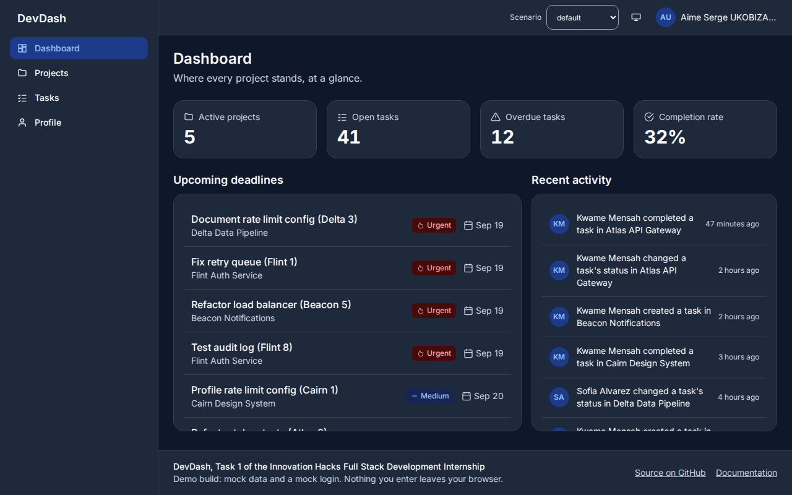
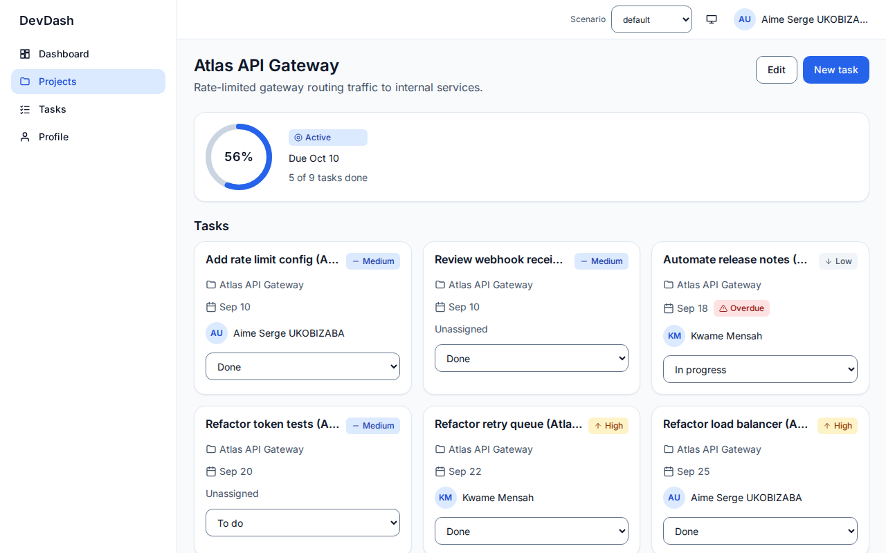
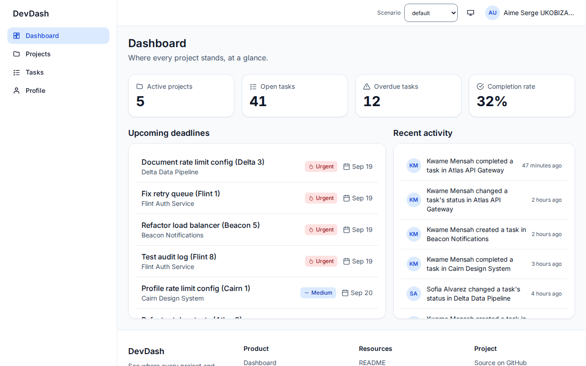
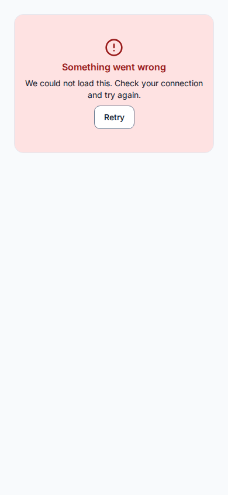
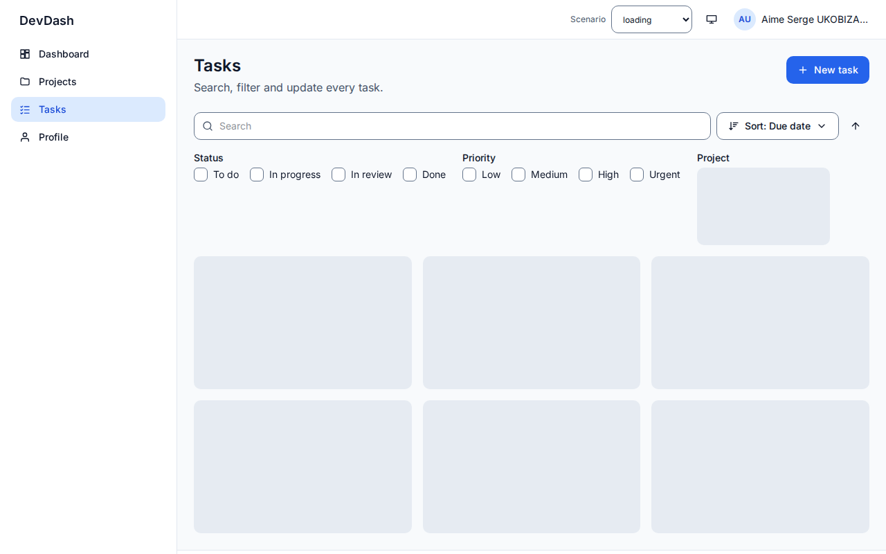
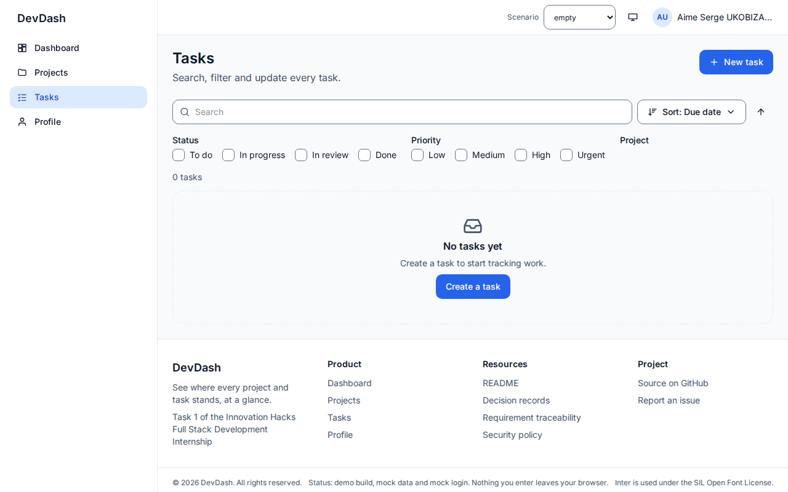
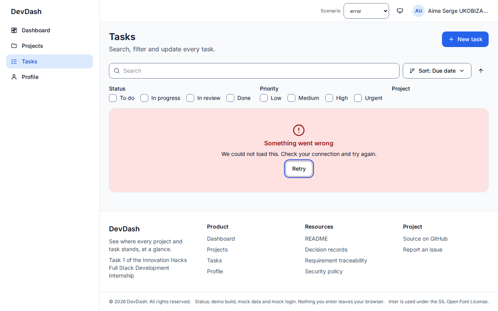
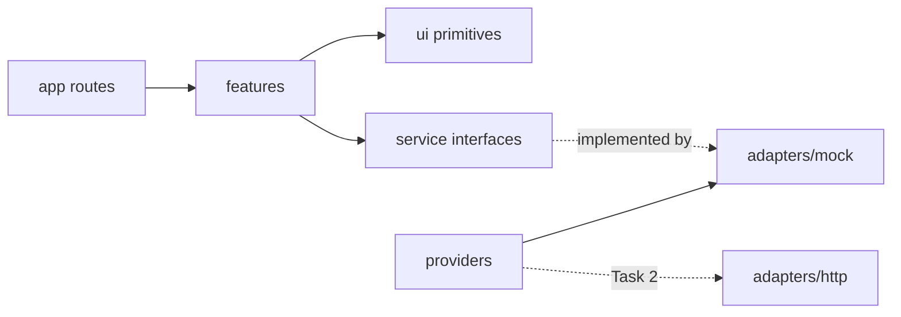

# DevDash: Developer Productivity Dashboard

An at-a-glance view of where every project and task stands. Task 1 of the
Innovation Hacks Full Stack Development Internship: a strict-TypeScript Next.js
frontend, built to the _Engineering Standards Pack (Task 1)_ and running on a
typed mock service layer that Task 2's API replaces without touching a component.

  



- **Live site:** https://task-management-dashboard-two-beta.vercel.app (deploys from `main`; this rebuild lives on `task/1-frontend` until it is merged)
- **Demo video:** _add the link after recording, see [DEMO_SCRIPT.md](DEMO_SCRIPT.md)_
- **Demo account:** `aime.serge@example.com` / `password123` (mock login, see [ADR-010](docs/adr/ADR-010-mock-auth.md); do not enter a real password)
- **Status:** the quality gate is not fully green. Two Pack budgets are missed (first-load JavaScript and Lighthouse performance); see [Quality gate](#quality-gate) and [ADR-017](docs/adr/ADR-017-first-load-javascript.md).

## Contents

[Tour](#tour) · [Run it](#run-it-3-commands) · [Features](#what-to-look-at) · [Scenarios](#every-state-is-reachable) · [Tech stack](#tech-stack) · [Architecture](#architecture) · [Scripts](#scripts) · [Quality gate](#quality-gate) · [Security](#security) · [Accessibility](#accessibility) · [Roadmap](#roadmap) · [Contributing](#contributing) · [Known limitations](#known-limitations)

## Tour

| | |
| --- | --- |
|  **Project detail:** progress ring and that project's tasks |  **Tasks:** search, filters and sort, all stored in the URL |
|  **Light Theme:** light, dark or system, with no flash on load |  **Mobile:** the sidebar becomes a focus-trapping drawer under 1024 px |

Every dynamic region has all its states, and each is one URL parameter away (`?scenario=`):

| Loading | Empty | Error with Retry |
| --- | --- | --- |
|  |  |  |

## Run it (3 commands)

Needs Node 22 or newer.

```bash
git clone https://github.com/Aime-Serge/innovation-hacks-task1-dashboard.git && cd innovation-hacks-task1-dashboard
npm ci
npm run dev        # http://localhost:3000
```

For the production build that the tests use: `npm run build && npm start`.
`.env.example` lists the only optional variable (`NEXT_PUBLIC_SCENARIO_SWITCHER`).

## What to look at

| Route | What it shows |
| --- | --- |
| `/` | Four KPIs, deadlines for the next 7 days, recent activity |
| `/projects` | Project cards with progress; search, filter, sort; create a project |
| `/projects/[id]` | Progress ring, that project's tasks, edit, add a task, not-found state |
| `/tasks` | Search (250 ms debounce), filters, sort, all in the URL; change a status from its card |
| `/profile` | Your task statistics, edit your name, choose a theme |
| `/login`, `/register`, `/forgot-password`, `/reset-password` | Mock authentication. Registering sends you to login, it never signs you in |

### Every state is reachable

Append `?scenario=<name>` to any URL, or use the **Scenario** select in the header.

| Scenario | What happens |
| --- | --- |
| `default` | Realistic mixed data |
| `loading` | Every request takes 3 s; skeletons hold the layout |
| `empty` | No projects, tasks or activity |
| `error` | Every list request fails with a 500 |
| `partial-error` | Only the tasks request fails; the rest of the page works |
| `flaky` | The first request fails, Retry succeeds |
| `update-fails` | A status change fails and rolls back with an error toast |
| `large` | 500 tasks and 40 projects |
| `edge-text` | 80-character names, long words, emoji, right-to-left text |

## Scripts

| Command | What it checks |
| --- | --- |
| `npm run dev` / `build` / `start` | Development server, production build, production server |
| `npm run typecheck` | `tsc --noEmit` with `strict`, `noUncheckedIndexedAccess`, `exactOptionalPropertyTypes` |
| `npm run lint` | ESLint (typescript-eslint strict, layer boundaries, no `any`, no literal JSX text), Prettier, no raw design values outside the token file |
| `npm run check:no-js` | Fails on any `.js`, `.jsx`, `.mjs` or `.cjs` file (the allowlist is empty; PostCSS is configured in `postcss.config.json`) |
| `npm test` | Vitest unit, component and contract tests with an 80% coverage threshold |
| `npm run test:e2e` | Playwright journeys per scenario at 3 viewports, plus security headers, JS budget and interaction latency |
| `npm run test:a11y` | axe on every route, in both themes and every scenario |
| `npm run lighthouse` | Lighthouse (mobile) on `/`, `/projects`, `/tasks`, `/profile` |
| `npm run audit` | `npm audit` for high and critical, plus a secret scan |
| `npm run gate` | All of the above in the Pack's order, stopping at the first failure |

## Tech stack

| Concern | Choice |
| --- | --- |
| Framework | Next.js 16 (App Router, Turbopack), React 19, strict TypeScript |
| Styling | Tailwind CSS v4 driven by design tokens (light, dark, system) |
| Server state | TanStack Query (loading, error, retry, cache, optimistic updates) |
| Validation | Zod (`zod/mini`) at the service boundary; every type is inferred from a schema |
| Accessible primitives | Radix UI (dialog, menu, toast), loaded on first use |
| Testing | Vitest and Testing Library, Playwright (Chromium, Firefox; WebKit in CI), axe-core, Lighthouse |
| Quality | ESLint (typescript-eslint strict, layer boundaries), Prettier, `tsc --noEmit` |
| CI | GitHub Actions, Dependabot |

## Architecture



```
app/ routes  →  features/  →  ui/ primitives and composites
                   │
                   ▼
             services/ (interfaces)  ←  providers/  →  adapters/mock  (adapters/http in Task 2)
```

Dependencies point one way, and ESLint fails the build if that breaks: `ui/`
imports no feature, service or adapter; features never import an adapter; only
`src/providers` does.

```
src/
  app/          routes, layouts, error, not-found, robots
  features/     dashboard, projects, tasks, profile, auth, data (query hooks), shared
  ui/           Button, Input, Badge, Dialog, DropdownMenu, Toast, ProgressBar/Ring, RegionState …
  layout/       AppShell, Header, Sidebar, Grid, PageHeader, SkipLink
  services/     ProjectService, TaskService, UserService, ActivityService, AuthService
  adapters/mock fixtures, latency and failure injection, mock auth
  providers/    services, auth, theme, scenario, query client
  schemas/      Zod schemas; every type is z.infer of one
  lib/          dates, list logic, error reporting, navigation
  i18n/         en.ts, the only place user-facing strings live
  styles/       tokens.css (colour, radius, shadow, motion), globals.css
tests/          unit, contract, e2e, a11y
docs/           audit, traceability, ADRs
```

Key decisions, each with an ADR in [docs/adr](docs/adr/README.md): the service
seam, TanStack Query, URL state, Radix primitives, nonce CSP, keeping the mock
login, the scenario switcher, and where this build deviates from the Pack.

## How to add a screen

1. **Schema.** Add or extend the Zod schema in `src/schemas/index.ts`; export the type with `z.infer`.
2. **Service.** Add the method to the interface in `src/services/types.ts`, then implement it in `src/adapters/mock/services.ts` (parse the response with the schema). Add a contract test in `tests/contract`.
3. **Hook.** Add a query hook in `src/features/data/hooks.ts`.
4. **Feature.** Create `src/features/<name>/` with a `<Name>View.tsx` (under 200 lines). Wrap each dynamic region in `RegionState` so it gets loading, empty, no-results and error states for free.
5. **Strings.** Add every user-facing string to `src/i18n/en.ts`; the linter rejects literal JSX text.
6. **Route.** Add `src/app/(app)/<name>/page.tsx` that renders the view, and a link in `src/layout/nav.ts`.
7. **Tests.** Name each test starting with a `TC-###`; add an e2e case per scenario that matters and an axe case in `tests/a11y`.
8. Run `npm run gate`.

## Quality gate

Every figure below is from a command run on this machine (Node 22, Chromium and Firefox from Playwright, a loaded laptop). `npm run gate` is **not green**: three commands fail, and the reasons are below the table. The tag `task-1-submission` has therefore not been created.

| Command | Result | Figures |
| --- | --- | --- |
| `npm run typecheck` | **Pass** | 0 errors |
| `npm run lint` | **Pass** | ESLint 0 problems (`--max-warnings 0`), Prettier clean, no raw design values outside `tokens.css` |
| `npm run check:no-js` | **Pass** | no JavaScript files, empty allowlist |
| `npm test` | **Pass** | 15 files, 235 tests. Coverage: 92.7% lines, 91.2% statements, 88.7% functions, 87.5% branches (threshold 80%) |
| `npm run test:e2e` | **Fail** | Chromium and Firefox: 134 passed, 6 failed, 6 skipped. All 6 failures are the JavaScript budget (NFR-04, below); the skips are the same test, which only runs in Chromium. Interaction latency (`@perf`, 4x throttled CPU, run alone) worst interaction 128 to 144 ms in four quiet runs against a 200 ms budget: pass. It is sensitive to machine load: one run with a stray headless Chrome eating CPU measured 264 ms and failed. The npm script stops at the first failing step, so run it with `npx playwright test tests/e2e --grep @perf --project=perf` |
| `npm run test:a11y` | **Pass** | 94 of 94: axe (WCAG 2.2 AA tags) found 0 violations across every route, both themes and all nine scenarios, plus the dialog, drawer, menu, toast and 404 |
| `npm run lighthouse` | **Fail** | Median of 3 runs, mobile profile. Performance 84 (`/`), 81 (`/projects`), 78 (`/tasks`), 86 (`/profile`), all under 90. Accessibility 100, best practices 100, SEO 100 everywhere. LCP 0.76 to 1.43 s (budget 2.5 s), CLS 0.002 to 0.005 (budget 0.1): both pass. Total Blocking Time 552 to 992 ms is what pulls performance down |
| `npm run audit` | **Pass** | `npm audit`: 0 vulnerabilities; secret scan: 182 files, 0 findings |
| `npm run build` | **Pass** | production build, 0 warnings |

**Why three commands fail (NFR-04 and the performance score).** The Pack asks for 170 KB or less of first-load JavaScript per route. This build ships 186 to 188 KB gzipped, and a page with almost none of this app's code shipped 179 KB in the same measurement, so the budget sits below what Next.js 16 and React 19 send on their own. The Lighthouse performance score and the 300 to 1000 ms of blocking time follow from the same script weight. The measurements, what was already trimmed (293 KB down to 186 KB), and four ways to close the gap are in [ADR-017](docs/adr/ADR-017-first-load-javascript.md). Nothing was loosened to hide this: the test and the script still enforce the Pack's numbers.

**Not run.** WebKit (Safari) needs system libraries this machine lacks (`sudo playwright install-deps`); it runs in CI through `PW_WEBKIT=1`. Microsoft Edge was not run. `.github/workflows/ci.yml` has not yet run on GitHub. The manual keyboard and screen-reader checklists (Pack sections 11 B to F) were not done by a person.

## Security

Nonce-based Content-Security-Policy, HSTS and the other required headers, defensive URL parsing, schema-validated API responses, an open-redirect guard, a secret scan and a dependency audit all run in the gate. The mock login is the one deliberate weakness ([ADR-010](docs/adr/ADR-010-mock-auth.md)). Details and how to report a problem: [SECURITY.md](SECURITY.md).

## Accessibility

axe-core runs on every route, in both themes and every scenario (94 checks, 0 violations). The app has a skip link, one `h1` per page with no skipped heading levels, labelled landmarks, a focus-trapping drawer, visible focus, 44 px touch targets on touch layouts, reduced-motion support, and status and priority that never rely on colour alone. Contrast ratios are computed from the design tokens in both themes by a unit test. A manual keyboard and screen-reader pass has not been done yet.

## Roadmap

| Task | Change | Status |
| --- | --- | --- |
| 1. Frontend | This repository | Built; two Pack budgets still open ([ADR-017](docs/adr/ADR-017-first-load-javascript.md)) |
| 2. API | `adapters/http` against the FastAPI service; session in an HttpOnly cookie; same scenarios replayed against the API | Planned |
| 3. Database | Pagination and server-side search; verify optimistic updates against real persistence | Planned |
| 4. AI | Streaming, cancel and failure states added to the state matrix; model output rendered as plain text | Planned |

## Contributing

See [CONTRIBUTING.md](CONTRIBUTING.md): branch naming, conventional commits, the definition of done, and the code rules the linter enforces.

## Known limitations

- **NFR-04 and the Lighthouse performance score are not met.** See the gate table and ADR-017.
- **Safari and Edge are unverified.** Only Chromium and Firefox ran locally.
- **Authentication is a mock.** Accounts and plain-text passwords live in `localStorage`, and the session is an unsigned cookie the route guard only checks for presence (ADR-010). It exists to demonstrate guarded routes. Do not enter a real password.
- **No Settings page.** Avatar upload, password change and account deletion from the baseline were removed to stay inside the Pack (ADR-013); the mock adapter still implements them.
- **The CSP carries one relaxation** (`style-src` accepts a per-request nonce, because Radix's scroll lock injects a style tag), recorded in ADR-011.
- **Mock data resets on reload.** Projects and tasks are in memory by design; nothing but the mock accounts and the theme choice touches browser storage.
- **Lighthouse numbers are lab numbers** and vary with the machine; the script reports the median of three runs after a warm-up.
- **The scenario switcher ships in production builds** so reviewers can reach every state (ADR-009).
- **The task list renders 24 cards at a time** with a Show more button, to keep the 500-task scenario responsive.

## Documents

- [docs/audit.md](docs/audit.md): what the baseline had and what changed
- [docs/traceability.md](docs/traceability.md): every FR and NFR with its tests
- [docs/adr/](docs/adr/README.md): decisions and deviations
- [DEMO_SCRIPT.md](DEMO_SCRIPT.md) and [docs/linkedin-post.md](docs/linkedin-post.md)

## Licence and fonts

Inter (variable, Latin subset) is self-hosted under the SIL Open Font License; the licence is in `src/app/fonts/`.
